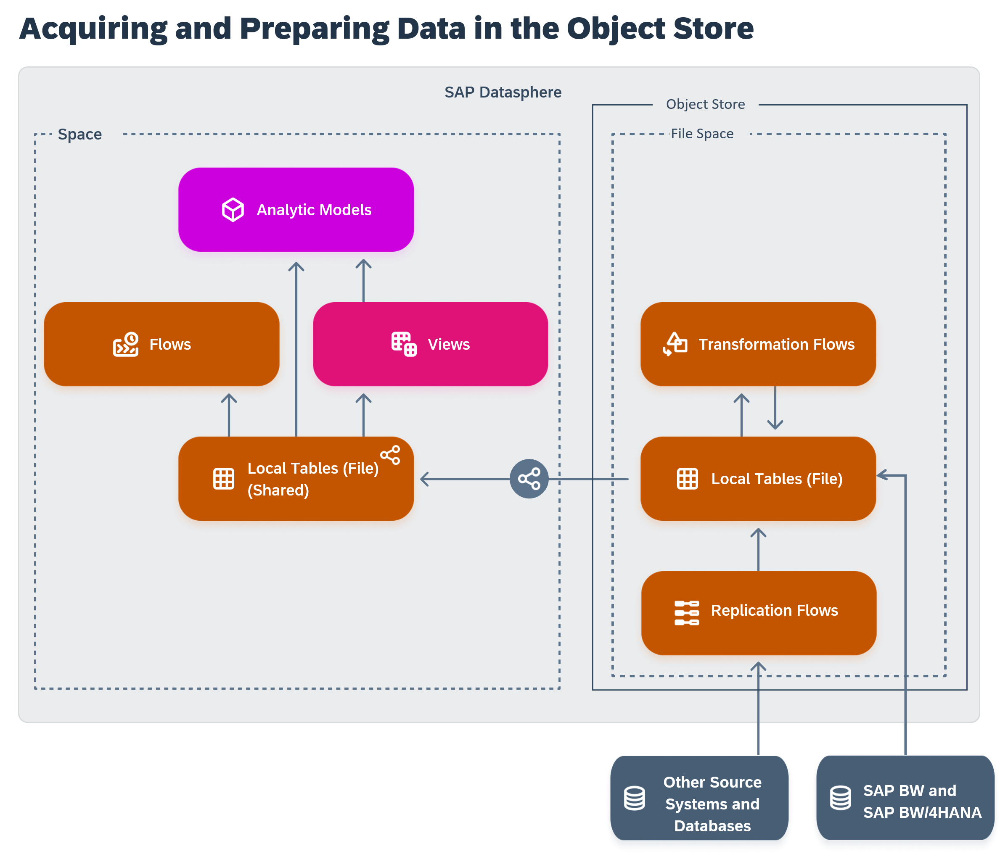

<!-- loio2a6bc3f6d79b4c39a01b6d58d043fbaf -->

# Acquiring and Preparing Data in the Object Store

Users with a modeler role can load large quantities of data via replication flows and store them inexpensively in file spaces in the SAP Datasphere object store. You can prepare the data using Apache Spark transformation flows and then share data to a standard space to be used as a source of flows, views, and analytic models.

This topic contains the following sections:

-   [Introduction to the SAP Datasphere Object Store](acquiring-and-preparing-data-in-the-object-store-2a6bc3f.md#loio2a6bc3f6d79b4c39a01b6d58d043fbaf__section_intro_to_big_data)
-   [Create a File Space in the Object Store](acquiring-and-preparing-data-in-the-object-store-2a6bc3f.md#loio2a6bc3f6d79b4c39a01b6d58d043fbaf__section_create_file_space)
-   [Load Data with Replication Flows](acquiring-and-preparing-data-in-the-object-store-2a6bc3f.md#loio2a6bc3f6d79b4c39a01b6d58d043fbaf__section_load_big_data)
-   [Integrate SAP BW Data Pushed Through the Data Product Generator](acquiring-and-preparing-data-in-the-object-store-2a6bc3f.md#loio2a6bc3f6d79b4c39a01b6d58d043fbaf__section_load_BWData)
-   [Prepare Data with Apache Spark Transformation Flows](acquiring-and-preparing-data-in-the-object-store-2a6bc3f.md#loio2a6bc3f6d79b4c39a01b6d58d043fbaf__section_prepare_big_data)
-   [Share Data to Standard Spaces](acquiring-and-preparing-data-in-the-object-store-2a6bc3f.md#loio2a6bc3f6d79b4c39a01b6d58d043fbaf__section_share_big_data)

<a name="loio2a6bc3f6d79b4c39a01b6d58d043fbaf__section_intro_to_big_data"/>

## Introduction to the SAP Datasphere Object Store

> ### Note:  
> For additional information on working with data in the object store, see SAP note [3538038](https://me.sap.com/notes/3538038).

The object store provides an inbound layer for staging large quantities of data cost-effectively. Data can be loaded by replication flows or pushed through the data product generator for SAP Business Data Cloud. You can optionally further prepare the data with Apache Spark transformation flows. You can then share the tables to standard spaces, where they can be used as sources for flows, views, and analytic models.

<a name="loio2a6bc3f6d79b4c39a01b6d58d043fbaf__section_create_file_space"/>

## Create a File Space in the Object Store

A user with an administrator role can create a space with SAP HANA data lake files storage in the object store. File spaces are intended for loading and preparing large quantities of data in an inexpensive inbound staging area \(see [Create a File Space to Load Data in the Object Store](https://help.sap.com/viewer/9f804b8efa8043539289f42f372c4862/cloud/en-US/947444683e524cfd9169d7671b72ba0c.html "Create a file space and allocate compute resources to it. File spaces are intended for loading and preparing large quantities of data in an inexpensive inbound staging area and are stored in the SAP Datasphere object store.") :arrow_upper_right:\).

> ### Note:  
> -   You cannot create views, data flows, data access controls, analytic models, intelligent lookups, E/R models, or use the *Business Builder* in a file space.
> -   You cannot import CSV files, entities, remote tables or currency conversion tables. SAP HANA smart data access and SAP HANA smart data integration are therefore not applicable as they are only used in spaces with storage type *SAP HANA Database \(Disk and In-Memory\)*\(see [Importing Tables and Views from Sources](importing-tables-and-views-from-sources-7c4acd3.md)\).

<a name="loio2a6bc3f6d79b4c39a01b6d58d043fbaf__section_load_big_data"/>

## Load Data with Replication Flows

Users with a modeler role can use replication flows to load data in local tables \(file\) that are stored in a file space \(see [SAP Datasphere Targets](sap-datasphere-targets-12c45eb.md)\). A replication flow writes data files to the inbound buffer \(specific folder in file storage\) of a target local table \(File\). To process data updates from this inbound buffer to the local table \(File\), and therefore make data visible, a merge task has to run via a task chain \(see [Creating a Task Chain](creating-a-task-chain-d1afbc2.md)\) or via the Local Tables \(File\) monitor. You can monitor the buffer merge status using the *Local Tables \(File\)* monitor \(See [Monitoring Local Tables (File)](https://help.sap.com/viewer/be5967d099974c69b77f4549425ca4c0/cloud/en-US/6b2d0073a8684ee6a59d6f47d00ec895.html "Monitor your local tables (file). Check how and when they were last updated and if new data has still to be merged.") :arrow_upper_right:\). You can also automate the merge task at replication flow creation level with the *Merge Data Automatically* option. For more information, see [Creating a Replication Flow](creating-a-replication-flow-25e2bd7.md).

<a name="loio2a6bc3f6d79b4c39a01b6d58d043fbaf__section_load_BWData"/>

## Integrate SAP BW Data Pushed Through the Data Product Generator

A user with a data integrator role can access local tables \(file\) received from SAP BW or SAP BW/4HANA. An SAP BW administrator has pushed BW data into the object store, in a dedicated BW file space, and data is received as local table \(file\) directly into the Data Builder \(see [Working With Local Tables (File) Received From the Data Product Generator for SAP Business Data Cloud](https://help.sap.com/viewer/be5967d099974c69b77f4549425ca4c0/cloud/en-US/72a055fc7dad40079efa442ddd4b998e.html "An administrator in SAP BW or SAP BW/4HANA has pushed data into SAP Datasphere as a local table (file), and you now want to use it for your business case.") :arrow_upper_right:\). Updates of these tables are pushed in the inbound buffer. To process data updates from this inbound buffer to the local table \(file\) generated by SAP BW and therefore make data visible, a merge task has to run via a task chain \(see [Creating a Task Chain](creating-a-task-chain-d1afbc2.md)\) or via the *Local Tables \(File\)* monitor. You can monitor the inbound buffer using the *Local Tables \(File\)* monitor \(See [Monitoring Local Tables (File)](https://help.sap.com/viewer/be5967d099974c69b77f4549425ca4c0/cloud/en-US/6b2d0073a8684ee6a59d6f47d00ec895.html "Monitor your local tables (file). Check how and when they were last updated and if new data has still to be merged.") :arrow_upper_right:\).

<a name="loio2a6bc3f6d79b4c39a01b6d58d043fbaf__section_prepare_big_data"/>

## Prepare Data with Apache Spark Transformation Flows

Users with a modeler role can use Apache Spark transformation flows to clean and otherwise prepare data in a file space \(see [Creating a Transformation Flow in a File Space](creating-a-transformation-flow-in-a-file-space-b917baf.md)\). Transformation flows can take one or more local tables \(file\) as sources, combine them, filter data, add or remove columns, and perform other transformations and output the result to another local table \(file\) \(see [Creating a Local Table \(File\)](creating-a-local-table-file-d21881b.md)\).

<a name="loio2a6bc3f6d79b4c39a01b6d58d043fbaf__section_share_big_data"/>

## Share Data to Standard Spaces

Users with a modeler role can share local tables \(file\) to standard spaces to allow the data to be used as a source for flows, views, and analytic models \(see [Sharing Entities and Task Chains to Other Spaces](../Creating-Finding-Sharing-Objects/sharing-entities-and-task-chains-to-other-spaces-64b318f.md)\).

