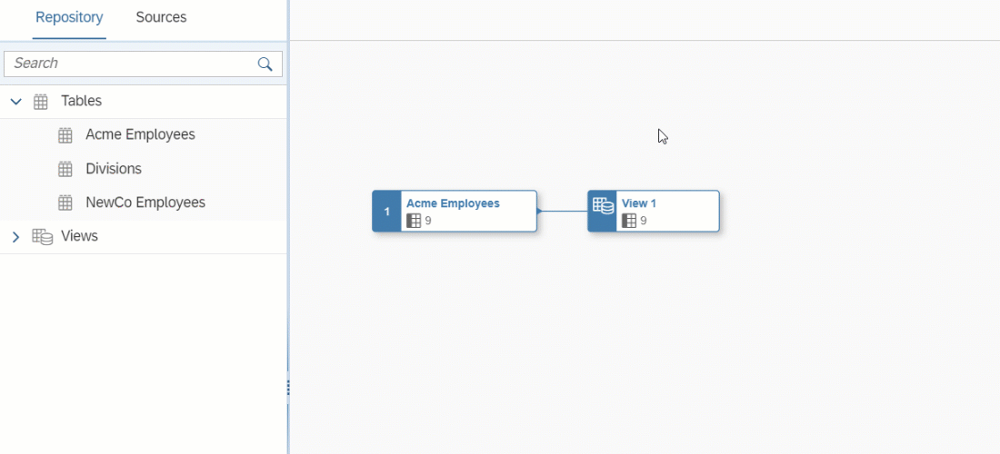

<!-- loio7733250f9d2a46b690a5288634d269f0 -->

<link rel="stylesheet" type="text/css" href="../css/sap-icons.css"/>

# Aggregate Data

Add an *Aggregation* node to perform `SUM`, `COUNT`, `MIN`, and `MAX` calculations. You group by any non-aggregated columns and can optionally filter by specifying a `HAVING` clause.

<a name="loio7733250f9d2a46b690a5288634d269f0__context_dxg_lzf_knb"/>

## Context

## Procedure

1.  Identify one or more columns containing data that you want to aggregate. The columns must have a numerical data type and can be calculated columns.

2.  Create a projection node to exclude all columns except this column and the column\(s\) by which you want to group your values.

    For example, if you want to aggregate ***Revenue*** per ***Country***, you should exclude all columns except ***Revenue*** and ***Country***.

3.  Select the projection node in order to display its context tools, and click  \(Aggregation\).

     An *Aggregation* node is created, its symbol is selected, and its properties are displayed in the side panel.

4.  Optional. Rename the node in its side panel to clearly identify it. This name can be changed at any time and can contain only alphanumeric characters and underscores.

5.  In the *Columns* section, click the `NONE` on a numeric column and select the appropriate aggregation function:

    -   `SUM`: calculate the total value
    -   `COUNT`: calculate the number of distinct values
    -   `MIN`: calculate the minimum value
    -   `MAX`: calculate the maximum value

6.  \[optional\]. Enter an expression in the *Having* section to filter the aggregated data. You can use the following items in your SQL expression:

    -   *Insert Values* - Click to open the *Insert Value* dialog:

        > ### Note:  
        > -   The button is enabled when, in the *Expression* field, a column name is followed by the operator `=`, `>`, `<`, `!=`, `IN`, `BETWEEN`, or `LIKE`. Values from the selected column are listed in the *Insert Value* dialog.
        > 
        > -   You can insert values of the data types string, interger, boolean, date, and time. The data types binary and UUID aren't supported.

        Select available value\(s\) and click *Insert* to add them to your expression.

    -   *Functions* - Browse, select a category, or filter available functions \(see [SQL Functions Reference](sql-functions-reference-6d624a1.md)\). Click a function name to see its syntax or click elsewhere in its token to add it to your expression.
    -   *Columns* - Browse or filter available columns. Click a column name to see its properties or click elsewhere in its token to add it to your expression.
    -   *Parameters* - Browse or filter available input parameters \(see [Create an Input Parameter](create-an-input-parameter-53fa99a.md)\). Click a parameter name to see its properties or click elsewhere in its token to add it to your expression.
    -   *Other* - Browse available operators, predicates, and case expressions, and click one to add it to your expression \(see [SQL Reference](sql-reference-6a37cc5.md)\).

    For example, if you have aggregated your ***Revenue*** column using `SUM`, and want to show only:

    -   Total revenues of more than 1m, enter `SUM(Revenue) > 1000000`
    -   Total revenues for the US only, enter `Country='US'`

    When working on a large expression, click  \(Enter Full Screen\) to expand the expression editor.

7.  Click  \(Preview Data\) to open the *Data Preview* panel and review the data output by this node. For more information, see [Viewing or Previewing Data in Data Builder Objects](viewing-or-previewing-data-in-data-builder-objects-b338e4a.md).

