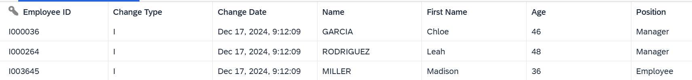

<!-- loio154bdffb35814d5481d1f6de143a6b9e -->

# Capturing Delta Changes in Your Local Table

Track the changes that will be made later on your local table after you have deployed it.

Local tables can be used as source data or target data by SAP Datasphere apps. For some business scenarios, you might need to keep an eye on changes that will be made after you have deployed your local table. For example, when you import a new csv file, or while running a replication flow, you might want to know which data is updated or deleted. When creating a local table, you can switch on a toggle that will capture the future updates made in your table.

<a name="loio154bdffb35814d5481d1f6de143a6b9e__section_uz2_bcm_2yb"/>

## Switching Delta Capture On

> ### Caution:  
> You need to meet the following requirements to add the setting *Delta Capture*:
> 
> -   Your table must not be deployed yet. After deployment, it is not possible to turn an existing local table into a table that allows *Delta Capture*.
> 
> -   You must define at least one key column.

You enable *Delta Capture* while creating a local table. See [Creating a Local Table](creating-a-local-table-2509fe4.md).

When *Delta Capture* is switched on:

-   *Delta Capture Table* field is added and a default name for the delta capture table is defined \(Technical name + Delta\).

    > ### Example:  
    > I define the business name "My Employee Data" for my local table with delta capture enabled, the technical name is "My\_Employee\_Data". The default delta capture table name will be "My\_Employee\_Data\_Delta": 

-   2 additional columns are automatically created in my table:

    <table>
    <tr>
    <th valign="top">

    Column

    
    </th>
    <th valign="top">

    Description

    
    </th>
    <th valign="top">

    Possible Values

    
    </th>
    </tr>
    <tr>
    <td valign="top">
    
    Change Date 

    
    </td>
    <td valign="top">
    
    The column will track the last date and time of the last change to an individual record.

    
    </td>
    <td valign="top">
    
    Current UTC timestamp. 

    
    </td>
    </tr>
    <tr>
    <td valign="top">
    
    Change Type

    
    </td>
    <td valign="top">
    
    This column will track the type of last change made to a record.

    
    </td>
    <td valign="top">
    
    This column will track the type of last change made to a record.When a new record is inserted, the change type is set to "I" \(Insert\). When an existing record is updated, the change type is set to "U" \(Update\). When an existing record is deleted, the change type is set to "D" \(Delete\). The change type is set to "M" \(Maintenance - Archive Delete\), when records have been archived in an ABAP source. "M" records are treated as "D" records in SAP Datasphere. Note that deleting a record will not physically delete it.

    
    </td>
    </tr>
    </table>
    

You can change both business name and technical name but you can't change the data type \(read-only\).

> ### Note:  
> -   The delta capture columns can't be set as key column.
> 
> -   They can't be deleted if the toggle is switched on.
> -   Once the table is deployed, the toggle can't be switched off.

<a name="loio154bdffb35814d5481d1f6de143a6b9e__section_pbf_qfm_2yb"/>

## Importing a File to Your Local Table With Delta Capture Enabled

You can import another csv file containing data in your table. In this case, the newly imported data will get change type as "I".

> ### Note:  
> You can’t import data that will erase existing key records data. You first need to delete the existing data by selecting the option*Delete Existing Data Before Upload* when importing the new csv file.

For example, if I import a csv file with new data, the change type is set to "I":

For more information, see [Load or Delete Local Table Data](load-or-delete-local-table-data-870401f.md)

<a name="loio154bdffb35814d5481d1f6de143a6b9e__section_sxm_bgm_2yb"/>

## Deployment and Consumption of Local Table With Delta Capture

When a local table with delta capture is deployed, the following objects are created and stored in the repository:

-   The table that contains the delta capture columns. The technical name ends with "Delta".

-   The table that contains only the active records. It excludes both the delta capture columns and deleted records \("M" and "D"\), and keeps only the active records.

    > ### Note:  
    > This table is saved in the repository, but is deployed as a view in the database.

The graphic below shows the different objects created: 

The 2 objects are consumed differently by SAP Datasphere apps:

<table>
<tr>
<th valign="top">

 

</th>
<th valign="top">

Table with active records only

</th>
<th valign="top">

Table with delta capture columns

</th>
<th valign="top">

More information

</th>
</tr>
<tr>
<td valign="top">

*Table Editor* - Data Preview

</td>
<td valign="top">

Not used

</td>
<td valign="top">

Used as source object

</td>
<td valign="top">

Data Preview is available once deployment is completed, and show only table with delta capture columns. [Viewing or Previewing Data in Data Builder Objects](../viewing-or-previewing-data-in-data-builder-objects-b338e4a.md)

</td>
</tr>
<tr>
<td valign="top">

*Table Editor* - Data Maintenance

</td>
<td valign="top">

Not used

</td>
<td valign="top">

Used as source and target objects

</td>
<td valign="top">

You can perform table maintenance once deployment is completed.[Maintain Local Table Data](maintain-local-table-data-4bd5e64.md)

</td>
</tr>
<tr>
<td valign="top">

*Table Editor* - File Upload

</td>
<td valign="top">

Not used

</td>
<td valign="top">

Used as source and target objects

</td>
<td valign="top">

You can update a table with delta capture by uploading a new csv file, after deployment is completed. [Load or Delete Local Table Data](load-or-delete-local-table-data-870401f.md)

</td>
</tr>
<tr>
<td valign="top">

*Transformation Flow*

</td>
<td valign="top">

Used as source objects

</td>
<td valign="top">

Used as source and target objects

</td>
<td valign="top">

-   Source: You can choose between source with "Delta Capture" or "All Active Records". See [Add a Source Table](add-a-source-table-ec702fe.md)
-   Target: It might depends of the combination of the load type used and the table type \(local table with or without delta capture\). See [Processing Changes to Source and Target Tables](processing-changes-to-source-and-target-tables-705292c.md) and [Add or Create a Target Table](add-or-create-a-target-table-0950746.md)

</td>
</tr>
<tr>
<td valign="top">

*Replication Flow* 

</td>
<td valign="top">

Not used

</td>
<td valign="top">

Used as target object

</td>
<td valign="top">

[Creating a Replication Flow](creating-a-replication-flow-25e2bd7.md)

</td>
</tr>
<tr>
<td valign="top">

*View Builder*

</td>
<td valign="top">

Used as source object

</td>
<td valign="top">

Not used

</td>
<td valign="top">

Only active records table is visible in

-   Data Builder Landing Page

-   Repository Tree as shown in View Builder, Transformation Flow, Data Flow, Replication Flow, ER Modeler

-   Association targets list

-   Graphical view - Calculated column - currency conversion tables list

[Creating a Graphical View](../creating-a-graphical-view-27efb47.md)

</td>
</tr>
<tr>
<td valign="top">

*ER Model*

</td>
<td valign="top">

Used as source object

</td>
<td valign="top">

Not used

</td>
<td valign="top">

Only the active records table is visible in the repository tree, but you can create local tables with delta capture. See [Create a Table in an E/R Model](../create-a-table-in-an-e-r-model-3939414.md)

</td>
</tr>
<tr>
<td valign="top">

*Data Flow*

</td>
<td valign="top">

Used as source object

</td>
<td valign="top">

Not used

</td>
<td valign="top">

Only the active records table is visible in the repository tree. See[Add a Source](add-a-source-7b50e8e.md)

</td>
</tr>
<tr>
<td valign="top">

*Business Builder*

</td>
<td valign="top">

Used as source object

</td>
<td valign="top">

Not used

</td>
<td valign="top">

Table with delta capture column is hidden when searching for entities. Only the "Active Record" table can be selected.

</td>
</tr>
</table>

