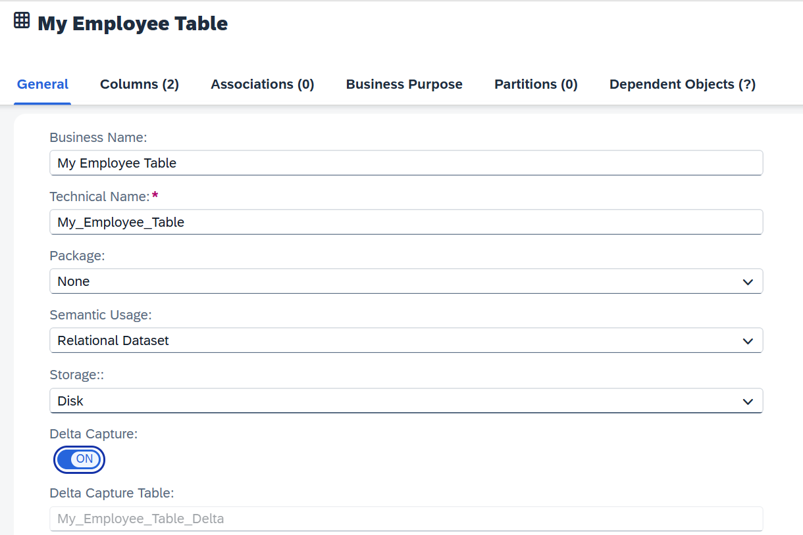

<!-- loio154bdffb35814d5481d1f6de143a6b9e -->

# Capturing Delta Changes in Your Local Table

Track the changes that will be made later on your local table after you have deployed it.

Local tables can be used as source data or target data by SAP Datasphere apps. For some business scenarios, you might need to keep an eye on changes that will be made after you have deployed your local table. For example, when you import a new csv file, or while running a replication flow, you might want to know which data is updated or deleted. When creating a local table, you can switch on a toggle that will capture the future updates made in your table.

> ### Restriction:  
> The Delta Capture Table is an internal table whose structure can incompatibly change at any time. It is not permitted for external data access and is only consumed by the above SAP Datasphere internal apps. Using the internal delta capture columns \(*Change Date* or *Change Type*\) or their content directly or indirectly for external delta replication outside the Premium Outbound Integration is also not permitted. For more information, see [Premium Outbound Integration](https://blogs.sap.com/2023/11/16/replication-flow-blog-series-part-2-premium-outbound-integration/).

<a name="loio154bdffb35814d5481d1f6de143a6b9e__section_uz2_bcm_2yb"/>

## Switching Delta Capture On

> ### Caution:  
> You need to meet the following requirements to add the setting *Delta Capture*:
> 
> -   Your table must not be deployed yet. After deployment, it is not possible to turn an existing local table into a table that allows *Delta Capture*.
> 
> -   You must define at least one key column.

You enable *Delta Capture* while creating a local table. See [Creating a Local Table](creating-a-local-table-2509fe4.md).

When *Delta Capture* is switched on:

-   *Delta Capture Table* field is added and a default name for the delta capture table is defined \(Technical name + Delta\).

    > ### Example:  
    > I define the business name "My Employee Data" for my local table with delta capture enabled, the technical name is "My\_Employee\_Data". The default delta capture table name will be "My\_Employee\_Data\_Delta": 

-   2 additional columns are automatically created in my table:

    <table>
    <tr>
    <th valign="top">

    Column
    
    </th>
    <th valign="top">

    Description
    
    </th>
    <th valign="top">

    Possible Values
    
    </th>
    </tr>
    <tr>
    <td valign="top">
    
    Change Date 
    
    </td>
    <td valign="top">
    
    The column will track the last date and time of the last change to an individual record.
    
    </td>
    <td valign="top">
    
    Current UTC timestamp. 
    
    </td>
    </tr>
    <tr>
    <td valign="top">
    
    Change Type
    
    </td>
    <td valign="top">
    
    This column will track the type of last change made to a record.
    
    </td>
    <td valign="top">
    
    This column will track the type of last change made to a record.When a record is inserted or updated corresponding change types are used: "*I*" for insert \(a new record is added\), "*U*" for update \(an existing record gets an updated value\), or "*A*" for upsert \(insert records if they do not exist yet in the target table, or update them by primary key if they do exist\). When an existing record is deleted other specific change types are used \(for example "*D*"\). Note that deleting a record will not physically delete it, so that the changes can be propagated to the different objects that consume it in delta mode. It is however filtered out when accessing the Local Table \(using the Active Records Table\). Also, note that the change types provided by the different SAP Datasphere apps vary and may depend on the actual source that is connected. The handling of the different change types is implemented internally by SAP Datasphere apps that consume the Delta Capture Table with no need for consideration in modeling. For more information on records deletion, see [Load or Delete Local Table Data](load-or-delete-local-table-data-870401f.md)
    
    </td>
    </tr>
    </table>
    

You can change both business name and technical name but you can't change the data type \(read-only\).

> ### Note:  
> -   The delta capture columns can't be set as key column.
> 
> -   They can't be deleted if the toggle is switched on.
> -   Once the table is deployed, the toggle can't be switched off.

<a name="loio154bdffb35814d5481d1f6de143a6b9e__section_pbf_qfm_2yb"/>

## Importing a File to Your Local Table With Delta Capture Enabled

You can import another csv file containing data in your table. In this case, the newly imported data will get change type as "I".

> ### Note:  
> You can’t import data that will erase existing key records data. You first need to delete the existing data by selecting the option*Delete Existing Data Before Upload* when importing the new csv file.

For example, if I import a csv file with new data, the change type is set to "I":

For more information, see [Load or Delete Local Table Data](load-or-delete-local-table-data-870401f.md)

<a name="loio154bdffb35814d5481d1f6de143a6b9e__section_sxm_bgm_2yb"/>

## Deployment and Consumption of Local Table With Delta Capture

When a local table with delta capture is deployed, the following objects are created and stored in the repository:

-   The table that contains the delta capture columns. The technical name ends with "Delta".

-   The table that contains only the active records. It excludes both the delta capture columns and deleted records \("M" and "D"\), and keeps only the active records.

    > ### Note:  
    > This table is saved in the repository, but is deployed as a view in the database.

The 2 objects are consumed differently by SAP Datasphere apps:

-   Most SAP Datasphere apps consume a local table with delta capture through the *Active Records* table only. In these cases, local tables behave the same way independent of whether *Delta Capture* is set to "*On*" or "*Off*". For examples in Graphical Views, SQL Views, E/R Modeler or Business Builder.
-   The following SAP Datasphere apps also interact with the Delta Capture Table that contains the delta columns:
    -   *Transformation Flow*:
        -   As Source, you can choose between source with "Delta Capture" or "All Active Records". See [Add a Source to a Graphical View](../add-a-source-to-a-graphical-view-1eee180.md)
        -   As target, it depends of the combination of the load type used and the table type \(local table with or without delta capture\). See [Processing Changes to Sources and Target Tables](../processing-changes-to-sources-and-target-tables-705292c.md) and [Create or Add a Target Table to a Transformation Flow](../create-or-add-a-target-table-to-a-transformation-flow-0950746.md) 

    -   *Replication Flow*: The Delta Capture Table can be used as source or as target, see [Creating a Replication Flow](creating-a-replication-flow-25e2bd7.md) and [Add the Source for a Replication Flow](add-the-source-for-a-replication-flow-7496380.md).
    -   *Table Editor*:
        -   Data Preview: Once deployment is completed, it shows only the delta capture tables. See [Viewing Object Data](../viewing-object-data-b338e4a.md)
        -   Data Maintenance: You can perform table maintenance on the delta capture table \(only\) once deployment is completed. See [Maintain Local Table Data](maintain-local-table-data-4bd5e64.md)
        -   File upload: You can update the delta capture table by uploading a new csv file, after deployment is completed. See [Load or Delete Local Table Data](load-or-delete-local-table-data-870401f.md)

> ### Note:  
> If the table is used as source or target in an object, for example in a flow, you can see it in the table editor under dependent objects. For more information, see [Review the Objects That Depend on Your Table or View](../review-the-objects-that-depend-on-your-table-or-view-ecac5fd.md).

