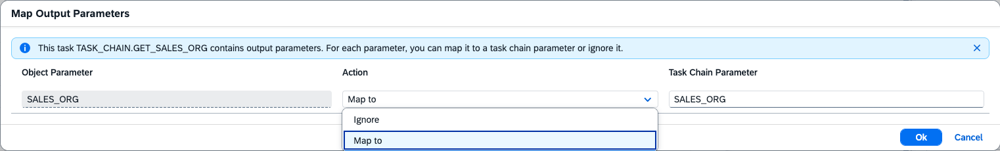
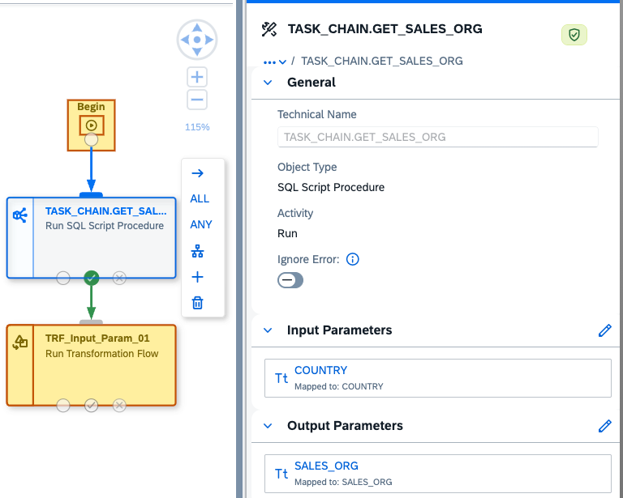
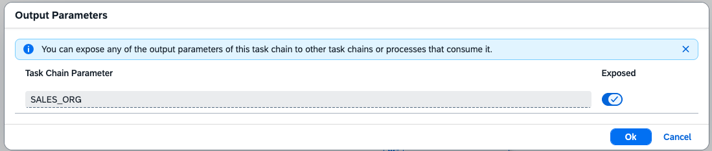

<!-- loioc6e2e01a9df7454fb23707887470ccf1 -->

<link rel="stylesheet" type="text/css" href="../css/sap-icons.css"/>

# Create Output Parameters in Task Chains

You can use output parameters in task chains. This allows more flexibility and refinement moving information from one task object to the next in a task chain.

<a name="loioc6e2e01a9df7454fb23707887470ccf1__prereq_s2x_dby_mgc"/>

## Prerequisites

To create output parameters in task chains, you need to have the correct authorizations required to create and run task chains. For more information see [Creating a Task Chain](creating-a-task-chain-d1afbc2.md).

## Context

You can map output parameters from source task objects to be used in your task chain and expose mapped output parameters to your task chain to be used in nested task chains.

To utilize output parameters in task chains, you must have task objects that have output parameters added at the source level of the task. You can use SQL script procedures with output parameters and you can nest a task chain with output parameters described in the following process. For more information see , [Run Open SQL Procedures in a Task Chain](https://help.sap.com/docs/SAP_DATASPHERE/c8a54ee704e94e15926551293243fd1d/59b9c773035a48c5beb54ce9bb29f1d8.html?locale=en-US&state=DRAFT&version=STABI) and [Nest and Share Task Chains](https://help.sap.com/docs/SAP_DATASPHERE/c8a54ee704e94e15926551293243fd1d/8067b774e4404dfc821fb771388d2a4c.html?locale=en-US&state=DRAFT&version=STABI).

## Procedure

1.  Create a new task chain.

2.  Drag a drop a task object that supports output parameters in task chains.

    > ### Note:  
    > SQL procedures with output parameters and task chains with output parameters are supported objects.

3.  Click on the object with the output parameters you want to use. In the property pane on the right, you will see the names of the output parameters that are in the object and available to be used.

    > ### Note:  
    > By default, the output parameter of the object is not considered in the status of the object when the task chain is run. You must choose to include it by mapping it.

4.  Click the  \(Output Parameters\) icon beside the output parameter that you want to use for the task object when the task chain is run. The *Map Output Parameters* dialog box will appear. You must decide how each output parameter will be processed.

5.  The *Map Output Parameters* dialog box will appear.

    <table>
    <tr>
    <th valign="top">

    Property
    
    </th>
    <th valign="top">

    Description
    
    </th>
    </tr>
    <tr>
    <td valign="top">
    
    *Object Parameter*
    
    </td>
    <td valign="top">
    
    \[read-only\] Shows the technical name of the output parameter in the task object. The technical names of output parameters created in the task source cannot be modified.
    
    </td>
    </tr>
    <tr>
    <td valign="top">
    
    *Action*
    
    </td>
    <td valign="top">
    
    Choose from the drop down list if you want to ignore the output parameter or map it to the task object in the task chain.

    -   *Ignore:*: Ignore the output parameters in the source object. This will not take the output parameters into account for the task in the execution of the task chain.

        > ### Note:  
        > Ignoring the output parameter is the default setting.

    -   *Map To* - Map the source output parameter to the individual object in the task chain.

    > ### Note:  
    > Mapped output parameters will only be considered in the status of the task object when running the task chain. It will not be saved automatically be saved to the task chain. To save it to be used as an output parameter in the task chain as a task object, it need to be *Exposed*.

    
    </td>
    </tr>
    <tr>
    <td valign="top">
    
    *Task Chain Parameter*
    
    </td>
    <td valign="top">
    
    Shows the name of the output parameter in the object task if you map it to be used by the object in the task run. Optional: You can change the name of the output parameter when you map it if you prefer.
    
    </td>
    </tr>
    </table>
    
    

6.  Press *OK*. This will save the output parameters that have been mapped to the task object or continue to ignore the parameters you do not want to have considered in the status at runtime.

7.  The mapped output parameter of a task can be used as a follow-up input parameter of the following task. For example,

    

    The SQL procedure has an output parameter, SALES\_ORG. The output parameter of the SQL procedure will become the input parameter, SALES\_ORG, of the following transformation flow task in the task chain.

    > ### Note:  
    > The first task has to be completed before the next task in the task chain starts. Monitor your task chains in the *Data Integration Monitor* to check the status of your task chain runs.

8.  \(Optional\) You can save any output parameters that have been mapped the task chain to be used as an object in a nested task chain.

9.  To do this, go to the task chain property panel on the right hand side. Under *Output Parameter*, you will see the options *All* and *Exposed*.

    <table>
    <tr>
    <th valign="top">

    Property
    
    </th>
    <th valign="top">

    Description
    
    </th>
    </tr>
    <tr>
    <td valign="top">
    
    *All*
    
    </td>
    <td valign="top">
    
    This lists all of the output parameters that have been mapped to be used by task objects in the task chain. You can click on the name, and this will take you to the relative object.
    
    </td>
    </tr>
    <tr>
    <td valign="top">
    
    *Exposed*
    
    </td>
    <td valign="top">
    
    This lists all of the output parameters that have been exposed to the task chain. They will be saved to the task chain and be able to be used when the task chain is used as an object in a nested task chain. For more information about nested task chains, see [Nest and Share Task Chains](nest-and-share-task-chains-8067b77.md).

    > ### Note:  
    > By default, output parameters are not exposed to the task chain. This is similar to the ignore default of output parameters coming from source objects.

    
    </td>
    </tr>
    </table>
    
    

10. To expose an output parameter, click the  \(Output Parameters\) icon.

11. A dialog box with a list of all available output parameters. Click on the button *Expose* in the dialog box beside the output parameter you want to save to task chain.

12. Press *OK*. This will save *Exposed* output parameters to the task chain.

13. After you have finished adding objects to your task chain and defining parameters in your task chain, save the task chain. Give the task chain a name and click *Save*.

14. Deploy and run the task chain. For more information, see [Run a Task Chain](run-a-task-chain-684bd8b.md).

15. View the status of your task chain by going to *Data Integration Monitor* \> *Task Chains*. For more information, see [Monitoring Task Chains](https://help.sap.com/viewer/be5967d099974c69b77f4549425ca4c0/cloud/en-US/4142201ec1aa49faad89a688a2f1852c.html "Monitor the status and progress of running and previously run task chains.") :arrow_upper_right:.

