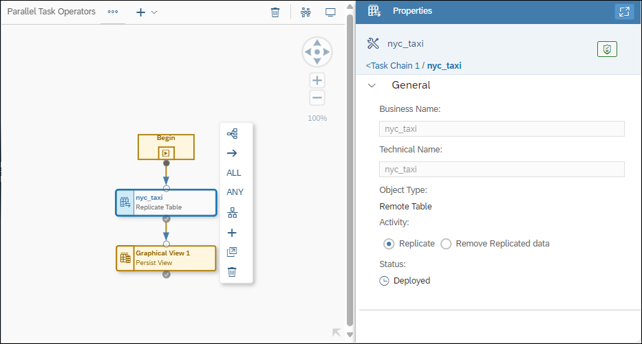
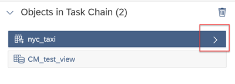
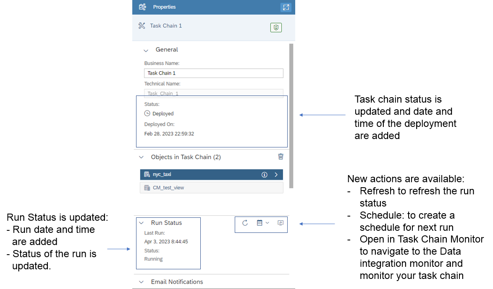

<!-- loiod1afbc2b9ee84d44a00b0b777ac243e1 -->

<link rel="stylesheet" type="text/css" href="../css/sap-icons.css"/>

# Creating a Task Chain

Group multiple tasks into a task chain and run them manually once, or periodically, through a schedule.

<a name="loiod1afbc2b9ee84d44a00b0b777ac243e1__prereq_ccw_sdc_gtb"/>

## Prerequisites

-   The DW Modeler role is required to create task chains, and the additional DW Integrator role is required to set up email notification for completion of task chain runs, and to run the activity *Delete Records with Change Type "Deleted"* in the case of local table with delta capture enabled. For more information, see [Standard Roles Delivered with SAP Datasphere](https://help.sap.com/viewer/935116dd7c324355803d4b85809cec97/DEV_CURRENT/en-US/a50a51d80d5746c9b805a2aacbb7e4ee.html "SAP Datasphere is delivered with several standard roles. A standard role includes a predefined set of privileges and permissions.") :arrow_upper_right:. In addition to these two role privileges, when setting up email notifications, either the Team.Read or User.Read privilege is also required to display and add notification recipients from a list of current tenant members. See [Privileges and Permissions](https://help.sap.com/viewer/935116dd7c324355803d4b85809cec97/DEV_CURRENT/en-US/d7350c6823a14733a7a5727bad8371aa.html "A privilege represents a task or an area in SAP Datasphere and can be assigned to a specific role. The actions that can be performed in the area are determined by the permissions assigned to a privilege.") :arrow_upper_right:.

-   For SAP HANA Open SQL schema procedures to be available for users to include in a task chain, the schema’s owner must grant EXECUTE privileges to the space user for objects in the Open SQL schema. See [Allow the Space to Access the Open SQL Schema](https://help.sap.com/viewer/9f36ca35bc6145e4acdef6b4d852d560/DEV_CURRENT/en-US/7eaa370fe4624dea9f182ee9c9ab645f.html "To grant the space write privileges in the Open SQL schema and the ability to write data to target tables in the schema, use the GRANT_PRIVILEGE_TO_SPACE stored procedure. Once this is done, data flows running in the space can select tables in the Open SQL schema as targets and write data to them, and task chains can run procedures in the schema.") :arrow_upper_right:.
-   Objects must have been already deployed, so that they can be added to the task chain. Task chains must also be deployed to allow selection of tenant users or specify email addresses for notification of task chain completion.

-   Persisting of views may include one parameter that uses the default value defined with the view. Views must not have data access controls assigned to them.

-   If a data flow that has input parameters is included in a task chain, task chain runs will use default parameter values defined for the data flow.
-   A replication flow can be included in a task chain if all objects in the flow have load type *Initial Only*.

## Context

You can create task chains that include SAP Datasphere repository objects, that is, Remote Tables and Views, Intelligent Lookup, Data Flow, Replication Flow \(load type *Initial Only*\), and Transformation Flow runs. You can also include non-repository objects such as SAP HANA Open SQL schema procedures. In addition, you can nest other existing task chains in new or different task chains.

> ### Note:  
> For remote table and view objects included in a task chain, you have the option, by default, to replicate or persist the data associated with the corresponding remote tables or views. Or, you can choose to remove the replicated or persisted data by selecting that option in the *Activities* section of an object’s *Properties* detail display.
> 
> -   For remote tables, if you choose the *Remove Replicated Data* option and the remote table object already has data replicated using Snapshot Replication, the replicated data will be removed and the data will be read directly from the remote source and no longer from the repository. For more information, see [Replicating Data and Monitoring Remote Tables](https://help.sap.com/viewer/9f36ca35bc6145e4acdef6b4d852d560/DEV_CURRENT/en-US/4dd95d7bff1f48b399c8b55dbdd34b9e.html "In the Remote Tables monitor, you can find a remote table monitor per space. Here, you can copy data from remote tables that have been deployed in your space into SAP Datasphere, and you can monitor the replication of the data. You can copy or schedule copying the full set of data from the source, or you can set up replication of data changes in real-time via change data capturing (CDC).") :arrow_upper_right:. If the data is being replicated via Real Time Replication, the data will also be removed and the object’s data access method will be changed to Remote access. \(A log message will be displayed in the remote table's log to indicate that the data access type has been changed when the remote table object is run.\)
> 
> -   For views, if you choose the *Remove Persisted Data* option, data persistence will be removed and the view data will be read from the remote source and no longer from the repository. For more information, see [Persisting and Monitoring Views](https://help.sap.com/viewer/9f36ca35bc6145e4acdef6b4d852d560/DEV_CURRENT/en-US/9af04c990f294fd28c00f46763dd8b0d.html "From Data Integration Monitor > > Views , you can monitor views that have been created in the Data Builder. You can persist these views (direct run or via a schedule) to make them available locally to improve the performance when accessing your data. You can monitor the existing persisted views to keep control of your data sizing and free up memory space.") :arrow_upper_right:.
> 
> If replication and data removal tasks are both attempted to run at the same time, the tasks are given priority based on a first-come, first served basis.

When creating a task chain, you can create linear task in which one task is run after another. A succeeding task is only run once the previous task in the series has finished successfully with a *completed* status. The running of tasks in the series will not resume if the previous task has a *failed* status. You can also create task chains in which individual tasks are run in parallel and successful continuation of the entire task chain run depends on whether ANY or ALL parallel tasks are completed successfully.

> ### Note:  
> For optimal performance, it is recommended that you consider staggering the scheduled run time of tasks such as data flows and task chains that may contain these tasks. There is a limit on how many tasks can be started at the same time. If you come close to this limit, scheduled task runs may be delayed and, if you go beyond the limit, some scheduled task runs might even be skipped.

When creating or editing a task chain, you can also set up email notification for deployed task chains to notify selected users of task chain completion. After deploying a task chain, you can add tenant users or email addresses to notify individuals when task chain runs are completed.

You can monitor the status of task chain runs from the Data Integration Monitor. For more information, see [Monitoring Task Chains](https://help.sap.com/viewer/9f36ca35bc6145e4acdef6b4d852d560/DEV_CURRENT/en-US/4142201ec1aa49faad89a688a2f1852c.html "Monitor the status and progress of running and previously run task chains.") :arrow_upper_right:.

> ### Note:  
> Exporting and importing task chains via the  \(*Transport*\) app may not be supported for SAP Datasphere tenants provisioned prior to version 2021.03. To request the migration of your tenant, see SAP note [3268282](https://launchpad.support.sap.com/#/notes/3268282).

## Procedure

1.  From the *Data Builder*, click *New Task Chain*.

2.  From the left-side panel, drag and drop a first object on to the task chain canvas from those available in the repository \(from the *Repository* tab\), or non-repository objects \(selected from the *Others* tab\).

    > ### Note:  
    > From the *Repository* tab, you can see the remote tables, views, intelligent lookups, data flow, replication flow, and transformation flow objects that meet prerequisites and are available to be added to the task chain. From the *Others* tab, you can see the non-repository Open SQL schema procedures you can add to a task chain. For more information on adding Open SQL schema procedures from the *Others* tab, see [Running Open SQL Procedures in a Task Chain](running-open-sql-procedures-in-a-task-chain-59b9c77.md).
    > 
    > For remote tables, if you choose the *Remove Replicated Data* option and the remote table object already has data replicated using Snapshot Replication, that data will be removed. If the data is being replicated via Real Time Replication, and you choose the *Remove Replicated Data* option, that table's data will also be removed and the object’s data access method will be changed to Remote access. For views, if you choose the *Remove Persisted Data* option, that view's data will be removed.

3.  Drag a second object on to the first object in the task chain. As you drag the object over the top of the first object, a context menu displays options *Add as New Task* \(the default\), *Replace Existing*, or *Add as Parallel* to place the new object.

    Choosing the *Add as New Task* option automatically connects the new object task to the previous object task. The properties panel for the task chain is also updated with the added objects.

4.  Continue adding remaining object tasks you want to include in the task chain.

    In addition to adding or replacing object tasks in a task chain, you can drag objects already on the task chain canvas to change the order in which tasks are run.

5.  In the properties panel, specify a name for the task chain.

    

    Task chain properties:

    <table>
    <tr>
    <th valign="top">

    Properties
    
    </th>
    <th valign="top">

    Comments
    
    </th>
    </tr>
    <tr>
    <td valign="top">
    
    Business Name
    
    </td>
    <td valign="top">
    
    Enter a descriptive name to help users identify the object. This name can be changed at any time. 
    
    </td>
    </tr>
    <tr>
    <td valign="top">
    
    Technical Name
    
    </td>
    <td valign="top">
    
    Displays the name used in scripts and code, synchronized by default with the *Business Name*. 
    
    </td>
    </tr>
    <tr>
    <td valign="top">
    
    Package
    
    </td>
    <td valign="top">
    
    Select the package to which the object belongs. 

    Packages are used to group related objects in order to facilitate their transport between tenants.

    > ### Note:  
    > Once a package is selected, it cannot be changed here. Only a user with the DW Space Administrator role \(or equivalent privileges\) can modify a package assignment in the *Packages* editor.

    For more information, see [Creating Packages to Export](https://help.sap.com/viewer/9f36ca35bc6145e4acdef6b4d852d560/DEV_CURRENT/en-US/24aba84ceeb3416881736f70f02e3a0a.html "Users with the DW Space Administrator role can create packages to model groups of related objects for transport between tenants. Modelers can add objects to packages via the Package field, which appears in editors when a package is created in their space. Once a package is complete and validated, the space administrator can export it to the Content Network. The structure of your package is preserved and, as the objects it contains evolve, you can easily export updated versions of it.") :arrow_upper_right:.
    
    </td>
    </tr>
    <tr>
    <td valign="top">
    
    Status
    
    </td>
    <td valign="top">
    
    Displays the deployment status of the task chain: it can be deployed, not deployed, or changes to deploy.
    
    </td>
    </tr>
    <tr>
    <td valign="top">
    
    Objects in Task Chain
    
    </td>
    <td valign="top">
    
    Displays all objects that have been added to the task chain.
    
    </td>
    </tr>
    <tr>
    <td valign="top">
    
    Run Status
    
    </td>
    <td valign="top">
    
    Displays the current run status of the task chain: Not run yet, running, failed, or completed.
    
    </td>
    </tr>
    <tr>
    <td valign="top">
    
    Email Notifications
    
    </td>
    <td valign="top">
    
    Set up email notification for task chain run completion.
    
    </td>
    </tr>
    </table>
    
    When you click on one of the task chain objects, the properties for this selected task object is displayed in the properties panel:

    

    Note that you can also access the details of each task chain object in the task chain properties panel. Select the relevant object in the object list and click :

    

    Task chain object properties:

    <table>
    <tr>
    <th valign="top">

    Properties
    
    </th>
    <th valign="top">

    Comments
    
    </th>
    </tr>
    <tr>
    <td valign="top">
    
    Business Name
    
    </td>
    <td valign="top">
    
    Name of the object
    
    </td>
    </tr>
    <tr>
    <td valign="top">
    
    Technical Name
    
    </td>
    <td valign="top">
    
    Technical name of the object
    
    </td>
    </tr>
    <tr>
    <td valign="top">
    
    Object Type
    
    </td>
    <td valign="top">
    
    A remote table, view, intelligent lookup, data flow, local table, replication flow \(load type *Initial Only*\), or transformation flow.
    
    </td>
    </tr>
    <tr>
    <td valign="top">
    
    Activity
    
    </td>
    <td valign="top">
    
    Activity that will be triggered by the task chain:

    -   Remote table - Replicate

    -   View - Persist
    -   Intelligent lookup - Run
    -   Data flow - Run
    -   Replication Flow - Run
    -   Transformation flow - Run
    -   Local table - Delete Records with Change Type "Deleted"

    > ### Note:  
    > For remote table and view objects included in a task chain, the default option lets you replicate or persist the data associated with the remote table or view respectively. Or, you can choose to remove the replicated or persisted data.
    > 
    > -   For remote tables, if you choose the *Remove Replicated Data* option and the remote table object already has data replicated using Snapshot Replication, that table's data will be removed. If the data is being replicated via Real Time Replication, the table's data will also be removed and the object’s data access method will be changed to Remote access. \(A log message will be displayed in the remote table log to indicate that the data access type has been changed when the remote table object is run.\)
    > 
    > -   For views, if you choose the *Remove Persisted Data* option, that view's data will be removed.

    
    </td>
    </tr>
    <tr>
    <td valign="top">
    
    Status
    
    </td>
    <td valign="top">
    
    Deployment status of the task chain: it can be deployed, not deployed, or changes to deploy
    
    </td>
    </tr>
    </table>
    
    > ### Note:  
    > When you select an object, you can delete it from the task chain or navigate to the corresponding editor for that object.

6.  When you’ve finished adding objects to the task chain, save and deploy your new task chain.

    The properties of your task chain are updated.

    

    > ### Note:  
    > SAP Datasphere allows you to save task chains that may have unconnected task objects on the canvas. However, you will not be able to deploy and run them until all task objects are connected to define their order of execution when the task chain is run.

    After creating and deploying a task chain, you can optionally set up email notification for completion of task chain runs. For more information, see [Configuring Email Notification](configuring-email-notification-7ff6a4e.md).

    After you've finished making changes and optionally setting up email notification for the task chain, you can then run the task chain or create a schedule to run your task chain periodically, and navigate to the *Task Chains* monitor to check your task chain runs. For more information, see [Scheduling Data Integration Tasks](https://help.sap.com/viewer/9f36ca35bc6145e4acdef6b4d852d560/DEV_CURRENT/en-US/7fa07621d9c0452a978cb2cc8e4cd2b1.html "Schedule data integration tasks to run periodically at a specified date or time.") :arrow_upper_right: and [Monitoring Task Chains](https://help.sap.com/viewer/9f36ca35bc6145e4acdef6b4d852d560/DEV_CURRENT/en-US/4142201ec1aa49faad89a688a2f1852c.html "Monitor the status and progress of running and previously run task chains.") :arrow_upper_right:.

    Once a task chain run has started, it will continue running as long as possible. Until all tasks in the chain have been completed and are in a non-running state, the task chain itself is considered to be "running". When finished, the overall state or status of the task chain will be reported as “failed” if any task in the chain has "failed". The final status of COMPLETED for a task chain is reported only if all tasks are COMPLETED.

    When a task chain is run that includes a parallel task chain branch, all the branch tasks are triggered to be run in parallel. The ANY or ALL condition applied to the branch specifies whether ANY or ALL branch tasks must be completed successfully to continue running remaining tasks in the chain.

    After finishing a task chain run that includes one or more parallel task branches, it may be possible that one or more tasks may be reported in an error state \(in each branch\). For example, in branches where completion of tasks is evaluated with the ANY operator. In that case, if you restart or retry the task chain, SAP Datasphere will then restart previously-failed tasks and run all subsequent tasks that had not yet run. In particular, this means that if a failed task is in a parallel branch which was evaluated with the ANY operator, those tasks in the same branch which had run successfully will not be run again. Only those tasks that have failed will be retried or run again.

7.  The tools in the editor toolbar help you work with your object throughout its lifecycle:

    <table>
    <tr>
    <th valign="top">

    Tool
    
    </th>
    <th valign="top">

    Description
    
    </th>
    </tr>
    <tr>
    <td valign="top">
    
     \(Save\)
    
    </td>
    <td valign="top">
    
    Save your changes to the design-time repository. You can use *Save As* to create a copy of the object. 

    See [Saving and Deploying Objects](../saving-and-deploying-objects-7c0b560.md).
    
    </td>
    </tr>
    <tr>
    <td valign="top">
    
     \(Deploy\)
    
    </td>
    <td valign="top">
    
    Deploy your changes to make them available in the run-time environment.

    See [Saving and Deploying Objects](../saving-and-deploying-objects-7c0b560.md).
    
    </td>
    </tr>
    <tr>
    <td valign="top">
    
     \(Run\)
    
    </td>
    <td valign="top">
    
    Run the object to obtain or update its output results.

    You must deploy the object before you can run it.
    
    </td>
    </tr>
    <tr>
    <td valign="top">
    
     \(Source Browser\)
    
    </td>
    <td valign="top">
    
    Show the *Source Browser* panel to drag objects into the task chain. 

    See [Using the Source Browser](../using-the-source-browser-7d2b21d.md).
    
    </td>
    </tr>
    <tr>
    <td valign="top">
    
     \(Undo\) /  \(Redo\)
    
    </td>
    <td valign="top">
    
    Revert the last change to the object or redo a change you have previously undone.
    
    </td>
    </tr>
    <tr>
    <td valign="top">
    
     \(Impact and Lineage Analysis\)
    
    </td>
    <td valign="top">
    
    Open the *Impact and Lineage Analysis* graph for the object. 

    See [Impact and Lineage Analysis](../impact-and-lineage-analysis-9da4892.md).
    
    </td>
    </tr>
    </table>
    

