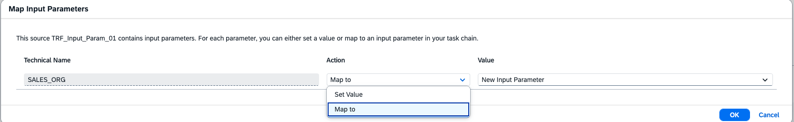
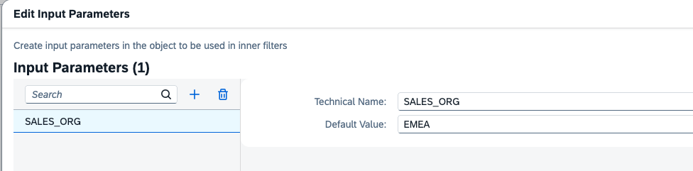
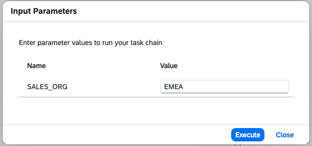
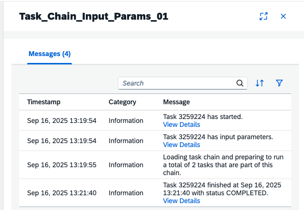

<!-- loioc9906ec515f04fbd9589c59339b03c6c -->

<link rel="stylesheet" type="text/css" href="../css/sap-icons.css"/>

# Creating Input Parameters in Task Chains

You can define input parameters on the task level of task chains. You can also create new input parameters in task chains. This will allow for more flexible usage of task chains and nested task chains.

<a name="loioc9906ec515f04fbd9589c59339b03c6c__prereq_s2x_dby_mgc"/>

## Prerequisites

To create input parameters in task chains, you need to have the correct authorizations required to create and run task chains. For more information see [Creating a Task Chain](creating-a-task-chain-d1afbc2.md).

<a name="loioc9906ec515f04fbd9589c59339b03c6c__context_ejw_hdx_4gc"/>

## Context

You can create new input parameters on the task chain level. You can also define values for input parameters on the task level or map source object input parameters to the task chain.

To utilize input parameters in task chains, you must have task objects that have input parameters added at the source level of the task. You can use SQL script procedures with input parameters, transformation flows with input parameters, and you can nest a task chain with input parameters described in the following process. For more information see [Creating a Transformation Flow](../creating-a-transformation-flow-f7161e6.md), [Run Open SQL Procedures in a Task Chain](run-open-sql-procedures-in-a-task-chain-59b9c77.md) and [Nest and Share Task Chains](nest-and-share-task-chains-8067b77.md).

Create a new input parameter on the task chain level. This will allow you to create a simple task chain with input parameters. This task chain can be used as an object to be nested in future task chains to create nested task chains with input parameters.

Define input parameters on the task level. You can set values of the input parameters from the source on the task level. You can also map these set input parameters to the task chain level.

Define different values for the input parameters on the task level and the task chain levels to create more flexibility.

## Procedure

1.  Create a new task chain.

2.  Create a new input parameter in the task chain from the task chain properties panel.

    1.  Open your task chains properties panel on the right. Click  \(Input Parameters\) .

    2.  The *Edit Input Parameters* dialog box will open.

    3.  Click  \(Add\) to create a new input parameter in the task chain.

    4.  Create a name for the new input parameter in your task chain. You can define a default value at this time. You can also delete the first mapped value and leave only the newly created parameter in the task chain. If not default value is defined, the input parameter will use an empty string \(""\).

    5.  Press *OK*. This will save your parameters and values on the task chain level.

3.  Create input parameters on the task level or create input parameters in a task chain by mapping parameters from source objects.

4.  Drag and drop a task object that supports input parameters in task chains.

    > ### Note:  
    > SQL procedures with input parameters, transformation flows with input parameters, and task chains with input parameters are supported objects.

5.  If the source is an object containing one or more input parameters, the *Map Input Parameters* dialog is displayed, and you must decide how each input parameter will be processed:

    <table>
    <tr>
    <th valign="top">

    Property
    
    </th>
    <th valign="top">

    Description
    
    </th>
    </tr>
    <tr>
    <td valign="top">
    
    *Technical Name*
    
    </td>
    <td valign="top">
    
    \[read-only\] The technical names of input parameters created in the task source cannot be modified.
    
    </td>
    </tr>
    <tr>
    <td valign="top">
    
    *Action*
    
    </td>
    <td valign="top">
    
    Choose from the drop down list how you want to process each source task.

    -   *Map To* - Map the source input parameter to the task chain. You can select an existing input parameter or create a new one.

        You will need to provide a value for the input parameter to be mapped to the task chain level.

    -   *Set Value* - Enter a value to resolve the input parameter. This will set a value for the input parameter on the task level.

    > ### Note:  
    > You can click *Cancel* in the dialog and not map the input parameters immediately, but then an error is displayed on the source, and you must subsequently map them in the source side panel *Input Parameters* section.

    
    </td>
    </tr>
    <tr>
    <td valign="top">
    
    *Value*
    
    </td>
    <td valign="top">
    
    Define option depending on the *Action* chosen.

    -   *Map To*: Choose an option from the drop down list.

        Map the existing input parameter to the task chain. This will create a new input parameter with the same name as the imported input parameter. The technical name will be shown.

    -   > ### Note:  
        > The first mapped parameter will be a new input parameter with the same name as the source input parameter name. After the first mapped input parameter, you will have the option to create a new input parameter or map to the existing input parameter created.

    -   *Set Value*: Set a value for the input parameter on the task level.

    
    </td>
    </tr>
    </table>
    
    

6.  Press *OK*. This will save your mapped or value options on the task level.

    > ### Note:  
    > The input parameter technical name and set value will show up in the properties panel on the right on the object task level.

7.  View the task chain properties panel. You will see the mapped input parameter on the task chain level. It will have the same name and value.

8.  You can edit the default value of the mapped parameter in the task chain. You can also add a new input parameter. Click on the input parameter  \(Input Parameters\)to view and edit details. The *Edit Input Parameters* pop up will open. You can keep the default value or change the default value in the *Default Value* field. You can also click  \(Add\) to create a new input parameter in the task chain.

9.  After you have finished adding objects to your task chain, save the task chain. Give the task chain a name and click *Save*.

10. Deploy and run the task chain. For more information, see [Run a Task Chain](run-a-task-chain-684bd8b.md).

    > ### Note:  
    > If you have deployed a task chain with input parameters, you will see a new *Input Parameters* pop up that will show your input parameters and their default values. Click *Execute*.
    > 
    > Optional: You can keep the default value or change the value of your input parameters before executing the task chain by changing the value in the pop up box.

    

11. View the status of your task chain by going to *Data Integration Monitor* \> *Task Chains*. For more information, see [Monitoring Task Chains](https://help.sap.com/viewer/be5967d099974c69b77f4549425ca4c0/cloud/en-US/4142201ec1aa49faad89a688a2f1852c.html "Monitor the status and progress of running and previously run task chains.") :arrow_upper_right:.

    > ### Note:  
    > In the messages panel on the right, you can see click *View Details* to see the values of the input parameters in your task chain.

    

12. Use task chains with input parameters to create nested task chains with input parameters. This is similar to the process above.

    1.  Drag and drop a task chain \(object\) with input parameters from the left panel to start a new task chain or add to an existing task chain. For more information about nested task chains see [Nest and Share Task Chains](nest-and-share-task-chains-8067b77.md),

    2.  The *Map Input Parameter* dialog box will pop up. You will see the original parameter name. Choose your *Action* and *Value*.

    3.  Follow the normal protocol for using objects with input parameters in task chains noted above.

    > ### Note:  
    > -   If you created a new input parameter in your previous task chain, you can map to this new parameter. If a value was not defined, you can choose to define a value.
    > -   If no value is defined, the input parameter will use an empty string \(""\).

    > ### Note:  
    > When working with input parameters with task chains, the parameters from the child task chain are mapped to the parent task chain.

    > ### Caution:  
    > -   If the underlying source task has not defined a default value for the parameter and no value is supplied while adding the task to the task chain, the execution of the task may fail due to the absence of a parameter value.
    > -   Input parameters are passed to the tasks as strings. You have to use the correct values corresponding to the parameter type on both the task level and the task chain level. For example if your set value is 'Number', you need to enter a numerical default value. Mismatched values may cause the task chain to fail to execute. Defined parameter values can be checked in the task log messages.

