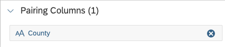

<!-- loio4995ae38c8d14fb3afe8b4ebf796b7c4 -->

# Example: Harmonizing County Data for UK Charging Sites

We have downloaded UK government data on electric vehicle charging sites, which we want to join to our sales data, aggregated by UK county.

Unfortunately, the downloaded data has some missing and inconsistent values for county names, so that many values do not match our master data for counties, and the `County` column cannot be reliably used to aggregate the data by county or join the table to location data. For example, the county `Argyll and Bute` is entered in several different ways in our electric vehicle charging data:

<table>
<tr>
<th valign="top">

Electric Vehicle Charging Entity `County` Column Value

</th>
<th valign="top">

Geo Master Data `County Name` Column

</th>
</tr>
<tr>
<td valign="top">

Argyll

</td>
<td valign="top">

\-

</td>
</tr>
<tr>
<td valign="top">

Argyll & Bute

</td>
<td valign="top">

\-

</td>
</tr>
<tr>
<td valign="top">

Argyll and Bute

</td>
<td valign="top">

Argyll and Bute

</td>
</tr>
</table>

Once we've loaded the raw data into SAP Datasphere:

<table>
<tr>
<th valign="top">

Step

</th>
<th valign="top">

Result

</th>
</tr>
<tr>
<td valign="top">

We create a view to:

-   Remove unneccessary columns
-   Clean up some column names
-   Create a new column to calculate the total wattage available in each station.

</td>
<td valign="top">

  

</td>
</tr>
<tr>
<td valign="top">

We create an intelligent lookup, add our view as the input entity, and set the pairing column to `County`, as this is the column that contains the data that should be joined with our lookup entity.

</td>
<td valign="top">

</td>
</tr>
<tr>
<td valign="top">

We add our `Geo` view as the lookup entity, and select the `County ID` and `County Name` columns as return columns.

</td>
<td valign="top">

</td>
</tr>
<tr>
<td valign="top">

We create a fuzzy rule to compare county names in each entity.

</td>
<td valign="top">

</td>
</tr>
<tr>
<td valign="top">

We deploy and run the intelligent lookup and our rule is able to match just under half the records.

We review and process the remaining records in the *Preview Data* panel.

</td>
<td valign="top">

</td>
</tr>
</table>

