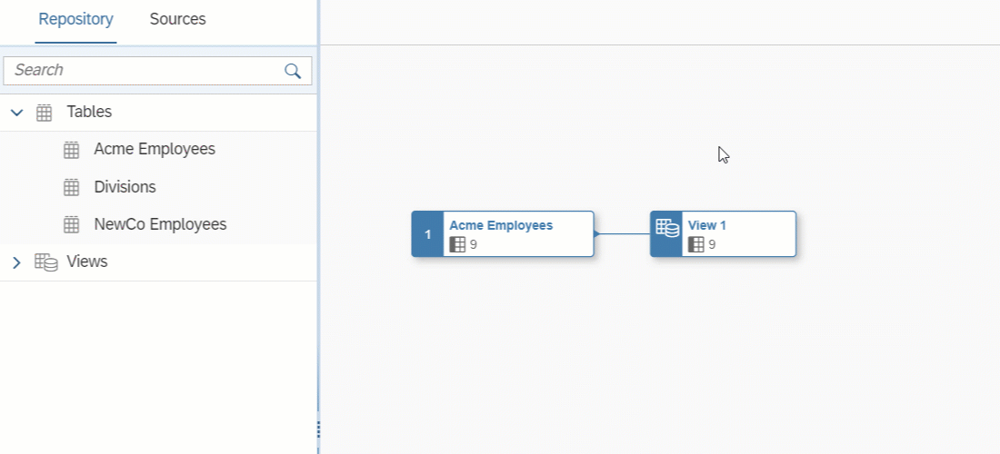

<!-- loio6f6fa18c7c9444da8ca62d76656b7b1a -->

<link rel="stylesheet" type="text/css" href="../css/sap-icons.css"/>

# Filter Data

Add a *Filter* node to filter your data with an SQL expression.

## Procedure

1.  Select an object in order to display its context tools, and click  Filter.

    

    A filter node is created, its symbol is selected, and its properties are displayed in the side panel.

2.  Optional. Rename the node in its side panel to clearly identify it. This name can be changed at any time and can contain only alphanumeric characters and underscores.

3.  Enter a SQL expression into the *Expression* field. You can use the following items in your SQL expression:

    -   *Insert Values* - Click to open the *Insert Value* dialog:

        > ### Note:  
        > -   The button is enabled when, in the *Expression* field, a column name is followed by the operator `=`, `>`, `<`, `!=`, `IN`, `BETWEEN`, or `LIKE`. Values from the selected column are listed in the *Insert Value* dialog.
        > 
        > -   You can insert values of the data types string, interger, boolean, date, and time. The data types binary and UUID aren't supported.

        Select available value\(s\) and click *Insert* to add them to your expression.

    -   *Functions* - Browse, select a category, or filter available functions \(see [SQL Functions Reference](sql-functions-reference-6d624a1.md)\). Click a function name to see its syntax or click elsewhere in its token to add it to your expression.
    -   *Columns* - Browse or filter available columns. Click a column name to see its properties or click elsewhere in its token to add it to your expression.
    -   *Parameters* - Browse or filter available input parameters \(see [Create an Input Parameter](create-an-input-parameter-53fa99a.md)\). Click a parameter name to see its properties or click elsewhere in its token to add it to your expression.
    -   *Other* - Browse available operators, predicates, and case expressions, and click one to add it to your expression \(see [SQL Reference](sql-reference-6a37cc5.md)\).

    For example, if you want to list only those products with 10 units or less in stock, enter `Units_on_hand <= 10` 

    When working on a large expression, click  \(Enter Full Screen\) to expand the expression editor.

4.  Click *Validate* to check if your expression is semantically correct, and fix any errors signaled. You can reference columns by name as well as HANA functions, operators, predicates, and case expressions.

5.  Click  \(Preview Data\) to open the *Data Preview* panel and review the data output by this node. For more information, see [Viewing or Previewing Data in Data Builder Objects](viewing-or-previewing-data-in-data-builder-objects-b338e4a.md).

