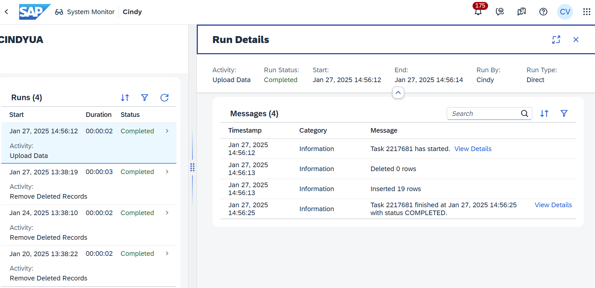
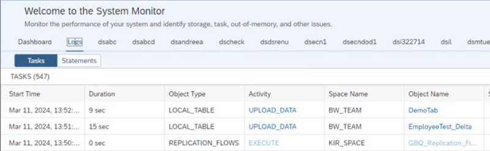

<!-- loio870401f211f94132909bd9f2fafd91b2 -->

<link rel="stylesheet" type="text/css" href="../css/sap-icons.css"/>

# Load or Delete Local Table Data

You can upload data from a CSV file to a local table. .You can also delelete records from your table.

<a name="loio870401f211f94132909bd9f2fafd91b2__section_kzs_fvw_mzb"/>

## Loading Local Table Data

From the toolbar, select *Edit* \> ** \(Upload Data From CSV File\).

> ### Note:  
> You must have the standard *DW Modeler* role to use this tool. For more information, see [Roles and Privileges by App and Feature](https://help.sap.com/viewer/935116dd7c324355803d4b85809cec97/DEV_CURRENT/en-US/2d8b7d04dcae402f911d119437ce0a74.html "Review the standard roles and the privileges needed to access apps, tools, and other features of SAP Datasphere.") :arrow_upper_right: 

Select your CSV file and follow the instructions.

> ### Note:  
> The file extension must be \*.csv. The file size must not exceed 25MB.

The following options are available:

-   Select the *Delete Existing Data Before Upload* option if appropriate.

-   Select *Use first row as column header* if your file contains column headers in its first line.
-   Next to *Insert missing string value as*, select *Empty value* or *NULL* before adding a record. All new empty values are stored as the selected value.
-   Select the character used to signify the boundary between columns in *CSV Delimiter*. In general, the default value `Auto-detect` is sufficient.

Review the matching of columns in your table with those in your CSV file.

> ### Note:  
> This data upload does not support the data transformations available when creating a table from a CSV file \(see [Creating a Local Table from a CSV File](creating-a-local-table-from-a-csv-file-8bba251.md)\).
> 
> The data in your CSV file must match the table structure, including respecting all data types and structures.
> 
> Date and time format support in this data upload is restricted as follows:
> 
> -   Date columns: `YYYY-MM-DD`, `YYYY/MM/DD`, `YYYY/MM-DD`, `YYYY-MM/DD`, or `YYYYMMDD`
> -   Time columns: `HH:MI:SS` or `HH24:MI[:SS]` 
> -   Date time columns: `YYYY-MM-DD HH:MI:SS`

Once the load action is completed, you can click on the notification from the notification area to navigate to the detailed log:

Alternatively, you can navigate to the detailed logs via the menu System Monitor -\> Task Logs:

<a name="loio870401f211f94132909bd9f2fafd91b2__section_qdq_nvw_mzb"/>

## Deleting Local Table Records

To delete records, select from the toolbar,  \(Delete Data From Table\).

> ### Caution:  
> To delete records, you must have the role *DW Integrator* or *DW Administrator*.

Depending if your local table is delta enabled or not, you will have different options. In the case of a table that is not delta enabled, you can delete all records contained in the table. In the case of a table that is delta capture enabled, you can choose between 3 options:

### Option 1: Delete All Records

\[Table with or without delta capture\] This option allows you to delete all records from the table, no matter if they are used by other apps or not. It's up to you to check if the data you are about to delete have dependencies.

### Option 2: Delete All Records \(Mark as “Deleted”\)

\[Delta capture table only\]. This option doesn't physically delete the records. They will be marked as to be deleted \(they take the Change Type “D”\) but these records can still be processed by other apps until you decide to permanently delete them.

### Delete all records marked for deletion which are older than the specified number of days

\[Delta capture table only\] If your table is delta capture enabled, when a record is deleted, it’s marked as deleted so that it won’t be visible in consuming \(view\) models, but it’s not physically deleted from the database. Indeed such deletion records from local tables with delta capture are considered by flows that are using the load type *Initial and Delta*. The records marked as deleted can’t be physically deleted until they have been processed by these flows. For more information, see [Capturing Delta Changes in Your Local Table](capturing-delta-changes-in-your-local-table-154bdff.md). Once this is given, selecting this option allows you to safely delete records already fully-processed. You also define a retention period.Once this is given, selecting this option allows you to safely delete records already fully-processed according to the retention period you've defined. Default retention period is 90 days.

> ### Example:  
> Today, it's January 13, 2025. I have the following table where 5 records have been marked for deletion. To make it easier, we will consider that all records have been fully-processed by other apps and are candidates for deletion:
> 
> 
> <table>
> <tr>
> <th valign="top">
> 
> Employee ID
> 
> </th>
> <th valign="top">
> 
> Employee Name
> 
> </th>
> <th valign="top">
> 
> Employee First Name
> 
> </th>
> <th valign="top">
> 
> Age
> 
> </th>
> <th valign="top">
> 
> Position
> 
> </th>
> <th valign="top">
> 
> Change Date
> 
> </th>
> <th valign="top">
> 
> Change Type
> 
> </th>
> </tr>
> <tr>
> <td valign="top">
> 
> I003963
> 
> </td>
> <td valign="top">
> 
> SMITH
> 
> </td>
> <td valign="top">
> 
> Emma
> 
> </td>
> <td valign="top">
> 
> 45
> 
> </td>
> <td valign="top">
> 
> Manager
> 
> </td>
> <td valign="top">
> 
> January 2, 2025
> 
> </td>
> <td valign="top">
> 
> I
> 
> </td>
> </tr>
> <tr>
> <td valign="top">
> 
> I005939
> 
> </td>
> <td valign="top">
> 
> RIVIERA
> 
> </td>
> <td valign="top">
> 
> Olivier
> 
> </td>
> <td valign="top">
> 
> 20
> 
> </td>
> <td valign="top">
> 
> Employee
> 
> </td>
> <td valign="top">
> 
> September 2, 2024
> 
> </td>
> <td valign="top">
> 
> I
> 
> </td>
> </tr>
> <tr>
> <td valign="top">
> 
> I297820
> 
> </td>
> <td valign="top">
> 
> SANCHEZ
> 
> </td>
> <td valign="top">
> 
> Liam
> 
> </td>
> <td valign="top">
> 
> 32
> 
> </td>
> <td valign="top">
> 
> Employee
> 
> </td>
> <td valign="top">
> 
> January 2, 2025
> 
> </td>
> <td valign="top">
> 
> U
> 
> </td>
> </tr>
> <tr>
> <td valign="top">
> 
> I205939
> 
> </td>
> <td valign="top">
> 
> GONZALEZ
> 
> </td>
> <td valign="top">
> 
> Olivia
> 
> </td>
> <td valign="top">
> 
> 18
> 
> </td>
> <td valign="top">
> 
> Employee
> 
> </td>
> <td valign="top">
> 
> January 2, 2025
> 
> </td>
> <td valign="top">
> 
> I
> 
> </td>
> </tr>
> <tr>
> <td valign="top">
> 
> I133939
> 
> </td>
> <td valign="top">
> 
> MARSHALL
> 
> </td>
> <td valign="top">
> 
> Emily
> 
> </td>
> <td valign="top">
> 
> 33
> 
> </td>
> <td valign="top">
> 
> Employee
> 
> </td>
> <td valign="top">
> 
> January 2, 2025
> 
> </td>
> <td valign="top">
> 
> D
> 
> </td>
> </tr>
> <tr>
> <td valign="top">
> 
> I065394
> 
> </td>
> <td valign="top">
> 
> DOWN
> 
> </td>
> <td valign="top">
> 
> Anna
> 
> </td>
> <td valign="top">
> 
> 39
> 
> </td>
> <td valign="top">
> 
> Employee
> 
> </td>
> <td valign="top">
> 
> Semptember 2, 2024
> 
> </td>
> <td valign="top">
> 
> I
> 
> </td>
> </tr>
> <tr>
> <td valign="top">
> 
> I055563
> 
> </td>
> <td valign="top">
> 
> JOHNSON
> 
> </td>
> <td valign="top">
> 
> Jayden
> 
> </td>
> <td valign="top">
> 
> 46
> 
> </td>
> <td valign="top">
> 
> EMPLOYEE
> 
> </td>
> <td valign="top">
> 
> October 10, 2024
> 
> </td>
> <td valign="top">
> 
> I
> 
> </td>
> </tr>
> <tr>
> <td valign="top">
> 
> I135693
> 
> </td>
> <td valign="top">
> 
> WILLIAMS
> 
> </td>
> <td valign="top">
> 
> Henri
> 
> </td>
> <td valign="top">
> 
> 50
> 
> </td>
> <td valign="top">
> 
> Employee
> 
> </td>
> <td valign="top">
> 
> September 2, 2024
> 
> </td>
> <td valign="top">
> 
> U
> 
> </td>
> </tr>
> <tr>
> <td valign="top">
> 
> I326981
> 
> </td>
> <td valign="top">
> 
> BROWN
> 
> </td>
> <td valign="top">
> 
> Isabella
> 
> </td>
> <td valign="top">
> 
> 28
> 
> </td>
> <td valign="top">
> 
> Employee
> 
> </td>
> <td valign="top">
> 
> September 2, 2024
> 
> </td>
> <td valign="top">
> 
> I
> 
> </td>
> </tr>
> <tr>
> <td valign="top">
> 
> I013598
> 
> </td>
> <td valign="top">
> 
> JONES
> 
> </td>
> <td valign="top">
> 
> Noah
> 
> </td>
> <td valign="top">
> 
> 29
> 
> </td>
> <td valign="top">
> 
> Employee
> 
> </td>
> <td valign="top">
> 
> November 2, 2024
> 
> </td>
> <td valign="top">
> 
> D
> 
> </td>
> </tr>
> <tr>
> <td valign="top">
> 
> I003645
> 
> </td>
> <td valign="top">
> 
> MILLER
> 
> </td>
> <td valign="top">
> 
> Madison
> 
> </td>
> <td valign="top">
> 
> 36
> 
> </td>
> <td valign="top">
> 
> Employee
> 
> </td>
> <td valign="top">
> 
> November 2, 2024
> 
> </td>
> <td valign="top">
> 
> D
> 
> </td>
> </tr>
> <tr>
> <td valign="top">
> 
> I695313
> 
> </td>
> <td valign="top">
> 
> DEVIS
> 
> </td>
> <td valign="top">
> 
> Amelia
> 
> </td>
> <td valign="top">
> 
> 34
> 
> </td>
> <td valign="top">
> 
> Employee
> 
> </td>
> <td valign="top">
> 
> October 10, 2024
> 
> </td>
> <td valign="top">
> 
> D
> 
> </td>
> </tr>
> <tr>
> <td valign="top">
> 
> I000036
> 
> </td>
> <td valign="top">
> 
> GARCIA
> 
> </td>
> <td valign="top">
> 
> Chloe
> 
> </td>
> <td valign="top">
> 
> 46
> 
> </td>
> <td valign="top">
> 
> Manager
> 
> </td>
> <td valign="top">
> 
> October 10, 2024
> 
> </td>
> <td valign="top">
> 
> D
> 
> </td>
> </tr>
> </table>
> 
> Now let's say that I want to delete records marked for deletion for more than 60 days. As a result, 4 on the 5 records that have change type "D"" will be deleted, considering that record “ Marshall” was marked as deleted on January 2, 2025.

> ### Note:  
> You can automate the deletion of those records using a scheduling option within a task chain.
> 
> For more information, see [Creating a Task Chain](creating-a-task-chain-d1afbc2.md).

