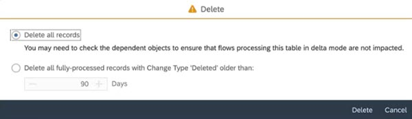
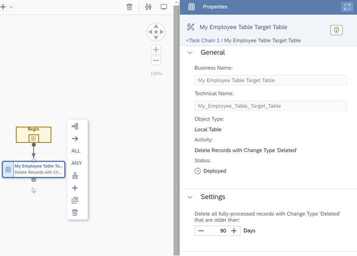

<!-- loio870401f211f94132909bd9f2fafd91b2 -->

<link rel="stylesheet" type="text/css" href="../css/sap-icons.css"/>

# Load or Delete Local Table Data

You can upload data from a CSV file to a local table. You can also delete all data from the table or in case of table with delta capture enabled, delete records that have already fully processed..

<a name="loio870401f211f94132909bd9f2fafd91b2__section_kzs_fvw_mzb"/>

## Loading Local Table Data

From the toolbar, select *Edit* \> ** \(Upload Data From CSV File\).

> ### Note:  
> You must have the standard *DW Modeler* role to use this tool. For more information, see [Roles and Privileges by App and Feature](https://help.sap.com/viewer/935116dd7c324355803d4b85809cec97/DEV_CURRENT/en-US/2d8b7d04dcae402f911d119437ce0a74.html "Review the standard roles and the privileges needed to access apps, tools, and other features of SAP Datasphere.") :arrow_upper_right: 

Select your CSV file and follow the instructions.

> ### Note:  
> The file extension must be \*.csv. The file size must not exceed 25MB.

The following options are available:

-   Select the *Delete Existing Data Before Upload* option if appropriate.

-   Select *Use first row as column header* if your file contains column headers in its first line.
-   Next to *Insert missing string value as*, select *Empty value* or *NULL* before adding a record. All new empty values are stored as the selected value.
-   Select the character used to signify the boundary between columns in *CSV Delimiter*. In general, the default value `Auto-detect` is sufficient.

Review the matching of columns in your table with those in your CSV file.

> ### Note:  
> This data upload does not support the data transformations available when creating a table from a CSV file \(see [Creating a Local Table from a CSV File](creating-a-local-table-from-a-csv-file-8bba251.md)\).
> 
> The data in your CSV file must match the table structure, including respecting all data types and structures.
> 
> Date and time format support in this data upload is restricted as follows:
> 
> -   Date columns: `YYYY-MM-DD`, `YYYY/MM/DD`, `YYYY/MM-DD`, `YYYY-MM/DD`, or `YYYYMMDD`
> -   Time columns: `HH:MI:SS` or `HH24:MI[:SS]` 
> -   Date time columns: `YYYY-MM-DD HH:MI:SS`

<a name="loio870401f211f94132909bd9f2fafd91b2__section_qdq_nvw_mzb"/>

## Deleting Local Table Data

From the toolbar, select  \(Delete Data From Table\).

> ### Caution:  
> To delete data, you must have the role *DW Integrator* or *DW Administrator*.

Depending if your local table is delta enabled or not, you will have different options. In the case of a table that is not delta enabled, you can delete all data. In case your table is delta capture enabled, you can choose between 2 options: delete all records or delete all fully-processed records with change type "Deleted".

### Delete All Records

This option allows you to delete all records from the table, no matter if they are used by other apps or not. It's up to you to check if the data you are about to delete have dependencies.

### Delete All Fully-Processed Records with Change Type "Deleted"

If your table is delta capture enabled, when a record is deleted, it’s marked as deleted so that it won’t be visible in consuming \(view\) models, but it’s not physically deleted from the database. Indeed such deletion records from local tables with delta capture are considered by flows that are using the load type *Initial and Delta*. The records marked as deleted can’t be physically deleted until they have been processed by these flows. For more information, see [Capturing Delta Changes in Your Local Table](capturing-delta-changes-in-your-local-table-154bdff.md). Once this is given, selecting this option allows you to safely delete records already fully-processed. You also define a retention period.

> ### Note:  
> You can automate the deletion of those records using a scheduling option within a task chain. 
> 
> For more information, see [Creating a Task Chain](creating-a-task-chain-d1afbc2.md).

