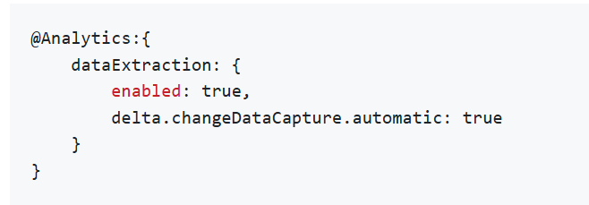

<!-- loio10891192186c4920b08939a7b46adc79 -->

# Load Types and Connections for Your Replication Flows

Understand which load type is supported by your source or target connection.

Replication flows currently support 3 load types: *Initial Only*, *Initial and Delta*, *Delta Only*. For more information, see [Configure a Replication Flow](configure-a-replication-flow-3f5ba0c.md).

Whenever a connection does not support a load type, it is not available as a selection while configuring your replication flow. The following tables display the compatibility between connections and load types.

<a name="loio10891192186c4920b08939a7b46adc79__section_iyh_5dj_rfc"/>

## Source Connections and Supported Load Types

<table>
<tr>
<th valign="top">

Connection

</th>
<th valign="top">

Load Type: Initial Only

</th>
<th valign="top">

Load Type: Initial and Delta

</th>
<th valign="top">

Load Type: Delta Only

</th>
</tr>
<tr>
<td valign="top">

Local table

</td>
<td valign="top">

Supported

</td>
<td valign="top">

Not Supported

</td>
<td valign="top">

Not Supported

</td>
</tr>
<tr>
<td valign="top">

Local table with delta capture

</td>
<td valign="top">

Supported

</td>
<td valign="top">

Supported

</td>
<td valign="top">

Supported

</td>
</tr>
<tr>
<td valign="top">

Local table \(file\)

</td>
<td valign="top">

Not Supported

</td>
<td valign="top">

Not Supported

</td>
<td valign="top">

Not Supported

</td>
</tr>
<tr>
<td valign="top">

Confluent Kafka

See also [Confluent Kafka Sources for Replication Flows](confluent-kafka-sources-for-replication-flows-4f2d0a8.md)

</td>
<td valign="top">

Not Supported

</td>
<td valign="top">

Supported

</td>
<td valign="top">

Not Supported

</td>
</tr>
<tr>
<td valign="top">

Cloud Storage Providers

See also [Cloud Storage Provider Sources for Replication Flows](cloud-storage-provider-sources-for-replication-flows-4d481a2.md)

</td>
<td valign="top">

Supported

</td>
<td valign="top">

Not Supported

</td>
<td valign="top">

Not Supported

</td>
</tr>
<tr>
<td valign="top">

ABAP Sources

</td>
<td valign="top">

Supported

</td>
<td valign="top">

Supported \(When property delta enabled is true\*\)

</td>
<td valign="top">

Supported \(When property delta enabled is true\*\)

</td>
</tr>
<tr>
<td valign="top">

ABAP Sources without primary key \(only CDS and ODP\)

</td>
<td valign="top">

Supported

</td>
<td valign="top">

Not Supported

</td>
<td valign="top">

Not Supported

</td>
</tr>
<tr>
<td valign="top">

Microsoft SQL Server

</td>
<td valign="top">

Supported

</td>
<td valign="top">

Supported

</td>
<td valign="top">

Supported

</td>
</tr>
<tr>
<td valign="top">

SAP HANA

</td>
<td valign="top">

Supported

</td>
<td valign="top">

Supported

</td>
<td valign="top">

Supported

</td>
</tr>
<tr>
<td valign="top">

AzureSQL

</td>
<td valign="top">

Supported

</td>
<td valign="top">

Supported

</td>
<td valign="top">

Supported

</td>
</tr>
</table>

\* To add the property delta enabled, you must add the @Analytics annotations to the view that sets the enabled flag and the change data capture approach:

<a name="loio10891192186c4920b08939a7b46adc79__section_nvr_plj_rfc"/>

## Target Connections and Supported Load Types

<table>
<tr>
<th valign="top">

Connection

</th>
<th valign="top">

Load Type: Initial Only

</th>
<th valign="top">

Load Type: Initial and Delta

</th>
<th valign="top">

Load Type: Delta Only

</th>
</tr>
<tr>
<td valign="top">

Local table

See also [SAP Datasphere Targets](sap-datasphere-targets-12c45eb.md)

</td>
<td valign="top">

Supported

</td>
<td valign="top">

Supported

</td>
<td valign="top">

Not Supported

</td>
</tr>
<tr>
<td valign="top">

Local table with delta capture

See also [SAP Datasphere Targets](sap-datasphere-targets-12c45eb.md)

</td>
<td valign="top">

Not Supported

</td>
<td valign="top">

Supported

</td>
<td valign="top">

Not Supported

</td>
</tr>
<tr>
<td valign="top">

Local table \(file\)

See also [SAP Datasphere Targets](sap-datasphere-targets-12c45eb.md)

</td>
<td valign="top">

Not Supported

</td>
<td valign="top">

Supported

</td>
<td valign="top">

Not Supported

</td>
</tr>
<tr>
<td valign="top">

Apache Kafka

See also [Apache Kafka Targets](apache-kafka-targets-6df55db.md)

</td>
<td valign="top">

Supported

</td>
<td valign="top">

Supported

</td>
<td valign="top">

Supported

</td>
</tr>
<tr>
<td valign="top">

Confluent Kafka

See also [Confluent Kafka Targets](confluent-kafka-targets-74b3c95.md)

</td>
<td valign="top">

Supported

</td>
<td valign="top">

Supported

</td>
<td valign="top">

Supported

</td>
</tr>
<tr>
<td valign="top">

Cloud Storage Provider

See also [Cloud Storage Provider Targets](cloud-storage-provider-targets-43d93a2.md)

</td>
<td valign="top">

Supported

</td>
<td valign="top">

Supported

</td>
<td valign="top">

Supported

</td>
</tr>
<tr>
<td valign="top">

Google BigQuery

See also [Google BigQuery Targets](google-bigquery-targets-56d4472.md)

</td>
<td valign="top">

Supported

</td>
<td valign="top">

Supported

</td>
<td valign="top">

Supported

</td>
</tr>
<tr>
<td valign="top">

SAP HANA

</td>
<td valign="top">

Supported

</td>
<td valign="top">

Supported

</td>
<td valign="top">

Not Supported

</td>
</tr>
<tr>
<td valign="top">

SAP Signavio

See also [SAP Signavio Targets](sap-signavio-targets-b8f5e28.md)

</td>
<td valign="top">

Supported

</td>
<td valign="top">

Supported

</td>
<td valign="top">

Not Supported

</td>
</tr>
</table>

