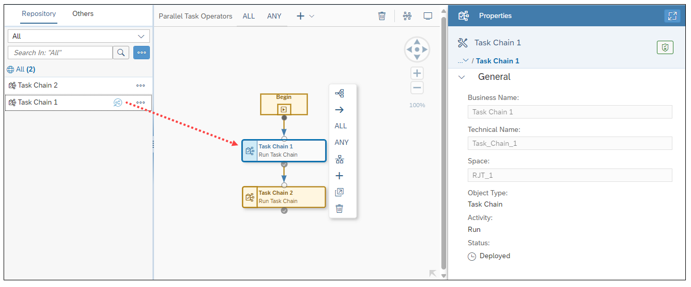
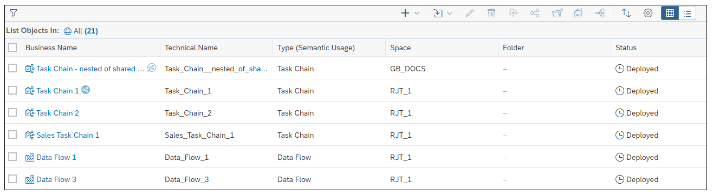

<!-- loio8067b774e4404dfc821fb771388d2a4c -->

<link rel="stylesheet" type="text/css" href="../css/sap-icons.css"/>

# Nesting and Sharing Task Chains

Nest and run other task chains within the current task chain. Share a task chain so that you can nest and run that task chain in another space.

-   The DW Modeler role is required to create task chains as well as share task chains with other spaces. The additional DW Integrator role is required to run task chains shared from other spaces as well as set up email notification for completion of task chain runs. In addition, the user consuming and running a shared task chain also needs to be assigned to the space where that task chain was shared from and also have the DW Integrator role in that space.

-   Task chains must have already been deployed to include them in task chains as well as to share them with other spaces.

> ### Note:  
> For more information on sharing and unsharing task chains with other spaces, see [Sharing Entities and Task Chains to Other Spaces](../Creating-Finding-Sharing-Objects/sharing-entities-and-task-chains-to-other-spaces-64b318f.md).

Task chains may be added to the current task chain being worked on, in the same way as adding any other object to a task chain. You can add a task chain to the current task chain anywhere you could add any other object. There is no set limit \(other than the availability of resources\) on the number of task chains you can run within a given task chain, or where in the sequence of tasks you add a task chain.

1.  To run a task chain as a step in the current task chain you are working on, simply drag it from the left-side *Repository* tab object list onto the canvas in the task chain editor.

    

    Task chains in the Repository tab that have been shared to your space are denoted by the  \(Share\) icon \(shown in a clear background circle\) following the task chain's business name. In addition, the space name from which a task chain is shared is displayed in the *Properties* pane.

    > ### Note:  
    > Task chains that are shared are also denoted on the *Data Builder* start page and in the *Repository Explorer* by the  \(Share\) icon displayed after their business name. The space from which the task chain was shared is displayed in the *Space* Column.
    > 
    > 
    > 
    > Tasks chains that have been shared with you from another space are denoted by the  \(Share\) shown in a clear background circle. Task chains you have shared to other spaces are shown in a blue background circle.

    From both the *Data Builder* start page and the task chain editor toolbar, you can click the  \(Impact and Lineage Analysis\) icon to gain a better understanding of the lineage and dependencies of task chains and the objects they contain.

2.  After adding all elements you want to include in your task chain, deploy and run the task chain.

    The run status of the task chain is displayed in the *Properties* detail pane. In addtion, you can open the Data Integration Monitor to view details of the task chains's execution. For more information, see [Monitoring Task Chains](https://help.sap.com/viewer/9f36ca35bc6145e4acdef6b4d852d560/DEV_CURRENT/en-US/4142201ec1aa49faad89a688a2f1852c.html "Monitor the status and progress of running and previously run task chains.") :arrow_upper_right:.

