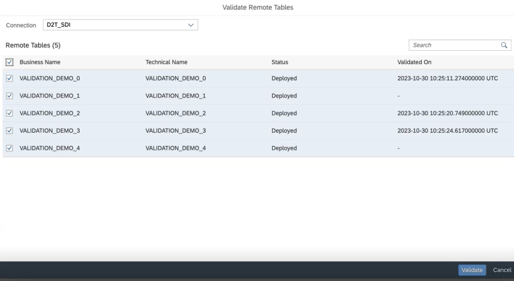
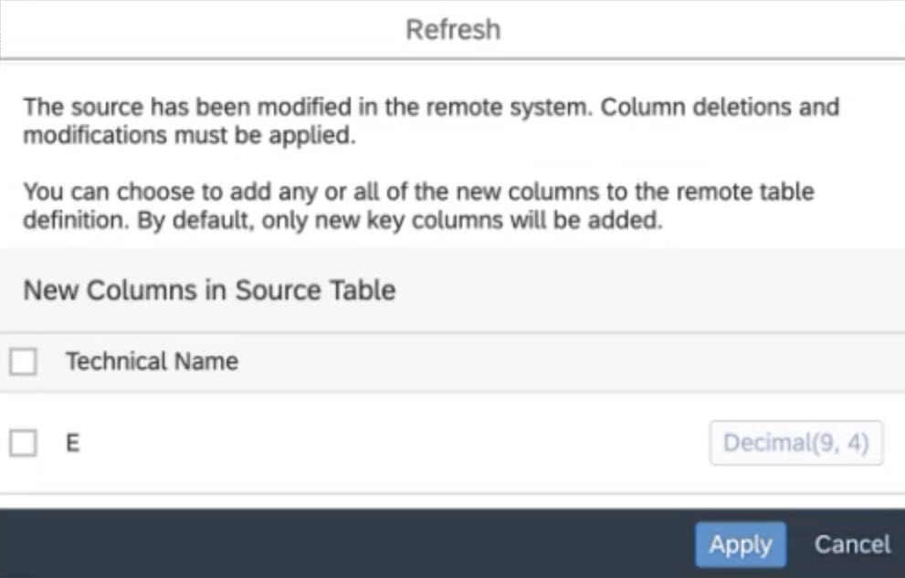

<!-- loio4e0be1612c9147069d0cddc9c6201455 -->

<link rel="stylesheet" type="text/css" href="../css/sap-icons.css"/>

# Process Source Changes for Several Remote Tables

Identify available table structure updates for all tables sharing the same source connection, and avoid errors and impact on dependent objects and runtimes in SAP Datasphere resulting from these updates, such as view runs, remote table replications or deployment.

## Context

Before you can process source changes for several remote table, you must fulfill the following prerequisites:

-   The remote tables are already saved in your space.
-   They are connected via an SAP HANA smart data integration or SAP HANA smart data access.

When changes are made in source models, they might not be reflected immediately in SAP Datasphere. This can result in errors and impact on dependent objects, and runtimes, and you need to do a refresh to get these updates in your remote table definition.

To identify source changes for several remote tables sharing the same connection, you can either proceed from the*Repository Explorer* or from the *Data Builder* landing page:

## Procedure

1.  Click  Validate Remote Tables.

2.  From the windows *Validate Remote Tables*, select the relevant source connection and then the remote tables you want to check, and click *Validate*:

    

    > ### Note:  
    > From the *Repository Explorer*, if you have remote tables in several spaces, you will be prompted to select a space.

    SAP Datasphere will compare the source and the target remote tables, and will refresh the status: Remote tables with incompatible changes will get the status *Runtime Error* \(for example a column has been removed\), whereas remote tables with compatible changes will get the status *Changes to Deploy* \(for example a non-key column has been added\). Remote tables that are not deployed at this time and have any changes in the source will get the status *Design Time Error*.

3.  To apply the changes, open the remote table in the table editor.

    The editor automatically opens a window to allow you to proceed with the changes:

    

    The object status set by *Validate Remote Tables* is only an indicator that a certain remote table requires action in the *Table Editor*. As there may be a delay between the *Validate* action and the time you enter into *Table Editor* screen, it is required to proceed with the *Refresh* action in the *Table Editor* to integrate the actual source changes in your remote table.

4.  Select the changes you want to apply to your remote table.

5.  Redeploy the remote table.

