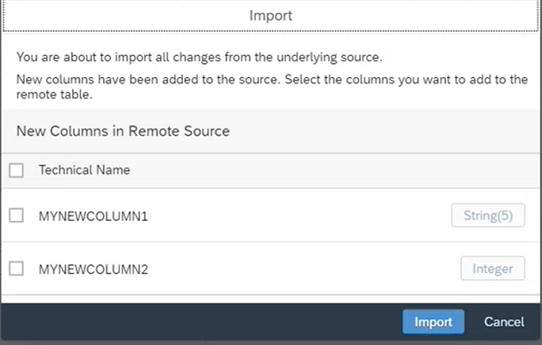

<!-- loio622328b59afa40fd810b44ac84d6afd3 -->

<link rel="stylesheet" type="text/css" href="../css/sap-icons.css"/>

# Process Source Changes in the Table Editor

Identify available table structure updates in your data sources and resolve conflicting errors resulting from these updates. This operation applies to any remote tables as well as local tables from an Open SQL Schema.

**Prerequisites**:

-   Your table data is imported via an Open SQL Schema or from an HDI container, and is already saved and deployed in your space.
-   Or it's a remote table connected via an SAP HANA smart data integration or SAP HANA smart data access.

    > ### Note:  
    > For SAP HANA smart data access, the remote table must be connected from one of the supported connection types:
    > 
    > -   SAP HANA Cloud via ODBC. For more information, see [Connect to the SAP HANA Database in SAP HANA Cloud via ODBC](https://help.sap.com/docs/HANA_CLOUD/db19c7071e5f4101837e23f06e576495/9c0c101e368a4102a7eaeef542970741.html?locale=en-US).
    > -   SAP S/4HANA Cloud and Cloud Data Integration. For more information, see [SAP S/4HANA Cloud](https://help.sap.com/docs/SAP_DATA_WAREHOUSE_CLOUD/be5967d099974c69b77f4549425ca4c0/a98e5ffdf47c44d9a845dca01a18bd82.html?locale=en-US) and [Cloud Data Integration](https://help.sap.com/docs/SAP_DATA_WAREHOUSE_CLOUD/be5967d099974c69b77f4549425ca4c0/cd33107246f446628f9baff56faf5a1b.html?locale=en-US).
    > -   SAP ABAP. For more information, see [SAP ABAP](https://help.sap.com/docs/SAP_DATA_WAREHOUSE_CLOUD/be5967d099974c69b77f4549425ca4c0/a75c1aacf951449ba3b740c7e46da3a9.html?locale=en-US).

> ### Restriction:  
> In case you remove columns from the remote table definition compared to the source object \(remote table having less columns than the source entity\), real-time replications don't work for remote tables connected via SAP HANA smart data access or Cloud Connector for SAP HANA on-premise versions lower than 2.0 SPS06.

Keeping your data up-to-date can sometimes be a challenge for modelers. When an update is available in your data source, you can do a refresh of your table structure in the *Data Builder* or click  Validate Remote Tables form the *Data Builder* landing page. For more information, see [Process Source Changes for Several Remote Tables](process-source-changes-for-several-remote-tables-4e0be16.md).

> ### Note:  
> This refresh is a manual action from the *Table Editor*. When you click *Refresh*, you will receive a notification of any structural changes in the remote source and can then decide whether to proceed and import the changes or cancel.

> ### Caution:  
> Refreshing table structures will affect dependent objects. But you’ll be notified about the changes and inconsistencies that can result because of these changes.

To import changes from the underlying sources,

1.  Click  \(Refresh\) to import available changes.

    > ### Note:  
    > Changes in data type, length, or precision are also automatically updated or aligned with the source table structure for either SAP HANA smart data acess or SAP HANA smart data integration remote connections.

    If new columns exist in the data source, a windows allows you to add those you need: 

    > ### Note:  
    > -   You must add new key columns.
    > 
    > -   Double check columns that contain spatial data type as remote tables don’t support this data type: The spatial reference system might be wrong. For more information on spatial reference system, see [Spatial Reference Systems \(SRS\) and Spatial Reference Identifiers \(SRID\)](https://help.sap.com/docs/SAP_HANA_PLATFORM/cbbbfc20871e4559abfd45a78ad58c02/7a2ea357787c101488ecd1b725836f07.html?version=2.0.02&locale=en-US)
    > 
    > -   Columns can be added or removed at any time from the column section. For more information, see [Restrict Remote Table Data Loads](restrict-remote-table-data-loads-bd1ece5.md).

2.  Once import is completed, you can see the changes in the validation area  \(Validation Messages\).
3.  Click  \(Preview Data\) to preview the data contained in your remote table.

    > ### Note:  
    > Previewing data on a remote system is similar to previewing data of a local table. However, it might take longer, it can impact the remote system’s performance, and some preview controls aren't available. You can replicate the table locally to address performance issues and have a richer preview experience. For more information on previewing data, see [Viewing Object Data](../viewing-object-data-b338e4a.md). Moreover, the remote table data preview is limited for the following connection types:
    > 
    > -   *ABAP* connection: the filters `=` and `IN` only are available.
    > -   *Cloud Data Integration \(CDI\)*connection: rows won't be counted in headers.

4.   \(Save\) Save your changes.
5.   \(Deploy\). A pop up informs you about the source updates before you can go forward with deployment and access data from the updated remote source.

> ### Caution:  
> If your remote table is replicated, you can refresh, import, preview, and save the changes as stated above. However, once import of changes is completed, you can't directly redeploy your table without first going back to the *Remote Tables* monitor and removing the replicated data. Once replicated data is removed, you’ll be able to redeploy your table with its updated structure. For more information on removing replicated data, see [Replicating Data and Monitoring Remote Tables](https://help.sap.com/viewer/9f36ca35bc6145e4acdef6b4d852d560/DEV_CURRENT/en-US/4dd95d7bff1f48b399c8b55dbdd34b9e.html "In the Remote Tables monitor, you can find a remote table monitor per space. Here, you can copy data from remote tables that have been deployed in your space into SAP Datasphere, and you can monitor the replication of the data. You can copy or schedule copying the full set of data from the source, or you can set up replication of data changes in real-time via change data capturing (CDC).") :arrow_upper_right:.

