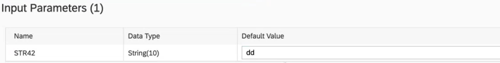

<!-- loio75cea7b1cbeb4c9dba0ac13605c527b3 -->

<link rel="stylesheet" type="text/css" href="../css/sap-icons.css"/>

# Review and Edit Imported Table Properties

Provide business-friendly names for your table and its columns, identify its semantic usage, enable replication and memory storage, and set other properties.

## Procedure

1.  Open your imported table in the table editor and review the properties in the *General* section:

    <table>
    <tr>
    <th valign="top">

    Property
    
    </th>
    <th valign="top">

    Description
    
    </th>
    </tr>
    <tr>
    <td valign="top">
    
    Business Name 
    
    </td>
    <td valign="top">
    
    Enter a descriptive name to help users identify the object. This name can be changed at any time. 
    
    </td>
    </tr>
    <tr>
    <td valign="top">
    
    Technical Name 
    
    </td>
    <td valign="top">
    
    \[read-only\] The technical names of remote tables cannot be modified. 
    
    </td>
    </tr>
    <tr>
    <td valign="top">
    
    Semantic Usage
    
    </td>
    <td valign="top">
    
    Select the way your entity should be used for data modeling purposes. 

    Choose from the following:

    -   *Fact* - Contains one or more measures and attributes. A fact typically has associations pointing to one or more dimensions and is consumed by analytic models \(see [Create a Fact to Contain Measurable Data](../Modeling-Data-in-the-Data-Builder/create-a-fact-to-contain-measurable-data-30089bd.md)\).
    -   *Dimension* - Contains attributes containing master data like a product list or store directory, and supporting hierarchies \(see [Create a Dimension to Categorize Data](../Modeling-Data-in-the-Data-Builder/create-a-dimension-to-categorize-data-5aae0e9.md)\).
    -   *Hierarchy* - Contains attributes defining a parent-child hierarchy \(see [Create an External Hierarchy for Drill-Down](../Modeling-Data-in-the-Data-Builder/create-an-external-hierarchy-for-drill-down-dbac7a8.md)\).
    -   *Hierarchy with Directory* - Contains one or more parent-child hierarchies \(see [Create a Hierarchy with Directory](../Modeling-Data-in-the-Data-Builder/create-a-hierarchy-with-directory-36c39ee.md)\).
    -   *Text* - Contains attributes used to provide textual content in one or more languages \(see [Create a Text Entity for Attribute Translation](../Modeling-Data-in-the-Data-Builder/create-a-text-entity-for-attribute-translation-b25726d.md)\).
    -   *Relational Dataset* - \[default\] Contains columns with no specific analytical purpose.
    -   *Analytical Dataset \(Deprecated\)* - Use *Fact* instead \(see [Analytical Datasets \(Deprecated\)](../Modeling-Data-in-the-Data-Builder/analytical-datasets-deprecated-70dab71.md).

    
    </td>
    </tr>
    </table>
    
2.  \[remote tables\] Review the properties in the *Remote* section:

    > ### Note:  
    > To enable replication, use the tools at the top of this section \(see [Replicate Remote Table Data](replicate-remote-table-data-7e258a7.md)\).
    > 
    > Replication is not available if the connection of your remote table is configured as data access: *Remote Only*.

    <table>
    <tr>
    <th valign="top">

    Property
    
    </th>
    <th valign="top">

    Description
    
    </th>
    </tr>
    <tr>
    <td valign="top">
    
    *Connection \(Business Name\) or Connection \(Technical Name* 
    
    </td>
    <td valign="top">
    
    \[read-only\]

    Displays the name of the connection the remote table belongs to. Technical or Business Name is displayed, depending on how you have configured your UI settings in *Your Profile* \> *Settings* 
    
    </td>
    </tr>
    <tr>
    <td valign="top">
    
    Remote Table
    
    </td>
    <td valign="top">
    
    \[read-only\] Displays the full path to the remote table in the source system.
    
    </td>
    </tr>
    <tr>
    <td valign="top">
    
    Data Access
    
    </td>
    <td valign="top">
    
    \[read-only\] Displays how the remote table data is stored:

    -   *Remote*: Data is accessed directly from the source \(federation\) and read from the virtual table.
    -   *Replicated*: Data is copied in SAP Datasphere and is read from the replica table.
        -   *Replicated \(Snapshot\)*: The data is read from the replica table but is not expected to be updated in real-time. You can create a schedule to refresh the data regularly.
        -   *Replicated \(Real-Time\)*: The data is read from the replica table and expected to be updated in real-time.

    
    </td>
    </tr>
    <tr>
    <td valign="top">
    
    Last Updated
    
    </td>
    <td valign="top">
    
    \[read-only\]

    Displays when the data was last successfully updated in SAP Datasphere.

    > ### Note:  
    > This section is not available if the connection of your remote table is configured as data access: *Remote Only*.

    
    </td>
    </tr>
    <tr>
    <td valign="top">
    
    Frequency
    
    </td>
    <td valign="top">
    
    \[read-only\]

    Displays how often data is replicated. The value here shows the intended frequency that might have not been reached yet depending on the status of the remote table.

    -   *–-*: Refresh frequency doesn't apply.
    -   *None*: There is no schedule defined for this table.
    -   *Scheduled*: A schedule is defined for this table.
    -   *Real-Time*: Real-time replication has been set up for the remote table.
    -   *Paused*: Data refresh is paused.

    > ### Note:  
    > This section is not available if the connection of your remote table is configured as data access: *Remote Only*.

    
    </td>
    </tr>
    <tr>
    <td valign="top">
    
    Status
    
    </td>
    <td valign="top">
    
    \[read-only\]

    Displays the current status of the remote table.

    -   *\---*: Initial state

    -   *Loading*: Started to load a new snapshot

    -   *Available*: Snapshot has been loaded and is available in the replica table

    -   *Initializing*: Started to enable real-time data replication

    -   *Active*: Data is replicated and updated in real-time

    -   *Error*: Failed to load a new snapshot, or failed to enable real-time data replication, or data is replicated in real-time but remote exceptions occurred

    -   *Paused*: Real-time replication is paused

    -   *Disconnected*: SAP HANA smart data integration Data Provisioning Agent got disconnected

        For information about how to connect the agent, see [Connect and Configure the Data Provisioning Agent](https://help.sap.com/viewer/935116dd7c324355803d4b85809cec97/DEV_CURRENT/en-US/e87952d7c656477cb5558e5c2f44ae9c.html "Connect the Data Provisioning Agent to the SAP HANA database of SAP Datasphere. This includes configuring the agent and setting the user credentials in the agent.") :arrow_upper_right:.

    > ### Note:  
    > This section is not available if the connection of your remote table is configured as data access: *Remote Only*.

    
    </td>
    </tr>
    <tr>
    <td valign="top">
    
    Statistics Type
    
    </td>
    <td valign="top">
    
    Displays the statistics type that has been created for the remote table :

    -   *HISTOGRAM*: Creates a data statistics object that helps the query optimizer estimate the data distribution.
    -   *RECORD COUNT*: Creates a data statistics object that helps the query optimizer calculate the number of records \(rows\) in a table data source. The*RECORD COUNT* type is a table-wide statistic.
    -   *SIMPLE*: Creates a data statistics object that helps the query optimizer calculate basic statistics, such as min, max, null count, count, and distinct count.

    > ### Note:  
    > Statistics can be created after you have deployed your remote table, for more information, see [Creating Statistics for Your Remote Tables](https://help.sap.com/viewer/9f36ca35bc6145e4acdef6b4d852d560/DEV_CURRENT/en-US/e4120bbb98e44994aa1e0b32ff3f209d.html "Create statistics for your remote tables to improve federated query execution.") :arrow_upper_right:

    
    </td>
    </tr>
    <tr>
    <td valign="top">
    
    Statistics Last Updated
    
    </td>
    <td valign="top">
    
    Displays the date when the last statistics update has been refreshed for the remote table.
    
    </td>
    </tr>
    </table>
    
    You can, at any time, click  \(Open Monitor\) and navigate to the *Remote Tables* monitor to review details of recent replication runs \(see [Replicating Data and Monitoring Remote Tables](https://help.sap.com/viewer/9f36ca35bc6145e4acdef6b4d852d560/DEV_CURRENT/en-US/4dd95d7bff1f48b399c8b55dbdd34b9e.html "In the Remote Tables monitor, you can find a remote table monitor per space. Here, you can copy data from remote tables that have been deployed in your space into SAP Datasphere, and you can monitor the replication of the data. You can copy or schedule copying the full set of data from the source, or you can set up replication of data changes in real-time via change data capturing (CDC).") :arrow_upper_right:\), or to *Remote Table Statistics* to create or review existing statistics for the remote table \(see [Creating Statistics for Your Remote Tables](https://help.sap.com/viewer/9f36ca35bc6145e4acdef6b4d852d560/DEV_CURRENT/en-US/e4120bbb98e44994aa1e0b32ff3f209d.html "Create statistics for your remote tables to improve federated query execution.") :arrow_upper_right:\).

    > ### Note:  
    > If the connection of your remote table source is configured as data access: *Remote Only,* you can navigate only to the *Remote Table Statistics*monitor.

3.  Review the columns that are contained in your table. You can change the *Business Name* of columns and set keys here \(see [Set Key Columns to Uniquely Identify Records](../Modeling-Data-in-the-Data-Builder/set-key-columns-to-uniquely-identify-records-d9ef2c9.md)\).

4.  \[remote tables\] Create filter conditions to load only the data that is needed \(see [Restrict Remote Table Data Loads](restrict-remote-table-data-loads-bd1ece5.md)\).

5.  \[imported remote and local tables\] *Input Parameters*: If your remote table consumes an SAP HANA SQL view or SAP HANA calculation view with input parameters, the parameter properties are displayed. You can define a default value for each parameter:

    

    > ### Restriction:  
    > -   Parameters with data type cds.LargeBinary are not supported.
    > -   Your remote table must be connected via an SAP HANA smart data access adaptor \(used in connections with Data Provisioning option = Direct or Cloud Connector\).

    Tables that contain input parameters require special treatment in the following situations:

    -   Previewing data - Accept the default value, if one is provided, or enter a value for each input parameter \(see [Viewing Object Data](../viewing-object-data-b338e4a.md)\).
    -   Adding a table as a source in the graphical view editor - Map each input parameter in the source table to a value or an input parameter in the view \(see [Add a Source to a Graphical View](../add-a-source-to-a-graphical-view-1eee180.md)\).
    -   Adding a table as a source in the SQL view editor - Complete the syntax to map each input parameter in the source table to a value or an input parameter in the new view \(see [Process Source Input Parameters in an SQL View](../process-source-input-parameters-in-an-sql-view-58d8763.md)\).
    -   Adding a table as a source in the analytic model editor - Map each input parameter in the source table to a variable in the model \(see [Create a Variable in an Analytic Model](../Modeling-Data-in-the-Data-Builder/create-a-variable-in-an-analytic-model-cdd8fa0.md)\).

6.  Save and Deploy.

    > ### Note:  
    > \[remote tables connected via SAP HANA smart data integration \(SDI\) only\]:
    > 
    > If a remote table definition created by an import doesn't match the remote table source definition, you won't be allowed to deploy it. You'll need to click  \(Refresh\) to repair the table structure and continue with deployment.

7.  The tools in the editor toolbar help you work with your object throughout its lifecycle:

    <table>
    <tr>
    <th valign="top">

    Tool
    
    </th>
    <th valign="top">

    Description
    
    </th>
    </tr>
    <tr>
    <td valign="top">
    
     \(Save\)
    
    </td>
    <td valign="top">
    
    Save your changes to the design-time repository. You can use *Save As* to create a copy of the object. 

    See [Saving and Deploying Objects](../saving-and-deploying-objects-7c0b560.md).
    
    </td>
    </tr>
    <tr>
    <td valign="top">
    
     \(Deploy\)
    
    </td>
    <td valign="top">
    
    Deploy your changes to make them available in the run-time environment.

    See [Saving and Deploying Objects](../saving-and-deploying-objects-7c0b560.md).
    
    </td>
    </tr>
    <tr>
    <td valign="top">
    
     \(Share\)
    
    </td>
    <td valign="top">
    
    Share the object to other spaces. 

    See [Sharing Entities and Task Chains to Other Spaces](../Creating-Finding-Sharing-Objects/sharing-entities-and-task-chains-to-other-spaces-64b318f.md).
    
    </td>
    </tr>
    <tr>
    <td valign="top">
    
     \(Preview Data\)
    
    </td>
    <td valign="top">
    
    Open the *Data Preview* panel to preview the data stored in the object.

    See [Viewing Object Data](../viewing-object-data-b338e4a.md).
    
    </td>
    </tr>
    <tr>
    <td valign="top">
    
     \(Undo\) /  \(Redo\)
    
    </td>
    <td valign="top">
    
    Revert the last change to the object or redo a change you have previously undone.
    
    </td>
    </tr>
    <tr>
    <td valign="top">
    
     \(Export\)
    
    </td>
    <td valign="top">
    
    Export the object to a CSN/JSON file. 

    See [Exporting Objects to a CSN/JSON File](../Creating-Finding-Sharing-Objects/exporting-objects-to-a-csn-json-file-3916101.md).
    
    </td>
    </tr>
    <tr>
    <td valign="top">
    
     \(Upload Data From CSV File\)
    
    </td>
    <td valign="top">
    
    Upload data.

    See [Load or Delete Local Table Data](load-or-delete-local-table-data-870401f.md)
    
    </td>
    </tr>
    <tr>
    <td valign="top">
    
     \(Hierarchies\)
    
    </td>
    <td valign="top">
    
    Add a hierarchy to your dimension to support drill-down and drill-up in BI clients.

    See [Add a Hierarchy to a Dimension](../Modeling-Data-in-the-Data-Builder/add-a-hierarchy-to-a-dimension-218b7e6.md).
    
    </td>
    </tr>
    <tr>
    <td valign="top">
    
     \(Delete Data From Table\)
    
    </td>
    <td valign="top">
    
    Delete records:

    -   Standard table - Delete all records
    -   Delta capture table- Delete all records, Delete all records \(mark as "deleted"\) or Delete all records marked for deletion which are older than the specified number of days.

    See [Load or Delete Local Table Data](load-or-delete-local-table-data-870401f.md).
    
    </td>
    </tr>
    <tr>
    <td valign="top">
    
     \(Edit Custom CSN Annotations\)
    
    </td>
    <td valign="top">
    
    Work with custom CSN annotations that are not otherwise supported by the interface. 

    See [Edit Custom CSN Annotations in a View or Table](../edit-custom-csn-annotations-in-a-view-or-table-820d013.md).
    
    </td>
    </tr>
    <tr>
    <td valign="top">
    
     \(Impact and Lineage Analysis\)
    
    </td>
    <td valign="top">
    
    Open the *Impact and Lineage Analysis* graph for the object. 

    See [Impact and Lineage Analysis](../impact-and-lineage-analysis-9da4892.md).
    
    </td>
    </tr>
    <tr>
    <td valign="top">
    
    Details
    
    </td>
    <td valign="top">
    
    Toggles the display of the *Properties* panel.
    
    </td>
    </tr>
    </table>
    

