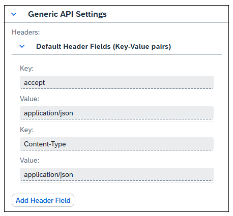
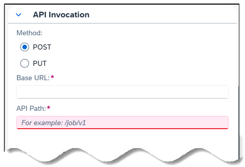
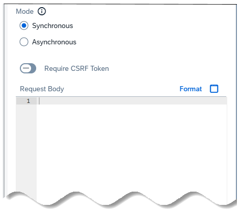
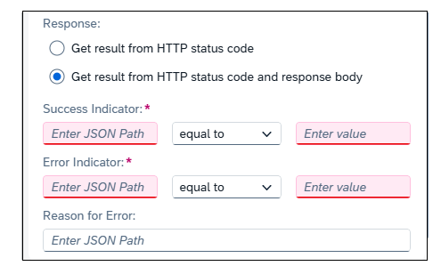

<!-- loio9a8489ed7443436197fbd8b8ffba61ab -->

<link rel="stylesheet" type="text/css" href="../css/sap-icons.css"/>

# Run API Tasks in a Task Chain

Run tasks in a task chain that use a REST-based API to access external systems.

<a name="loio9a8489ed7443436197fbd8b8ffba61ab__prereq_c1j_kks_tfc"/>

## Prerequisites

-   Users require the usual Modeler and Integrator role permissions to model and run any task chain that includes an API task. The DWC\_REMOTECONNECTION privilege must also be set, but that privilege is already configured in the default Modeler/Integrator roles you would typically already have to run a task chain.
-   The configuration of an API task requires selection of a pre-defined HTTP connection to access the external system that will run the API task. Credentials to connect to the external system are stored and fetched from the configuration details of the selected HTTP connection.

    For more information on creating an HTTP connection, see [Integrating Data via Connections](https://help.sap.com/viewer/9f36ca35bc6145e4acdef6b4d852d560/DEV_CURRENT/en-US/eb85e157ab654152bd68a8714036e463.html "Users with a space administrator or integrator role can create connections to SAP and non-SAP source systems, including cloud and on-premise systems and partner tools, and to target systems for outbound replication flows. Users with modeler roles can import data via connections for preparation and modeling in SAP Datasphere.") :arrow_upper_right:.

## Context

-   To add an API task to a task chain, you need to click and drag the API Task object \(\) from the toolbar to the task chain canvas. \(This is different than the way in which you can select and drag other SAP Datasphere object types directly from the Repository to the canvas.\)
-   Once you’ve added a new API task object to the canvas, you configure the API task from settings in the *Properties* pane. Settings and options for configuring an API task are arranged in the following sections:
    -   *General* – provides general information such as technical name, object type, and activity, of a selected API object on the canvas.
    -   *Connection* – specifies the existing HTTP connection used to connect to the external system where an API task will be run. The connection stores host, path, and credential information needed for communicating securely with the external system. For more information, see [Integrating Data via Connections](https://help.sap.com/viewer/9f36ca35bc6145e4acdef6b4d852d560/DEV_CURRENT/en-US/eb85e157ab654152bd68a8714036e463.html "Users with a space administrator or integrator role can create connections to SAP and non-SAP source systems, including cloud and on-premise systems and partner tools, and to target systems for outbound replication flows. Users with modeler roles can import data via connections for preparation and modeling in SAP Datasphere.") :arrow_upper_right:.
    -   *Generic API Settings* – specifies JSON API header fields \(key-value pairs\) sent and received with every HTTP request and response.
    -   *API Invocation* – specifies the HTTP method \(POST or GET\) for invocation of an API task, the base URL and endpoint path of the API task, whether the API task is run in asynchronous or synchronous mode, the API task’s request body, and handling of success, error, or other API task responses from the external system.
    -   *API Test Run* – provides a method to test execution of a specific API task you have created and want to test.

-   Following execution of an API task in a task chain, you can monitor details of the execution of an API task in the task chain’s Data Integration monitor, the same as for other objects in a task chain.

    > ### Note:  
    > API tasks do not currently provide parameter support or allow the retrieval of information out of an external system and transport into another task in a chain.

## Procedure

1.  To add an API task to a task chain, select and drag the API Task object \(\) from the task chain toolbar to the task chain canvas.

    A new API task object is added to the task chain canvas. While the object is selected, the *Properties* pane provides configuration information that details the API task’s operation, formulation of calls to the external system and handling of responses.

2.  In the *General* section of the Properties pane, type a new technical name to represent the API task in the task chain.

3.  Expand the *Connection* section and then select the HTTP Connection you want to use to run the API task.

4.  Expand the *Generic API Settings* section and specify any JSON API headers you want to send with every API task HTTP invocation.

    The following shows default JSON headers included with new API tasks.

    

    In addition to customizing the default header fields, you can also click the *Add Header Field* button to add your own custom header fields.

    Additional header fields allow only *Prefer: respond-async* and customized headers with keys beginning with *X-*, except *x-forwarded-host*. To set multiple values for a header field, you can separate the values using a comma or enter multiple header fields with the same key.

5.  Next, specify how the API task will be invoked. Expand the *API Invocation* section in the Properties pane.

    

    -   First, select the method to invoke the API task, *POST* or *PUT*, the *Base URL* \(fixed by the connection\), and the *API path* needed to access the external system to run the API task. By default,*POST* is automatically selected.

        > ### Note:  
        > Only HTTPS URLs are supported. Also, the host and port in the API URL should be consistent with the corresponding connection.

    -   Next, select the mode of API task, *Synchronous* or *Asynchronous*.

        

        Whether you choose Synchronous or Asynchronous modes for your API task’s execution, that choice will impact the options available for retrieving responses, status \(such as success or failure\), and other messages returned from the external system.

        With synchronous operation, the API task makes a request and waits for a response. With asynchronous operation, the API task sends a request to the external system, and the response is received later via a callback, event, or message queue. Status, message and error handling for each of these modes of execution are described below.

    -   Enter the request payload for your API task in the*Request Body*. The request payload must be in JSON format.
    -   Select the *Require CSRF Token* checkbox if a CSRF token is required before a POST request can be made. Enter the required CSRF token URL to get the CSRF token.

    > ### Note:  
    > If you don't enter a CSRF token URL, the request API URL will be used, by default, to get the CSRF token.

6.  Following the Request Body field, the Properties pane provides options for obtaining your API task’s responses from the external system. The options presented depend on whether you chose synchronous or asynchronous execution of your task chain. By default, the options provided for synchronous mode are the following:

    

    Here you have the option of retrieving the API status just from the HTTP status code or from both the HTTP status code and response body \(as shown here\).

    For asynchronous API task execution, the Properties pane provides an additional *Status* section for determining how to retrieve status information and other messages from the external system.

    > ### Note:  
    > Results from an API task’s invocation are interpreted differently based on the invocation mode, synchronous or synchronous:
    > 
    > -   In synchronous mode, the result of the status code response is success \(COMPLETED\) or error \(FAILED\).
    > -   In asynchronous mode, the status code response will return FAILED or RUNNING. In addition, tasks in asynchronous mode retrieve the job status using the status endpoint located in the response location header or entered in the *Status* section of the Properties panel.

7.  After you’ve completed the configuration of an API task, you can expand the last section of the Properties pane, *API Test Run*, to perform a test run of your API task. To initiate the test, click the*Test Run* button.

    SAP Datasphere will run a test of your API task, independent of the other tasks or objects included in the task chain. As it executes your API task, it displays progress of the run and its success or failure, in addition, to displaying any errors or issues encountered in executing the API task.

    > ### Note:  
    > Performing a test run on a task which is already running will cause the first run to be set to failed to allow for the second run to go forward. A test run can also be canceled in the System Monitor.

8.  Following verification that your API task can be executed successfully, you can proceed with any other setup and inclusion of other objects in the task chain, and then directly run or schedule the entire task chain. As with any other objects in a task chain, you can monitor details of the execution of an API task in the Data Integration Monitor.

    > ### Note:  
    > Cancelling the task chain that includes an API task will set the API task to fail, although it may still remain running in the external system. There is no hard timeout for execution of API tasks. A task can run as long as it is healthy, that is, the status being retrieved is an HTTP code between 200 and 299. In case there is a problem obtaining the API task status \(for example, the HTTP connections is down\), execution of the API task is retried for another five minutes before failing the task. Using the Test API function does not perform the retry.

