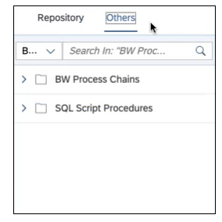
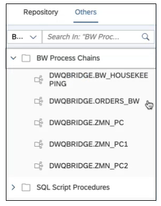
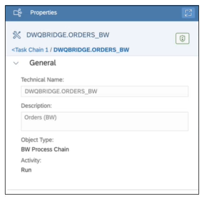

<!-- loio7d7d02a81bfe401ab85ce4d6c527a536 -->

# Run BW Bridge Process Chains in a Task Chain

Include and run SAP BW Bridge process chains in a task chain.

<a name="loio7d7d02a81bfe401ab85ce4d6c527a536__prereq_ccw_sdc_gtb"/>

## Prerequisites

To create and run BW Bridge process chains in a task chain, you must first have created the BW Bridge space and configured the SAP BW Bridge Cockpit. For more information, see [Provisioning the SAP BW Bridge Tenant](https://help.sap.com/viewer/ecce5bb08ae24ed089497fc00c2320d8/cloud/en-US/c356f4ce55744aa09ac2d79a5235c300.html "You can provision SAP BW bridge as an optional feature in SAP Datasphere.") :arrow_upper_right:. The SAP Datasphere user must also be added as a BW Bridge user. For more information, see [Creating Users](https://help.sap.com/viewer/ecce5bb08ae24ed089497fc00c2320d8/cloud/en-US/418216b8676b460c9b5331f74b03e709.html "You need to create SAP BW bridge users as well as SAP Datasphere users.") :arrow_upper_right:.

> ### Note:  
> Before adding a BW Bridge process chain to a task chain, also make sure that the open ID authentication is properly configured in the BW Bridge system. To properly configure open ID authentication, refer to SAP Note [3536298](https://me.sap.com/notes/3536298) - *Usage of BW Bridge Process Chains in Datasphere TaskChains.*

You use the cockpit to create and update process chains. For more information on creating BW Bridge process chains, see [Logging Into SAP BW Bridge](https://help.sap.com/docs/SAP_DATASPHERE/ecce5bb08ae24ed089497fc00c2320d8/b73a5a6e3b36401aac93b2fd19ae5ad2.html) and [Creating Process Chains](https://help.sap.com/docs/SAP_BW_BRIDGE/107a6e8a38b74ede94c833ca3b7b6f51/c372b0ab181d4ba88d0f8eac11d81a7a.html).

To include BW Bridge process chains in a task chain, users need SAP Datasphere DW Modeler and DW Integrator roles in both the SAP Datasphere and BW Bridge spaces. The SAP Datasphere roles include all the necessary privileges and permissions needed to add process chains to a task chain. However, if you have defined scoped roles \(based on custom roles\) they may not automatically include all the necessary privileges. In that case, you would need to make sure these custom roles include the following scoped privileges and permissions:

-   The Data Warehouse Data Builder privilege with Read permission.

-   The Space Files privilege with Read permission and the Data Warehouse Connection privilege with Read permission.

-   The Data Warehouse Data Integration privilege with the Update or Execute permissions.

> ### Note:  
> For more information on defining roles and permissions, including scoped roles, see [Privileges and Permissions](https://help.sap.com/viewer/9f804b8efa8043539289f42f372c4862/cloud/en-US/d7350c6823a14733a7a5727bad8371aa.html "A privilege represents a task or an area in SAP Datasphere and can be assigned to a specific role. The actions that can be performed in the area are determined by the permissions assigned to a privilege.") :arrow_upper_right:.

## Context

SAP BW Bridge process chains available to be run in a task chain are show in the *Others* tab in the task chain editor.

You can monitor the status of process chains runs within a task chain using the Data Integration Monitor, the same as any other object run in a task chain. For more information, see [Monitoring Task Chains](https://help.sap.com/viewer/be5967d099974c69b77f4549425ca4c0/cloud/en-US/4142201ec1aa49faad89a688a2f1852c.html "Monitor the status and progress of running and previously run task chains.") :arrow_upper_right:. In addition, you can also monitor process chain execution from the SAP BW Bridge Cockpit. For more information, see [Monitoring Process Chains](https://help.sap.com/docs/SAP_BW_BRIDGE/107a6e8a38b74ede94c833ca3b7b6f51/d541939cf28540f08946a2ea9a0d4f34.html) and [Monitoring Process Chain Runs](https://help.sap.com/docs/SAP_BW_BRIDGE/107a6e8a38b74ede94c833ca3b7b6f51/3ff97fc3ef6747d58e969f16beeb0922.html).

## Procedure

1.  To add a process chain after starting to create a new task chain, click the *Others* tab.

    The *Others* tab includes two folders: *BW Process Chains* and *SQL Script Procedures*.

    

2.  Expand the BW Process Chains folder to display a list of available BW Bridge process chains.

    

    > ### Note:  
    > If a bridge space does not exist or the user does not have the necessary authorization for access, the *BW Process Chains* folder will be empty.

3.  Select and drag the process chain that you want to run to the task chain canvas.

    You can place a process chain anywhere in the task chain that you could include like any other SAP Datasphere object.

4.  Clicking or selecting the process chain in the task chain displays details about the process chain in the Properties pane detail.

    

5.  After you have finished adding all objects you want to run in a task chain, save and deploy the task chain.

    You can now immediately run the task chain, or schedule the task chain run, the same way you would run or schedule any other task chain. Similarly, you can monitor the task chain run, including the status or the process chain execution, in the Data Integration Monitor. For more information, see [Monitoring Task Chains](https://help.sap.com/viewer/be5967d099974c69b77f4549425ca4c0/cloud/en-US/4142201ec1aa49faad89a688a2f1852c.html "Monitor the status and progress of running and previously run task chains.") :arrow_upper_right:. You can also monitor the execution of process chains from the SAP BW Bridge cockpit by clicking on the *View in SAP BW Bridge Monitor* link that is available in the task log messages after successful start of a process chain.

    > ### Note:  
    > SAP BW Bridge process chains are available across all SAP Datasphere spaces. If a process chain is already being run in one space, it will be locked until the current execution is finished. If you try to run a process chain that is already running, SAP Datasphere returns the error "A conflicting task is already running." Clicking the *View in Monitor* link on the locked task takes you to a page where can see the RUNNING task. That page also shows the details of the space where it is currently being run, as well as the name of the parent chain if the user also has access to that space.

