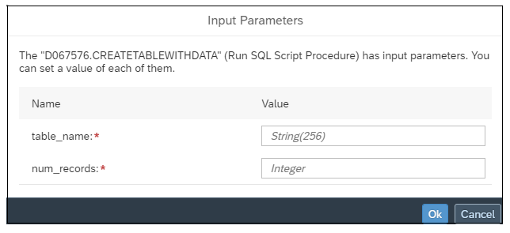

<!-- loio59b9c773035a48c5beb54ce9bb29f1d8 -->

<link rel="stylesheet" type="text/css" href="../css/sap-icons.css"/>

# Run Open SQL Procedures in a Task Chain

Include and run Open SQL schema procedures in a task chain. Use to efficiently manage and execute Open SQL procedures in task chains.

<a name="loio59b9c773035a48c5beb54ce9bb29f1d8__prereq_ccw_sdc_gtb"/>

## Prerequisites

-   For SAP HANA Open SQL schema procedures to be available for users to include in a task chain, the Open SQL schema database user must grant EXECUTE privileges to the space technical HANA user so that other users of the space can view and execute Open SQL schema procedures. See [Allow the Space to Access the Open SQL Schema](https://help.sap.com/viewer/9f36ca35bc6145e4acdef6b4d852d560/DEV_CURRENT/en-US/7eaa370fe4624dea9f182ee9c9ab645f.html "To grant the space write privileges in the Open SQL schema and the ability to write data to target tables in the schema, use the GRANT_PRIVILEGE_TO_SPACE stored procedure. Once this is done, data flows running in the space can select tables in the Open SQL schema as targets and write data to them, and task chains can run procedures in the schema.") :arrow_upper_right:.

## Context

-   No deployment is required for individual Open SQL procedure objects, since they are non-repository objects that already exist in SAP HANA. However, task chains that include Open SQL procedures still require deployment to run, as always.

-   Running Open SQL procedures in spaces where the Relational Data Lake Engine option is enabled are not supported. Enabling the data lake option is specified by the Data Lake Access: *Use this space to access the data lake* option in the *General Settings* tab section of the *Space Management* app.
-   Open SQL procedures added to task chains may include scalar input parameters for which the user is prompted to enter values when the procedure is added to a task chain.

## Procedure

1.  To add Open SQL schema procedures to a task chain, first click the *Others* tab in the left-side panel.

    The left side panel displays the *SQL Script Procedure* folder.

2.  Click  to open the folder and show a list of procedures that are available for you to add to a task chain.

    

3.  Drag a procedure you want to run on to the task chain canvas.

    You may treat the running of procedures just like any other object you might include in a task chain, for example, adding procedures to parallel branches of a task chain, sending out email notifications on completion, and viewing the status or completion of their run in the task chain monitor.

    If the procedure you added to a task chain has input parameters, the task chain editor displays the *Input Parameters* dialog in which you can specify values to use when the procedure is run.

    

4.  Enter values for each input parameter, based on the data type displayed in the *Value* field, then click *Ok*.

    After successful entries in the Input Parameters dialog, your entries for the parameters are displayed in the *Properties* panel where you can update the values as needed.

    

5.  When you've finished adding procedures or other objects, save and deploy the task chain.

    When you save and deploy the task chain, SAP Datasphere validates the input parameter values you entered for all procedures.

    Along with other objects in the task chain, you can monitor the status of procedure runs from the Data Integration Monitor. For more information, see [Monitoring Task Chains](https://help.sap.com/viewer/9f36ca35bc6145e4acdef6b4d852d560/DEV_CURRENT/en-US/4142201ec1aa49faad89a688a2f1852c.html "Monitor the status and progress of running and previously run task chains.") :arrow_upper_right:. In addition, information on HANA Memory resource consumption for procedures included in task chains is displayed in the system monitor.

