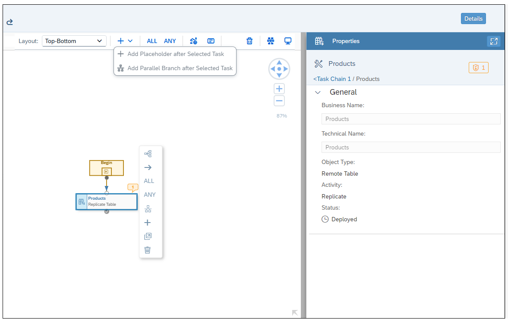

<!-- loio363ffe9b7be84aafba6274503d0e7200 -->

<link rel="stylesheet" type="text/css" href="../css/sap-icons.css"/>

# Running Parallel Tasks in a Task Chain

Create task chains in which individual tasks are run in parallel and successful continuation of the entire task chain run depends on whether ANY or ALL parallel tasks are completed successfully.

## Procedure

1.  After adding an object to the task chain canvas, there are a few different ways in which you can specify that the object or task you added is part of a parallel branch in the task chain:

    -   Select the task object you added to the canvas and then click the *Add as Parallel Branch* option from the list of context menu options available.

        

    -   Alternatively, you can select the task object, click  Add from the shell bar above the canvas, and select the *Add Parallel Branch to Selected Task* menu option.

        

        If you choose either of these options, a new task placeholder is added to the canvas, next to the currently selected task object.

        

        You can then drag another task object on to the canvas to take the place of the new task placeholder.

        > ### Note:  
        > The task chain editor displays indications of warnings and errors with the bubble icon appearing next to specific task objects. You can click on an individual bubble to view the specific warning or error that was detected; for example, if a specific task was already included in another task chain, or if you need to make additional changes or updates to the task chain for it to be deployed and run.

    -   Another way to create a parallel branch in a task chain is simply to drag a new object to the canvas on top of the currently selected task object and then choose the *Add as Parallel* context menu option.

        

        Following this selection, the new task object will be placed next to the currently selected object. For example:

        

2.  You may continue to add additional parallel task objects in the same way. When you're finished making changes, save and deploy the task chain.

    > ### Note:  
    > There is no predefined limit on the number of tasks you can include in a parallel task chain branch.

