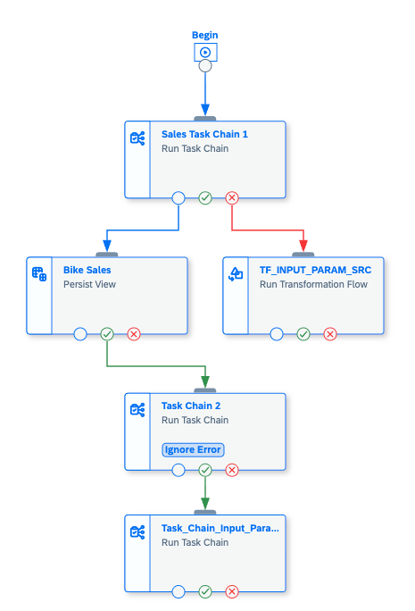
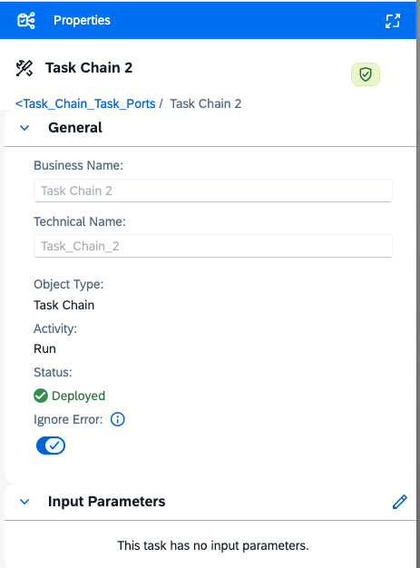

<!-- loio04dcfa7fcf374e8798c9807cfe612c0c -->

<link rel="stylesheet" type="text/css" href="../css/sap-icons.css"/>

# Select Task Ports in a Task Chain

Use task ports to control the flow of task based on success or failure outcomes.

## Context

Task ports provide options for error handling in a task chain. Traditionally, if a task in a task chain was not successful, the entire task chain flow would stop. Task ports provide options that allow you to continue a task chain even if a task in the chain is not successfully executed. This feature is beneficial for maintaining workflow continuity, managing errors effectively, and customizing task execution paths.

## Procedure

1.  Create a new task chain.

2.  Add tasks into your task chain.

3.  For each object task, select a task port to connect to the following task.

    <table>
    <tr>
    <th valign="top">

    Task Port
    
    </th>
    <th valign="top">

    Description
    
    </th>
    </tr>
    <tr>
    <td valign="top">
    
    :white_circle:
    
    </td>
    <td valign="top">
    
    The object task linked by an *Any* port will be initiated regardless of the success or failure of the first task. The task chain will continue as normal.
    
    </td>
    </tr>
    <tr>
    <td valign="top">
    
     Success \(green\)
    
    </td>
    <td valign="top">
    
    The object task linked by a *Success* port will be initiated if the first task is successful. The task chain will continue as normal. This is the default task port.
    
    </td>
    </tr>
    <tr>
    <td valign="top">
    
     Error \(red\)
    
    </td>
    <td valign="top">
    
    The object task linked by an *Error* port will be initiated if the task is not successful and has a *failed* status
    
    </td>
    </tr>
    </table>
    
    

4.  \(Optional\) Turn on the *Ignore Error* button in the right side panel to disregard the status of the single object task in the status evaluation of the entire task chain. 

5.  Run your task chain.

