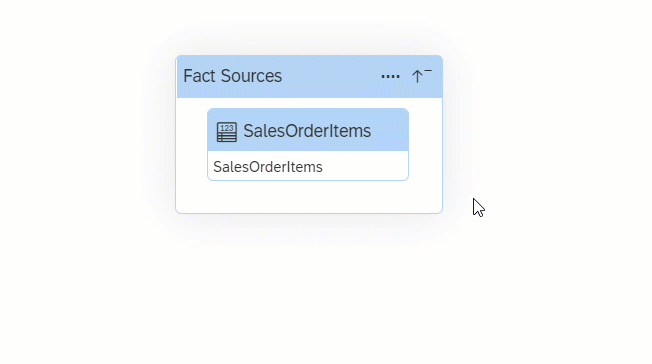

<!-- loio337fa99de4a44700ba49e2214a1f3349 -->

<link rel="stylesheet" type="text/css" href="../css/sap-icons.css"/>

# Creating a Consumption Model

Consumption models are the basis to consume your data.

<a name="loio337fa99de4a44700ba49e2214a1f3349__prereq_sgr_fdr_1mb"/>

## Prerequisites

Analytical datasets, fact models or dimensions have already been defined.

## Context

You build your consumption models on top of business entities or on top of fact models, which have some elements of the consumption model already predefined.

These consumption models focus on specific analytical requirements and enrich the model accordingly. As an example, this could mean setting measures and attributes from different fact and dimension sources or fact models into relation by defining context-dependent navigations to compose use case-specific consumption models.

For instance, if we consider the case of Controlling - Profitability Analysis \(COPA\) in a business context, it becomes clear that three fact sources storing the measures *Actuals*, *Budget*, and *Forecast* are connected to different dimension sources via associations \(*Material*, *Profit Center*, *SAP Mastercode*, and *Time*\). All four dimensions from the first level are connected to the three fact sources. Given that the link between the different business entities was already established, the information on *Company Code* is automatically available through the *Profit Center* dimension source.

As a result, the consumption model allows harmonized reporting on different measures and attributes of all the included fact and dimension sources. The object used for reporting is the perspective which is defined within the consumption model editor.

## Procedure

1.  In the side navigation area, click  \(*Business Builder*\), select a space if necessary, and click *New Consumption Model* to open the editor.

2.  Enter a title for your consumption model. Choose *Step 2*.

3.  Choose the fact source you want to use in your consumption model: you can choose analytical datasets or fact models. Choose *Step 3*.

4.  Define a *Source Alias* and choose *Create*. You are taken to the graphical representation of your model. At the center of the diagram, you can see your fact source.

5.  You can zoom into your fact source and add associated business entities for consumption by selecting your fact source and choosing  \(Show Source Graph\) .

    If your consumption model contains just one fact source, you will see all associations from the selected fact by default.

6.  To add dimension sources, choose  *Add Dimension Sources* and select your business entities. They then appear under *Dimensions* in the right half of the screen.

    

7.  Define the authorizations for the consupmption model. Go to the *General* tab and choose either *Allow public data access* or choose an auhtorization scenario.

8.  \[optional\] Select the package to which the object belongs.

    Packages are used to group related objects in order to facilitate their transport between tenants.

    > ### Note:  
    > Once a package is selected, it cannot be changed here. Only a user with the DW Space Administrator role \(or equivalent privileges\) can modify a package assignment in the *Packages* editor.

    For more information, see [Creating Packages to Export](https://help.sap.com/viewer/9f36ca35bc6145e4acdef6b4d852d560/DEV_CURRENT/en-US/24aba84ceeb3416881736f70f02e3a0a.html "Users with the DW Space Administrator role can create packages to model groups of related objects for transport between tenants. Modelers can add objects to packages via the Package field, which appears in editors when a package is created in their space. Once a package is complete and validated, the space administrator can export it to the Content Network. The structure of your package is preserved and, as the objects it contains evolve, you can easily export updated versions of it.") :arrow_upper_right:.

    Perspectives are automatically assigned to the same package.

9.  Define the measures of your consumption model. More information: [Define Measures](define-measures-5cbcfee.md)

10. Define the attibutes of your consumption model. More information: [Define Attributes](define-attributes-5b7b0f8.md)

11. Define the filters for your consumption model. More information: [Define Filters](define-filters-bc73ffe.md)

12. Define the perspectives for your consumption model. More information: [Define Perspectives](define-perspectives-ce26fd3.md)

