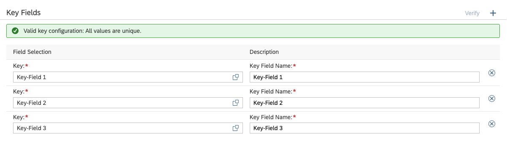

<!-- loio9748bab194d94b9085eae7a139b55097 -->

<link rel="stylesheet" type="text/css" href="../css/sap-icons.css"/>

# Define a Key

Keys unambiguously identify a single record in a business entity.

## Context

Keys need to be unique. A business entity can have more than one key and you can define a key with multiple members.

> ### Caution:  
> Don't use fields of SAP HANA datatype BIGINT as key of a dimension, as this can lead to problems with displaying large values in SAP Analytics Cloud.

## Procedure

1.  Go to the *Key Definitions* tab.

2.  Choose  *Add*.

3.  Enter a title for your key.

4.  Select one or several of the fields as key. A key can have multiple members. The key is validated by the system and you get a message telling you how many entries within the respective business entity there are and how many of them match to the defined key. This information shall help you evaluate whether the set configuration makes sense.

5.  When using compound keys it is very important to consider the order of the key fields as this order will define the compounding sequence and the representative key field. The compounding sequence is defined from top to bottom \(ideally from “more general” to “specific”\). The representative key field will be the last and ideally most specific field in the list. The order of key fields cannot be changed anymore when the key is used in associations.

    > ### Example:  
    > In this example the compounding sequence is “Key-Field 1/Key-Field 2/Key-Field 3” and “Key-Field 3” will be set as representative key field.

    When a perspective is deployed the compounding information for a dimension will only be deployed for the primary key. The primary key is the first key in the list of keys that matches all fields which are used in the association to the Dimension. As the keys are listed in alphabetical order, the order can be influenced by giving the primary key a name which moves it to the top of the list.

6.  Enter a description for the key field.

7.  Save your entries.

