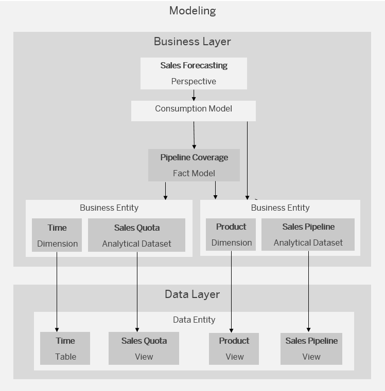

<!-- loio925f6a6e86344de0b65170ec27c01c78 -->

# Example for Using the Business Layer

Here is a simple example for a scenario using the Business Builder.

Let's look at the objects you might need to create in order to analyze the sales performance of a given product range for a given month.

In the Data Builder, your data engineer has created the tables and views with the data you need. In the Business Builder, you first create the business entities *time*, *sales quota*, *product* and *sales pipeline* and connect them to the objects in the Data Builder. Since you want to reuse this information for a different analysis, you then create a fact model on *pipeline coverage* on top. On top of that, you create your consumption model with the *sales forecasting* perspective, which contains all the data that is relevant for your analysis.

