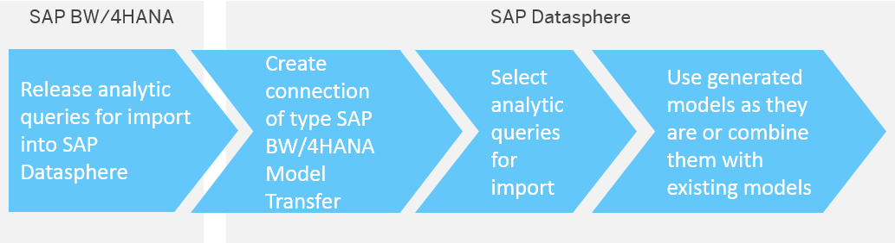

<!-- loioa3d4a2f91bea4810ba8839ff73577dac -->

<link rel="stylesheet" type="text/css" href="../css/sap-icons.css"/>

# Importing SAP BW∕4HANA Models

You can import existing analytic queries from SAP BW∕4HANA into SAP Datasphere in order to build new models on top of them or enhance them.

The import of SAP BW∕4HANA models enables you to re-use existing metadata and data from SAP BW∕4HANA systems so that you can include this metadata and data in SAP Datasphere without having to rebuild them manually. To enable interaction between SAP Datasphere and SAP BW∕4HANA, we need to ensure that SAP Datasphere and SAP BW∕4HANA understand each other. This requires a transformation of metadata of entities from SAP BW∕4HANA to the definition of entities known in SAP Datasphere.

With the import, objects are generated in the Business Builder and the Data Builder. Data access to SAP BW∕4HANA is realized through these objects. The data is retrieved directly from the SAP BW∕4HANA system via remote tables.

You can then use these models as they are or enhance the data in SAP Datasphere on each level of your model - for example by adding master data to a view of type dimension.

The graphic shows the process flow for importing queries:

<a name="loioa3d4a2f91bea4810ba8839ff73577dac__section_epn_wpg_k4b"/>

## Prerequisites

You have a SAP BW∕4HANA system installed.

In your SAP BW∕4HANA system, you need to release the analytic queries for transferring into SAP Datasphere. For more information, see: [Releasing Analytic Queries for Use in SAP Datasphere](https://help.sap.com/viewer/107a6e8a38b74ede94c833ca3b7b6f51/2.0.7/en-US/cb1e79fc792b4737881b00c1685edc2a.html) 

In SAP Datasphere, You have created a connection of type *SAP BW/4HANA Model Transfer* to connect to your SAP BW∕4HANA system. For more information, see [SAP BW∕4HANA Model Transfer Connections](https://help.sap.com/viewer/be5967d099974c69b77f4549425ca4c0/cloud/en-US/1caba954bc604e00bf8e82e383a46368.html "Use an SAP BW/4HANA Model Transfer connection to import analytic queries from SAP BW∕4HANA with their Composite Providers and InfoObjects.") :arrow_upper_right:.

<a name="loioa3d4a2f91bea4810ba8839ff73577dac__section_hc2_xpg_k4b"/>

## Procedure

1.  In the side navigation area, click *Business Builder*. Select a space if necessary.

2.  Choose  \(Import\) ** \> *SAP BW/4HANA* \> *Model Transfer Wizard*.

3.  In the *Model Transfer Wizard*, search for and select the SAP BW∕4HANA connection that you would like to use. Choose *Next*. The system will show you all available analytic queries.

    > ### Note:  
    > Only analytic queries that have been exposed in the source system for consumption in SAP Datasphere can be imported. For more information see [Releasing Analytic Queries for Use in SAP Datasphere](https://help.sap.com/viewer/107a6e8a38b74ede94c833ca3b7b6f51/2.latest/en-US/cb1e79fc792b4737881b00c1685edc2a.html).

4.  Use the *Create Business Builder Objects* setting to control which objects to create:
    -   *Business Entities and Consumption Models* \[default\] - Create all possible *Data Builder* and *Business Builder* objects.
    -   *Business Entities Only* - Create *Data Builder* objects and *Business Builder* business entities.
    -   *None* - Create only *Data Builder* objects. Queries are imported as SAP Datasphere analytic models, which can be consumed directly in SAP Analytics Cloud.

5.  Select the analytic query that you would like to transfer. In the pane on the right, you will see the list of objects which will be generated in the *Business Builder* and in the *Data Builder*. The *Import Status* tells you if the objects already exist and will be overwritten or if they are new.

    > ### Note:  
    > When re-importing a model, changes in the column defintions of source entities that generate remote tables will automatically result in updating and redeploying the remote tables. This is only possible for remote tables that directly access data live in the source. Before doing the re-import, you need to stop snapshot and real-time replication for any affected remote tables. This is necessary because of the inconsistent changes in the source.
    > 
    > If there is a remote table that needs to be updated but has been set up for replication \(snapshot or real-time replication\), you will be notified and asked to stop replication first.

6.  \[optional\] To import the analysis authorizations associated with the data in the query, click the *Import Permissions* button, and then click *OK*.

    Additional objects will be added to the list of objects to be imported on the *Data Builder/Data Access Controls* tab to create the data access control and apply it to the fact.

    > ### Note:  
    > If you do not import the analysis authorizations in this wizard, you can do it later in the *Data Access Controls* app \(see [Import SAP BW and SAP BW∕4HANA Analysis Authorizations](https://help.sap.com/viewer/be5967d099974c69b77f4549425ca4c0/cloud/en-US/f56e4271dc4943aa9f21223ce5c93873.html "You can import analysis authorizations defined in SAP BW and SAP BW∕4HANA systems into SAP Datasphere to provide row-level protection for data imported from these systems.") :arrow_upper_right:\).

7.  Choose *Import*.

    > ### Note:  
    > The system will generate notifications about the import process.
    > 
    > If the import was successful, the generated objects will appear in the Business Builder and Data Builder.
    > 
    > You can check this in detail by choosing  \(Import\)** \> *SAP BW/4HANA* \> *Show Logs*.

