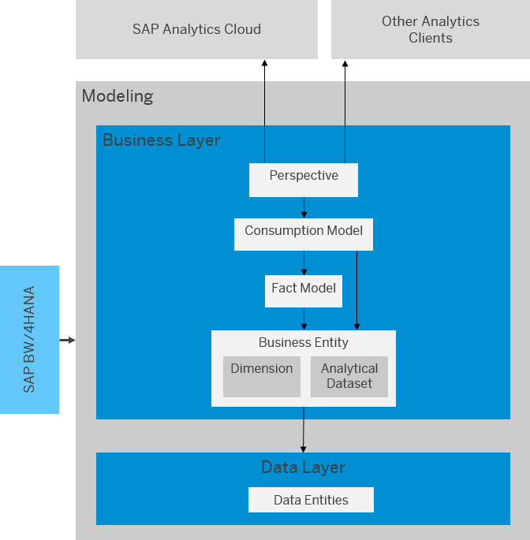

<!-- loio3829d46c48a44f1e94915054bd76b7b9 -->

# Modeling Data in the Business Builder

The business layer is the area where business users can define objects with a business approach.

SAP Datasphere has two modeling layers tailored for different user groups: the data layer is the area where data engineers create their models with a technical approach, whereas the business layer is the area for business users who create their models using a more semantic approach. This allows business users to work independently from data engineers, while still being able to collaborate and share data with them. The collaboration between business users and data engineers changes fundamentally: data engineers can focus on the data consolidation and provisioning, while the business users can optimize the business models.

The IT infrastructure on the data layer is usually more volatile than the needs of the business user. The reasons for changes are multifold: system updates, software changes, acquisitions, etc. All this leads to the fact that the data layer changes permanently and needs adjustments. Business definitions on the other hand stay relatively stable. They do not change frequently, e.g. the calculation of the KPI margin.

To keep the business layer more robust, while continuously modifying the data layer, the business layer is loosely coupled to the data layer. The layers can be mapped and remapped at any point of time. Without the need of modifying the business models themselves, the data models can be upgraded and remapped to the business models.

The Business Builder is the designated tool for modeling the objects of the business layer. Business users can define business models in the Business Builder, which are separate from the physical data layer. They create their models top down, and map them to the data layer.

The business layer can be used to expose business users to the data fields they need while hiding any data fields that might not be relevant.

Business users can create different business entities like dimensions and analytical datasets on top of the data layer. On top of these models, you can create fact models and consumption models as a basis to consume your data. On top of the consumption model, you can create perspectives, which can be used to analyze your data in stories within SAP Analytics Cloud.

Authorization scenarios give the users access to the relevant data according to their role.

To create your models in the Business Builder, you proceed as follows:

1.  Create your business entities \(dimensions and analytical datasets\).
2.  Optional: Create an authorization scenario, if you want to restrict access to your business entities. Assign your authorization scenario to the business entities.
3.  Optional: Create a fact model if you want to have a reusable part for a consumption model.
4.  Create a consumption model.

When you have a SAP BW/4HANA system, you can import analytical queries. These queries need to have been exposed in the SAP BW/4HANA system for consumption in SAP Datasphere. The corresponding objects in the Data Builder \(remote tables\) and in the Business Builder \(dimensions, analytical datasets, consumption models\) are then generated. The generated perspective has the same visual representation of the data as the SAP BW/4HANA query.

