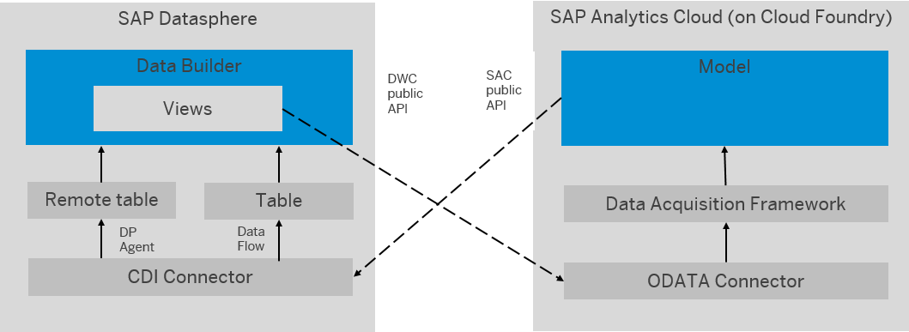

<!-- loiof589cdea41674badaecfa1bf02571b6f -->

# Bi-Directional Integration of SAP Datasphere and SAP Analytics Cloud for Planning

You can load data into SAP Analytics Cloud and retract planning data for consolidation of actual and plan data.

As we have already established, SAP Analytics Cloud should be your first choice for a BI client, as it is seamlessly integrated with SAP Datasphere.

You can now use the bi-directional integration for planning: planners can not only transfer data from SAP Datasphere to SAC, but also between SAC and SAP Datasphere.

For example, you can load fact data and master data from SAP Datasphere to SAP Analytics Cloud to use actual data from SAP Datasphere in your planning tables in SAC. Then you can seamlessly retract plan data from SAC models and use it in SAP Datasphere. Additionally, you can join plan and actual data from multiple sources in common views in SAP Datasphere that you can then use for live reporting or any other kind of downstream processing of your plan data. You can also meet corporate requirements to store all steering-relevant data in one data warehouse as a single source of truth.

<a name="loiof589cdea41674badaecfa1bf02571b6f__section_r1k_sqd_cvb"/>

## Architecture

This use case of bi-directional integration is enabled by two public APIs:

-   SAP Datasphere provides a public OData API to pull data from SAP Datasphere and integrate it into SAP Analytics Cloud using the OData Services Connection.
-   SAP Analytics Cloud provides the Data Export Service \(DES\) API to pull data from SAC and make it available in SAP Datasphere using remote tables or data flows.

<a name="loiof589cdea41674badaecfa1bf02571b6f__section_ejk_df4_dvb"/>

## Procedure

1.  Prepare the prerequisites for the bi-directional integration. For more information, see [Prerequisites for Consuming Data from SAP Datasphere in SAP Analytics Cloud via the OData Services Connection](prerequisites-for-consuming-data-from-sap-datasphere-in-sap-analytics-cloud-via-the-odata-044fe8e.md).
2.  Transfer data from SAP Datasphere to SAP Analytics Cloud. For more information, see [Transfer Data from SAP Datasphere to SAP Analytics Cloud](transfer-data-from-sap-datasphere-to-sap-analytics-cloud-e33edf4.md).
3.  Transfer planning data into SAP Datasphere. For more information, see [Transfer Planning Data into SAP Datasphere](transfer-planning-data-into-sap-datasphere-5866995.md).
4.  Use combined data in a story in SAP Analytics Cloud. For more information, see [Use Combined Data in a Story in SAP Analytics Cloud](use-combined-data-in-a-story-in-sap-analytics-cloud-9e2111f.md).

