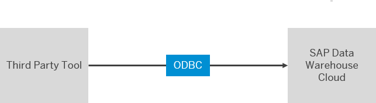

<!-- loio4db6f5a329af44509ae422ad707877b2 -->

# Connecting BI Clients and Tools via ODBC on Microsoft Windows

You can expose your space data via ODBC to use it in third-party BI clients.

<a name="loio4db6f5a329af44509ae422ad707877b2__prereq_uwb_glm_plb"/>

## Prerequisites

-   You have created a database user in your space \(see [Create a Database User](https://help.sap.com/viewer/9f36ca35bc6145e4acdef6b4d852d560/internal/en-US/798e3fd6707940c3bd2219b2d1ebaac2.html "Users with the DW Space Administrator or DW Integrator role (space administrators and integrators) can create database users, granting them privileges to read from and/or write to an Open SQL schema with restricted access to the space schema.") :arrow_upper_right:\)
-   You have at least one view in your space with the *Expose for Consumption* switch enabled \(see [Exposing a View For Consumption](../Modeling-Data-in-the-Data-Builder/exposing-a-view-for-consumption-40ec77e.md)\).
-   You have added the IP address of your third-party tool to the IP allowlist \(see [Add IP address to IP Allowlist](https://help.sap.com/viewer/935116dd7c324355803d4b85809cec97/internal/en-US/a3c214514ef94e899459f68f4c1e2a23.html "Clients in your local network need an entry in the appropriate IP allowlist in SAP Datasphere. Cloud Connectors in your local network only require an entry if you want to use them for federation and replication from on-premise systems.") :arrow_upper_right:\).
-   You have an ODBC Data Source Administrator installed. If you are using 64-bit MS Office, the 64-bit ODBC Data Source Administrator is preferable. If you are using 32-bit MS Office, the 32-bit ODBC Data Source Administrator should be used.
-   You have the prerequisites for SAP HANA Cloud \(see [Connect to SAP HANA Cloud via ODBC](https://help.sap.com/viewer/db19c7071e5f4101837e23f06e576495/cloud/en-US/9c0c101e368a4102a7eaeef542970741.html)\).

## Context

You can expose the data of a dedicated space via ODBC to third-party BI clients. You can decide if all the objects in the space are allowed to be consumed, or just specific objects.

## Procedure

1.  **Create an ODBC Data Source pointing to SAP Datasphere schema**
2.  Go to the ODBC Data Source Administrator.

3.  On the *User DSN* tab, choose *Add* to create a new ODBC data source.

4.  Select the HDBOBC driver and choose *Finish*. The HDBOBC driver should have version 2.4.183 or higher.

5.  You now need to configure your ODBC data source:

    1.  Enter the Host and Port number of your SAP Datasphere system. You are given these credentials when you create your space schema user.
    2.  Deselect *Multitenant* under *Database*.
    3.  Select *Connect to the database using TLS/SSL* under TLS/SSL.
    4.  You can now test the connection by entering the User ID and password you got when you created the space schema user.

        > ### Note:  
        > If you receive the error “Connection refused”, you might have to add your IP to the IP allowlist in SAP Datasphere \(see [Add IP address to IP Allowlist](https://help.sap.com/viewer/935116dd7c324355803d4b85809cec97/internal/en-US/a3c214514ef94e899459f68f4c1e2a23.html "Clients in your local network need an entry in the appropriate IP allowlist in SAP Datasphere. Cloud Connectors in your local network only require an entry if you want to use them for federation and replication from on-premise systems.") :arrow_upper_right:\).

6.  **Load data into your third-party frontend using the ODBC Data Source**
7.  Go to your third-party frontend.

8.  Connect via ODBC to SAP Datasphere. Enter the username and password from your space schema user. You can select your SAP Datasphere source and load your data.

9.  You can now change the appearance of your data by using your third-party tools.

