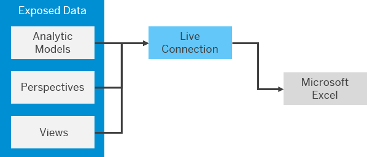

<!-- loioef6e226fc32e48a5b3655fdb1102c0d5 -->

# Consume Data in Microsoft Excel via an SAP Add-In

You can create a live connection from SAP Analytics Cloud to SAP Datasphere and consume data exposed as analytic models, perspectives, and views in Microsoft Excel, via the SAP Analytics Cloud add-in for Microsoft Office. 

## Context

You must:

-   Install the add-in \(see [Deploying the Add-In](https://help.sap.com/docs/SAP_ANALYTICS_CLOUD_OFFICE/2b73edbc8f8f4189a36bc7a2e038185c/6a191aeefd5c464aa2adc4e1a69d4523.html) in the *SAP Analytics Cloud, Add-In for Microsoft Office* documentation.
-   Be a SAP Datasphere user with any of the standard roles. If you do not need to connect to SAP Datasphere itself, and only consume data, then an administrator can grant you the *DW Consumer* role \(see [Standard Application Roles](https://help.sap.com/viewer/9f804b8efa8043539289f42f372c4862/cloud/en-US/a50a51d80d5746c9b805a2aacbb7e4ee.html "SAP Datasphere is delivered with several standard roles.") :arrow_upper_right:\).

    If data access controls have been applied, then the data you can consume will be filtered based on your user id \(see [Securing Data with Data Access Controls](https://help.sap.com/viewer/be5967d099974c69b77f4549425ca4c0/cloud/en-US/a032e51c730147c7a1fcac125b4cfe14.html "Data access controls allow you to apply row-level security to your objects. When a data access control is applied to a data layer view or a business layer object, any user viewing its data will see only the rows for which they are authorized, based on the specified criteria.") :arrow_upper_right:\).

-   Be a member of the SAP Datasphere space exposing the data \(see [Assign Members to Your Space](https://help.sap.com/viewer/be5967d099974c69b77f4549425ca4c0/cloud/en-US/9d59fe511ae644d98384897443054c16.html "As a Space Administrator, you can assign users as members of your space.") :arrow_upper_right:\).
-   Have access to an SAP Analytics Cloud tenant and have the role *BI Content Creator* or another role providing equivalent privileges.
-   Create or have access to an SAP Analytics Cloud live data connection to your SAP Datasphere tenant \(see [Live Data Connections to SAP Datasphere](https://help.sap.com/docs/SAP_ANALYTICS_CLOUD/00f68c2e08b941f081002fd3691d86a7/ad4281e2875949f0b4d45d1072ff4c38.html) in the *SAP Analytics Cloud* documentation\).

> ### Note:  
> This topic focuses on the SAP Analytics Cloud add-in for Microsoft Office. You can also consume data exposed as perspectives and views in the SAP Analysis for Microsoft Office add-in \(see the [SAP Analysis for Microsoft Office](https://help.sap.com/docs/SAP_BUSINESSOBJECTS_ANALYSIS_OFFICE) documentation\). Data exposed as analytic models cannot be consumed in the SAP Analysis for Microsoft Office add-in.

<a name="loioef6e226fc32e48a5b3655fdb1102c0d5__steps_a4v_2lx_3wb"/>

## Procedure

1.  Open your Excel desktop app \(or Excel for the Web\) and create a new blank workbook.

2.  Click the *SAP Analytics Cloud* Ribbon tab, and click *Sign In* to open the *SAP Analytics Cloud* panel.

3.  Enter the URL for your SAP Analytics Cloud tenant, and click *Go*.

4.  Enter your SAP Analytics Cloud user name and password, and click *Log On* to connect to the tenant.

5.  Click *Add Table*, select your SAP Datasphere connection and space, then select your analytic model, perspective, or view, and click *Open*.

6.  Select measures and dimensions as appropriate and work with your data as usual.

    For detailed information about working in Excel, see [Analyze Your Data](https://help.sap.com/docs/SAP_ANALYTICS_CLOUD_OFFICE/c637c9ff5d61457eb415ce161e38e57b/c66430b1b2084f05a5cc8fde0422f670.html) in the *SAP Analytics Cloud, Add-In for Microsoft Office* documentation.

    See also the blog [Access SAP Data Warehouse Cloud with SAP’s Microsoft Excel add-ins](https://blogs.sap.com/2022/05/17/access-sap-data-warehouse-cloud-with-saps-microsoft-excel-add-ins/comment-page-1/) \(published May 2022\).

