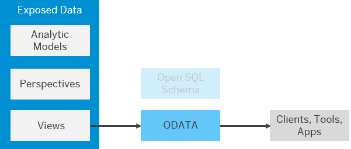
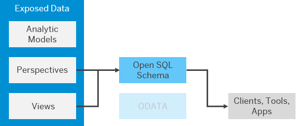

<!-- loioadd771abf6f54c9d8de4c7e470a0e6f0 -->

# Consume Data in Power BI and Other Third-Party Clients, Tools, and Apps

You can consume data exposed as views in Microsoft Power BI and other third-party clients, tools, and apps. You can connect to SAP Datasphere through the OData API, or via an Open SQL schema.

This topic contains the following sections:

-   [Connect Power BI to SAP Datasphere via an OData Service](consume-data-in-power-bi-and-other-third-party-clients-tools-and-apps-add771a.md#loioadd771abf6f54c9d8de4c7e470a0e6f0__section_power_bi_odata)
-   [Connecting Power BI to an Open SQL Schema](consume-data-in-power-bi-and-other-third-party-clients-tools-and-apps-add771a.md#loioadd771abf6f54c9d8de4c7e470a0e6f0__section_power_bi_open_sql)

<a name="loioadd771abf6f54c9d8de4c7e470a0e6f0__section_power_bi_odata"/>

## Connect Power BI to SAP Datasphere via an OData Service

You can connect Power BI to SAP Datasphere via an OData service by way of a custom connector or a blank query and consume views that are exposed for consumption.

You must:

-   Be a SAP Datasphere user with any of the standard roles. If you do not need to connect to SAP Datasphere itself, and only consume data, then an administrator can grant you the *DW Consumer* role \(see [Standard Application Roles](https://help.sap.com/viewer/935116dd7c324355803d4b85809cec97/internal/en-US/a50a51d80d5746c9b805a2aacbb7e4ee.html "SAP Datasphere is delivered with several standard roles.") :arrow_upper_right:\).

    If data access controls have been applied, then the data you can consume will be filtered based on your user id \(see [Securing Data with Data Access Controls](https://help.sap.com/viewer/9f36ca35bc6145e4acdef6b4d852d560/internal/en-US/a032e51c730147c7a1fcac125b4cfe14.html "Data access controls allow you to apply row-level security to your objects. When a data access control is applied to a data layer view or a business layer object, any user viewing its data will see only the rows for which they are authorized, based on the specified criteria.") :arrow_upper_right:\).

-   Be a member of the SAP Datasphere space exposing the data \(see [Assign Members to Your Space](https://help.sap.com/viewer/9f36ca35bc6145e4acdef6b4d852d560/internal/en-US/9d59fe511ae644d98384897443054c16.html "As a Space Administrator, you can assign users as members of your space.") :arrow_upper_right:\).
-   Obtain the following parameters for an OAuth client defined in your SAP Datasphere tenant:
    -   Client ID
    -   Secret
    -   Token URL
    -   Authorization URL

See the following blogs for more information:

-   [SAP Data Warehouse Cloud: OData Connector for Power BI](https://blogs.sap.com/2022/10/14/sap-data-warehouse-cloud-odata-connector-for-powerbi/) \(published October 2022\)
-   [Connecting SAP Data Warehouse Cloud OData API with Power BI via a Blank Query](https://blogs.sap.com/2022/09/23/connecting-sap-data-warehouse-cloud-odata-api-with-powerbi-via-a-blank-query-2/) \(published September 2022\)

<a name="loioadd771abf6f54c9d8de4c7e470a0e6f0__section_power_bi_open_sql"/>

## Connecting Power BI to an Open SQL Schema

You can connect Power BI to SAP Datasphere via an Open SQL schema, and consume perspectives and views that are exposed for consumption.

You must:

-   Request a space administrator or integrator to provide you with access to a database user/Open SQL schema associated with the SAP Datasphere space exposing the data \(see [Create a Database User](https://help.sap.com/viewer/9f36ca35bc6145e4acdef6b4d852d560/internal/en-US/798e3fd6707940c3bd2219b2d1ebaac2.html "Users with the DW Space Administrator or DW Integrator role (space administrators and integrators) can create database users, granting them privileges to read from and/or write to an Open SQL schema with restricted access to the space schema.") :arrow_upper_right:\).
-   Request an administrator to add the IP address of your tool to the IP allowlist \(see [Add IP address to IP Allowlist](https://help.sap.com/viewer/935116dd7c324355803d4b85809cec97/internal/en-US/a3c214514ef94e899459f68f4c1e2a23.html "Clients in your local network need an entry in the appropriate IP allowlist in SAP Datasphere. Cloud Connectors in your local network only require an entry if you want to use them for federation and replication from on-premise systems.") :arrow_upper_right:\).
-   Connect to your Open SQL schema. For information about connecting through ODBC on Windows, see [Connecting BI Clients and Tools via ODBC on Microsoft Windows](connecting-bi-clients-and-tools-via-odbc-on-microsoft-windows-4db6f5a.md).

See the blog [How to Consume SAP Data Warehouse Cloud in Power BI](https://blogs.sap.com/2022/02/23/how-to-consume-sap-data-warehouse-cloud-in-power-bi/) for more information.

