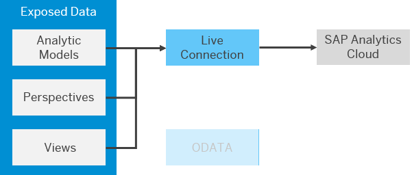

<!-- loioa2c5486c03174620be9de3c8c769ce54 -->

<link rel="stylesheet" type="text/css" href="../css/sap-icons.css"/>

# Consume Data in SAP Analytics Cloud via a Live Connection

You can create a live connection from SAP Analytics Cloud to SAP Datasphere and consume data exposed as analytic models, perspectives, and views to create stories and analytic applications.

## Context

You must:

-   Be a SAP Datasphere user with any of the standard roles. If you do not need to connect to SAP Datasphere itself, and only consume data, then an administrator can grant you the *DW Consumer* role \(see [Standard Application Roles](https://help.sap.com/viewer/935116dd7c324355803d4b85809cec97/internal/en-US/a50a51d80d5746c9b805a2aacbb7e4ee.html "SAP Datasphere is delivered with several standard roles.") :arrow_upper_right:\).

    If data access controls have been applied, then the data you can consume will be filtered based on your user id \(see [Securing Data with Data Access Controls](https://help.sap.com/viewer/9f36ca35bc6145e4acdef6b4d852d560/internal/en-US/a032e51c730147c7a1fcac125b4cfe14.html "Data access controls allow you to apply row-level security to your objects. When a data access control is applied to a data layer view or a business layer object, any user viewing its data will see only the rows for which they are authorized, based on the specified criteria.") :arrow_upper_right:\).

-   Be a member of the SAP Datasphere space exposing the data \(see [Assign Members to Your Space](https://help.sap.com/viewer/9f36ca35bc6145e4acdef6b4d852d560/internal/en-US/9d59fe511ae644d98384897443054c16.html "As a Space Administrator, you can assign users as members of your space.") :arrow_upper_right:\).
-   Have access to an SAP Analytics Cloud tenant and have the role *BI Content Creator* or another role providing equivalent privileges.
-   Create or have access to an SAP Analytics Cloud live data connection to your SAP Datasphere tenant \(see [Live Data Connections to SAP Datasphere](https://help.sap.com/docs/SAP_ANALYTICS_CLOUD/00f68c2e08b941f081002fd3691d86a7/ad4281e2875949f0b4d45d1072ff4c38.html) in the *SAP Analytics Cloud* documentation\).

## Procedure

1.  Navigate to your SAP Analytics Cloud tenant.

    > ### Note:  
    > If an administrator has configured a connection to an SAP Analytics Cloud tenant \(and you are assigned one or more BI roles\), you can use the  \(*Product Switch*\) in the top-right corner of the screen to navigate.

2.  In the side navigation area, click  \(*Stories*\).

3.  Click the *Responsive* or *Canvas* tile, select the *Optimized Design Experience* mode, and click *Create* to open a new story in the editor.

    > ### Note:  
    > SAP Datasphere analytic models are not supported in the *Classic Design Experience* mode.

4.  In the *Tools* menu, click *Add New Data* and then select *Data from an existing dataset or model* to open the *Select Dataset or Model* dialog.

5.  In the panel on the left, select your SAP Datasphere live data connection, select your space, and then click the model to open.

6.  Drag a chart or table from the *Assets* list in the left panel and build your story as usual.

    For detailed information about creating stories, see [Data Visualization \(Stories\)](https://help.sap.com/docs/SAP_ANALYTICS_CLOUD/00f68c2e08b941f081002fd3691d86a7/29e0feaf17584e118ef30e6102008224.html) in the *SAP Analytics Cloud* documentation.

    > ### Note:  
    > For information about SAP Analytics Cloud limitations with this type of connection, see SAP Note [2832606](https://launchpad.support.sap.com/#/notes/2832606).

