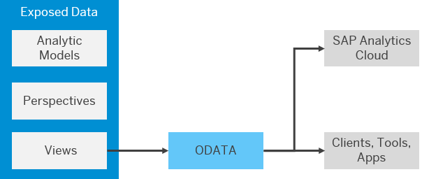

<!-- loio7a453609c8694b029493e7d87e0de60a -->

<link rel="stylesheet" type="text/css" href="../css/sap-icons.css"/>

# Consume Data via an OData Service

You can connect to the OData API and consume data exposed as views in SAP Analytics Cloud and other clients, tools, and apps that are capable of accessing an OData service and authenticating via an OAuth client.

This topic contains the following sections:

-   [Getting Started with the SAP Datasphere OData APIs](consume-data-via-an-odata-service-7a45360.md#loio7a453609c8694b029493e7d87e0de60a__section_getting_started)
-   [Catalog Service](consume-data-via-an-odata-service-7a45360.md#loio7a453609c8694b029493e7d87e0de60a__section_catalog_service)
-   [Consumption Service](consume-data-via-an-odata-service-7a45360.md#loio7a453609c8694b029493e7d87e0de60a__section_consumption_service)
-   [Parameters](consume-data-via-an-odata-service-7a45360.md#loio7a453609c8694b029493e7d87e0de60a__section_request_parameters)
-   [Pagination](consume-data-via-an-odata-service-7a45360.md#loio7a453609c8694b029493e7d87e0de60a__section_pagination)
-   [OData Annotation Limitations](consume-data-via-an-odata-service-7a45360.md#loio7a453609c8694b029493e7d87e0de60a__section_limitations)
-   [API Rate Limiting](consume-data-via-an-odata-service-7a45360.md#loio7a453609c8694b029493e7d87e0de60a__section_rate_limiting)


<a name="loio7a453609c8694b029493e7d87e0de60a__section_getting_started"/>

## Getting Started with the SAP Datasphere OData APIs



You must:

-   Be a SAP Datasphere user with any of the standard roles. If you do not need to connect to SAP Datasphere itself, and only consume data, then an administrator can grant you the *DW Consumer* role \(see [Standard Application Roles](https://help.sap.com/viewer/9f804b8efa8043539289f42f372c4862/cloud/en-US/a50a51d80d5746c9b805a2aacbb7e4ee.html "SAP Datasphere is delivered with several standard roles.") :arrow_upper_right:\).

    If data access controls have been applied, then the data you can consume will be filtered based on your user id \(see [Securing Data with Data Access Controls](https://help.sap.com/viewer/be5967d099974c69b77f4549425ca4c0/cloud/en-US/a032e51c730147c7a1fcac125b4cfe14.html "Data access controls allow you to apply row-level security to your objects. When a data access control is applied to a data layer view or a business layer object, any user viewing its data will see only the rows for which they are authorized, based on the specified criteria.") :arrow_upper_right:\).

-   Be a member of the SAP Datasphere space exposing the data \(see [Assign Members to Your Space](https://help.sap.com/viewer/be5967d099974c69b77f4549425ca4c0/cloud/en-US/9d59fe511ae644d98384897443054c16.html "As a Space Administrator, you can assign users as members of your space.") :arrow_upper_right:\).
-   Obtain the following parameters for an OAuth client defined in your SAP Datasphere tenant:
    -   Client ID
    -   Secret
    -   Token URL
    -   Authorization URL


Compose your OData request based on your SAP Datasphere tenant URL in the following format:

```
https://<tenant_url>.cloud.sap/api/v1/dwc/<request>
```

or:

```
https://<tenant_url>.cloud.sap/dwaas-core/odata/v4/<request>
```

For example, to list all the spaces you have access to, use:

```
https://<tenant_url>.cloud.sap/api/v1/dwc/catalog/spaces
```

To list all the views you have access to, use:

```
https://<tenant_url>.cloud.sap/api/v1/dwc/catalog/assets
```

Requests return, by default, the first 10 results and for retrieving more or other pages you should make use of the $top and $skip parameters.

The API specification is available at the [SAP API Business Hub](https://api.sap.com/package/sapdatasphere/overview).


<a name="loio7a453609c8694b029493e7d87e0de60a__section_catalog_service"/>

## Catalog Service

Lets you list and query all accessible spaces and views that are exposed for consumption.


<table>
<tr>
<th valign="top">

Endpoint


</th>
<th valign="top">

Description


</th>
</tr>
<tr>
<td valign="top">

/catalog


</td>
<td valign="top">

Returns list of available OData entities \(spaces and assets\). This is the root URL that should be used when creating OData connections that intent to list catalog definitions.


</td>
</tr>
<tr>
<td valign="top">

/catalog/$metadata


</td>
<td valign="top">

Returns the metadata of the service containing the definitions of spaces and assets.


</td>
</tr>
<tr>
<td valign="top">

/catalog/spaces


</td>
<td valign="top">

Returns an array containing the spaces structure the business user has access to.


</td>
</tr>
<tr>
<td valign="top">

/catalog/spaces\('\{spaceId\}'\)


</td>
<td valign="top">

Returns the description of the `spaceId`.


</td>
</tr>
<tr>
<td valign="top">

/catalog/spaces\('\{spaceId\}'\)/assets


</td>
<td valign="top">

Returns the list of assets in a given `spaceId`.


</td>
</tr>
<tr>
<td valign="top">

/catalog/spaces\('\{spaceId\}'\)/assets\('\{assetId\}'\)


</td>
<td valign="top">

Returns the description of the `assetId` belonging to the `spaceId`. Contains the link to the consumption service for this asset.


</td>
</tr>
<tr>
<td valign="top">

/catalog/assets


</td>
<td valign="top">

Returns the list of assets that are exposed for consumption in the spaces the user has access to.


</td>
</tr>
<tr>
<td valign="top">

/catalog/assets\(space\_name='\{spaceId\}',name='assetId'\)


</td>
<td valign="top">

Returns the description of the `assetId` belonging to the `spaceId`. Contains the link to the consumption service for this asset.


</td>
</tr>
</table>


<a name="loio7a453609c8694b029493e7d87e0de60a__section_consumption_service"/>

## Consumption Service

Lets you consume the data exposed by a view either as plain relational tables or as analytical models. Rich metadata definitions about the entity are exposed allowing you to derive detailed information about each column, dimension or measure.

When performing a relational request, all results will be returned as if they were row-by-row, without filters or aggregations. You can use query parameters that will allow the client to request a specific set of properties for each entity as defined in the [OData Version 4.0 Specification](http://docs.oasis-open.org/odata/odata/v4.0/odata-v4.0-part1-protocol.html).

> ### Note:  
> Views containing input parameters \(see [Create an Input Parameter](../Acquiring-and-Preparing-Data-in-the-Data-Builder/create-an-input-parameter-53fa99a.md)\) are not supported.


<table>
<tr>
<th valign="top">

Endpoint


</th>
<th valign="top">

Description


</th>
</tr>
<tr>
<td valign="top">

/consumption/relational/\{spaceId\}/\{assetId\}


</td>
<td valign="top">

Returns the list of models which are available inside the specified `assetId`. This is the root OData path for consuming data row by row from one asset. It should be used to configure the OData connection in BI tools, like SAP Analytics Cloud.


</td>
</tr>
<tr>
<td valign="top">

/consumption/relational/\{spaceId\}/\{assetId\}/$metadata


</td>
<td valign="top">

Returns the metadata of the service containing the definitions of spaces and assets.


</td>
</tr>
<tr>
<td valign="top">

/consumption/relational/\{spaceId\}/\{assetId\}/\{assetId\}


</td>
<td valign="top">

Returns the result set in a relational fashion. Supports all $ operands from OData.


</td>
</tr>
<tr>
<td valign="top">

/consumption/analytical/\{spaceId\}/\{assetId\}


</td>
<td valign="top">

Returns the list of models which are available inside the specified `assetId`. This is the root OData path for consuming data in analytical fashion from one asset. It should be used to configure the OData connection in BI tools, such as SAP Analytics Cloud.


</td>
</tr>
<tr>
<td valign="top">

/consumption/analytical/\{spaceId\}/\{assetId\}/$metadata


</td>
<td valign="top">

Returns the metadata of the service containing the definitions of spaces and assets.


</td>
</tr>
<tr>
<td valign="top">

/consumption/analytical/\{spaceId\}/\{assetId\}/\{assetId\}


</td>
<td valign="top">

Returns the ResultSet in an analytical fashion. Supports `$select`, `$filter`, `$orderby`, and `$count` operands.


</td>
</tr>
</table>


<a name="loio7a453609c8694b029493e7d87e0de60a__section_request_parameters"/>

## Parameters


<table>
<tr>
<th valign="top">

Parameter


</th>
<th valign="top">

Description


</th>
</tr>
<tr>
<td valign="top">

$select


</td>
<td valign="top">

Requests that the service returns only the specified properties \(see [System Query Option `$select`](http://docs.oasis-open.org/odata/odata/v4.0/errata03/os/complete/part1-protocol/odata-v4.0-errata03-os-part1-protocol-complete.html#_System_Query_Option_3) in the *ODATA Version 4.0 Specification*\).


</td>
</tr>
<tr>
<td valign="top">

$filter


</td>
<td valign="top">

Request the service to restrict returned results according to the provided criteria:

-   `eq` - Equals
-   `ne` - Not equal
-   `gt` - Greater Than
-   `ge` - Greater Than or Equal To
-   `lt` - Less Than
-   `le` - Less Than or Equal To
-   `and` - And
-   `or` - Or
-   `not` - Not
-   `()` - Grouping


</td>
</tr>
<tr>
<td valign="top">

$orderby


</td>
<td valign="top">

Specifies the order in which items are returned from the service \(see [System Query Option `$orderby`](http://docs.oasis-open.org/odata/odata/v4.0/errata03/os/complete/part1-protocol/odata-v4.0-errata03-os-part1-protocol-complete.html#_The_$orderby_System) in the *ODATA Version 4.0 Specification*\).


</td>
</tr>
<tr>
<td valign="top">

$top


</td>
<td valign="top">

Specifies a value N that limits the number of items returned from a collection \(see [System Query Option `$top`](http://docs.oasis-open.org/odata/odata/v4.0/errata03/os/complete/part1-protocol/odata-v4.0-errata03-os-part1-protocol-complete.html#_The_$top_System_1) in the *ODATA Version 4.0 Specification*\).


</td>
</tr>
<tr>
<td valign="top">

$skip


</td>
<td valign="top">

Specifies a value N that excludes the first N items of the selected collection \(see [System Query Option `$skip`](http://docs.oasis-open.org/odata/odata/v4.0/errata03/os/complete/part1-protocol/odata-v4.0-errata03-os-part1-protocol-complete.html#_The_$skip_System) in the *ODATA Version 4.0 Specification*\).


</td>
</tr>
</table>


<a name="loio7a453609c8694b029493e7d87e0de60a__section_pagination"/>

## Pagination

Client side pagination can be performed via the usage of the `$top` and `$skip` query parameters. Combining both parameters allow the API consumer to retrieve an specific batch of results from the consuming OData service.

In some cases, the full response cannot be returned in one page due to the page size query option or the response size limit enforced by the service.

In this case, a next link annotated by the `@odata.nextLink` is provided at the end of the response, which allows you to move to the next page. There will be no next link when client side pagination is applied or at the final page.


<table>
<tr>
<th valign="top">

Request Service


</th>
<th valign="top">

Default Page Size


</th>
</tr>
<tr>
<td valign="top">

Catalog


</td>
<td valign="top">

500 records


</td>
</tr>
<tr>
<td valign="top">

Consumption


</td>
<td valign="top">

Varies according to the amount of fields in the model. Maximum document size of 20MB.


</td>
</tr>
</table>


<a name="loio7a453609c8694b029493e7d87e0de60a__section_limitations"/>

## OData Annotation Limitations

Annotations in the metadata of a specific service might restrict the query options. Some of the CDS data types are partially or not supported by the SAP Datasphere Consumption API.


<table>
<tr>
<th valign="top">

Data Type


</th>
<th valign="top">

Writable


</th>
<th valign="top">

Sortable


</th>
<th valign="top">

Filterable


</th>
<th valign="top">

Overwritten EDM Type


</th>
</tr>
<tr>
<td valign="top">

cds.hana.ST\_GEOMETRY


</td>
<td valign="top">

:x:


</td>
<td valign="top">

:x:


</td>
<td valign="top">

:heavy_check_mark:


</td>
<td valign="top">

Edm.String


</td>
</tr>
<tr>
<td valign="top">

cds.hana.ST\_POINT


</td>
<td valign="top">

:x:


</td>
<td valign="top">

:x:


</td>
<td valign="top">

:heavy_check_mark:


</td>
<td valign="top">

Edm.String


</td>
</tr>
<tr>
<td valign="top">

cds.Binary


</td>
<td valign="top">

 


</td>
<td valign="top">

:x:


</td>
<td valign="top">

:x:


</td>
<td valign="top">

\-


</td>
</tr>
<tr>
<td valign="top">

cds.LargeBinary


</td>
<td valign="top">

:x:


</td>
<td valign="top">

:x:


</td>
<td valign="top">

:x:


</td>
<td valign="top">

\-


</td>
</tr>
<tr>
<td valign="top">

cds.hana.BINARY


</td>
<td valign="top">

:x:


</td>
<td valign="top">

:x:


</td>
<td valign="top">

:x:


</td>
<td valign="top">

\-


</td>
</tr>
<tr>
<td valign="top">

cds.LargeString


</td>
<td valign="top">

:heavy_check_mark:


</td>
<td valign="top">

:x:


</td>
<td valign="top">

:heavy_check_mark:


</td>
<td valign="top">

\-


</td>
</tr>
<tr>
<td valign="top">

cds.UUID


</td>
<td valign="top">

:heavy_check_mark:


</td>
<td valign="top">

:heavy_check_mark:


</td>
<td valign="top">

:x:


</td>
<td valign="top">

\-


</td>
</tr>
</table>


<a name="loio7a453609c8694b029493e7d87e0de60a__section_rate_limiting"/>

## API Rate Limiting

Authenticated requests are associated either with the authenticated username, tenant ID or with the OAuth client ID. Unauthenticated requests are associated with the originating IP address, and not the user.

When the rate limit is exceeded, the client receives the `HTTP 429 Too Many Requests` response status code.

