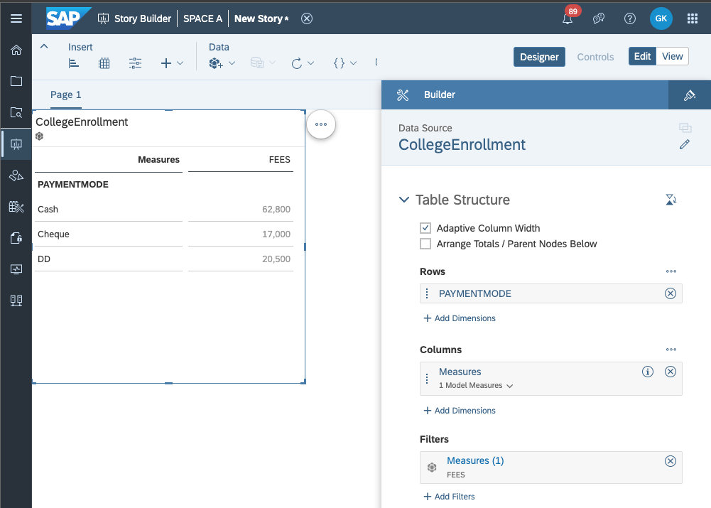

<!-- loio8e5e9150a7744d7f88fec5a327b0bb7c -->

# /consumption/analytical/\{spaceId\}/\{assetId\}/\{modelId\}


<a name="loio8e5e9150a7744d7f88fec5a327b0bb7c__section_f2z_43b_55b"/>

## GET /consumption/analytical/\{spaceId\}/\{assetId\}/\{modelId\}

Returns the ResultSet of the specified model on an asset inside a space in an analytical \(aggregated\) fashion.

By default the analytical responses always include all model measures and attributes, by consequence no aggregation will be applied on the measures. In order to aggregate the results, specify the measures and attributes to be in the result set using the $select query parameter. When using the $select, at least one measure should be specified as part of the selected fields.

**Request Path Parameters**


<table>
<tr>
<th valign="top">

Property Name


</th>
<th valign="top">

Description


</th>
</tr>
<tr>
<td valign="top">

spaceId


</td>
<td valign="top">

Technical title of the space, which is used as space ID.


</td>
</tr>
<tr>
<td valign="top">

assetId


</td>
<td valign="top">

Technical title of the asset, which is used as asset ID.


</td>
</tr>
<tr>
<td valign="top">

modelId


</td>
<td valign="top">

Technical title of the model, which is used as model ID. This is listed in the /consumption/analytical/\{spaceId\}/\{assetId\} API, usually is the same as assetId in single fact models.


</td>
</tr>
</table>

**Request Query Parameters:**The query parameters $select, $filter and $orderby, $count, $top, $skip are supported, see [Parameters](odata-api-reference-b9098c3.md#loiob9098c3a706640189bc1d4eb7d5d5c52__section_request_parameters).

**Sample Request:**GET https://....cloud.sap/api/v1/dwc/consumption/analytical/SPACE\_A/CollegeEnrollment/CollegeEnrollment


### Successful Response

**Response Code:** 200

**Sample Response Body:**The response body will follow the sample and the content of each object in the value array will depend on the model \(view / table\) structure.

> ### Sample Code:  
> ```
> {
>   "@odata.context": "https://....cloud.sap/api/vq/dwc/consumption/analytical/SPACE_A/$metadata#CollegeEnrollment",
>   "@odata.metadataEtag": "W/\"KrzpeilTY54+InLtcF2T9arfdy9X5p7E+2az8mFUg5o=\"",
>   "value": [
>     <list of objects>
>   ]
> }
> ```

**Response Headers**


<table>
<tr>
<th valign="top">

Property Name


</th>
<th valign="top">

Description


</th>
</tr>
<tr>
<td valign="top">

Content-Type


</td>
<td valign="top">

application/json


</td>
</tr>
<tr>
<td valign="top">

odata-version


</td>
<td valign="top">

4


</td>
</tr>
</table>


<a name="loio8e5e9150a7744d7f88fec5a327b0bb7c__section_ijx_4jb_55b"/>

## Sample with Analytical Aggregation

**Sample Request:**GET https://....cloud.sap/api/v1/dwc/consumption/relational/SPACE\_A/CollegeEnrollment/CollegeEnrollment?$select=FEES,PAYMENTMODE


### Successful Response

**Response Code:** 200

**Sample Response Body:**

> ### Sample Code:  
> ```
> {
>   "@odata.context": "https://....cloud.sap/dwaas-core/odata/v4/consumption/analytical/SPACE_A/CollegeEnrollment/$metadata#CollegeEnrollment(FEES,PAYMENTMODE)",
>   "value": [
>     {
>       "PAYMENTMODE": "Cash",
>       "FEES": 62800
>     },
>     {
>       "PAYMENTMODE": "Cheque",
>       "FEES": 17000
>     },
>     {
>       "PAYMENTMODE": "DD",
>       "FEES": 20500
>     }
>   ]
> }
> ```

**SAC Story Visualization:**



