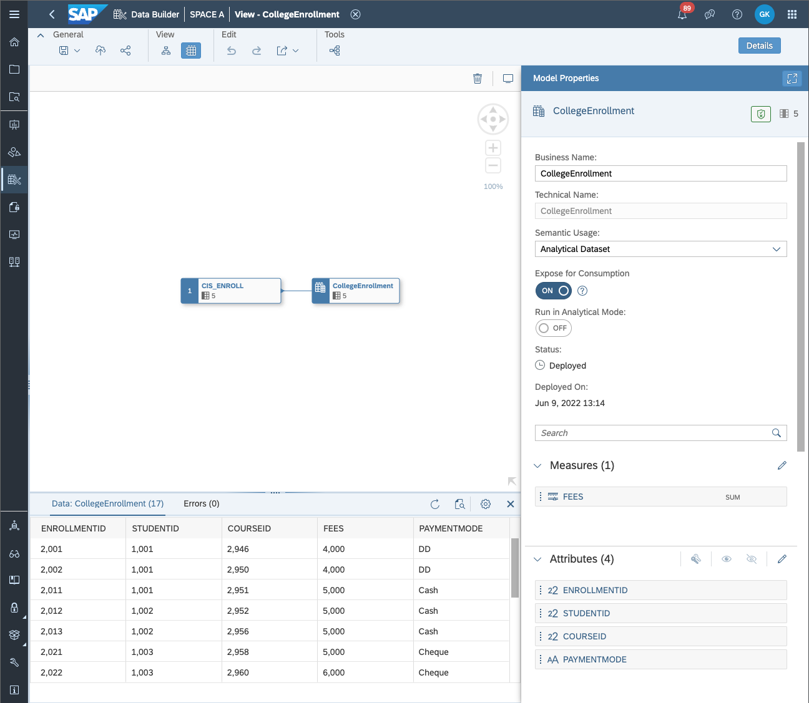

<!-- loio179ab94c6e494865a78b33ec6f8cedbd -->

# /consumption/relational/\{spaceId\}/\{assetId\}/\{modelId\}


<a name="loio179ab94c6e494865a78b33ec6f8cedbd__section_trr_rvh_55b"/>

## GET /consumption/relational/\{spaceId\}/\{assetId\}/\{modelId\}

Returns the ResultSet of the specified model on an asset inside a space in a relational \(row-by-row\) fashion.

**Request Path Parameters**


<table>
<tr>
<th valign="top">

Property Name


</th>
<th valign="top">

Description


</th>
</tr>
<tr>
<td valign="top">

spaceId


</td>
<td valign="top">

Technical title of the space, which is used as space ID.


</td>
</tr>
<tr>
<td valign="top">

assetId


</td>
<td valign="top">

Technical title of the asset, which is used as asset ID.


</td>
</tr>
<tr>
<td valign="top">

modelId


</td>
<td valign="top">

Technical title of the model, which is used as model ID. This is listed in the /consumption/relational/\{spaceId\}/\{assetId\} API, usually is the same as assetId in single fact models.


</td>
</tr>
</table>

**Request Query Parameters:**The query parameters $select, $filter and $orderby, $count, $top, $skip are supported, see [Parameters](consume-data-via-an-odata-service-7a45360.md#loio7a453609c8694b029493e7d87e0de60a__section_request_parameters).

**Sample Request:**GET https://....cloud.sap/api/v1/dwc/consumption/relational/SPACE\_A/CollegeEnrollment/CollegeEnrollment


### Successful Response

**Response Code:** 200

**Sample Response Body:**

The response body will follow the sample and the content of each object in the value array will depend on the model \(view / table\) structure.

> ### Sample Code:  
> ```
> {
>   "@odata.context": "https://....cloud.sap/api/vq/dwc/consumption/relational/SPACE_A/$metadata#CollegeEnrollment",
>   "@odata.metadataEtag": "W/\"KrzpeilTY54+InLtcF2T9arfdy9X5p7E+2az8mFUg5o=\"",
>   "value": [
>     <list of objects>
>   ]
> }
> ```

**Response Headers**


<table>
<tr>
<th valign="top">

Property Name


</th>
<th valign="top">

Description


</th>
</tr>
<tr>
<td valign="top">

Content-Type


</td>
<td valign="top">

application/json


</td>
</tr>
<tr>
<td valign="top">

odata-version


</td>
<td valign="top">

4


</td>
</tr>
</table>


<a name="loio179ab94c6e494865a78b33ec6f8cedbd__section_wc1_xxh_55b"/>

## Example with Client Side Paging

**Sample Request:**GET https://....cloud.sap/api/v1/dwc/consumption/relational/SPACE\_A/CollegeEnrollment/CollegeEnrollment?$top=5&$skip=10


### Successful Response

**Response Code:** 200

**Sample Response Body:**

> ### Sample Code:  
> ```
> {
>   "@odata.context": "https://....cloud.sap/api/v1/dwc/consumption/relational/GKATH/CollegeEnrollment/$metadata#CollegeEnrollment",
>   "value": [
>     {
>       "ENROLLMENTID": 2040,
>       "STUDENTID": 1005,
>       "COURSEID": 2974,
>       "FEES": 5500,
>       "PAYMENTMODE": "DD"
>     },
>     {
>       "ENROLLMENTID": 2051,
>       "STUDENTID": 1006,
>       "COURSEID": 2977,
>       "FEES": 5800,
>       "PAYMENTMODE": "Cash"
>     },
>     {
>       "ENROLLMENTID": 2052,
>       "STUDENTID": 1006,
>       "COURSEID": 2978,
>       "FEES": 7000,
>       "PAYMENTMODE": "Cash"
>     },
>     {
>       "ENROLLMENTID": 2061,
>       "STUDENTID": 1007,
>       "COURSEID": 2979,
>       "FEES": 7000,
>       "PAYMENTMODE": "Cash"
>     },
>     {
>       "ENROLLMENTID": 2062,
>       "STUDENTID": 1007,
>       "COURSEID": 3002,
>       "FEES": 8000,
>       "PAYMENTMODE": "Cash"
>     }
>   ]
> }
> ```

**Data Builder Visualization**



