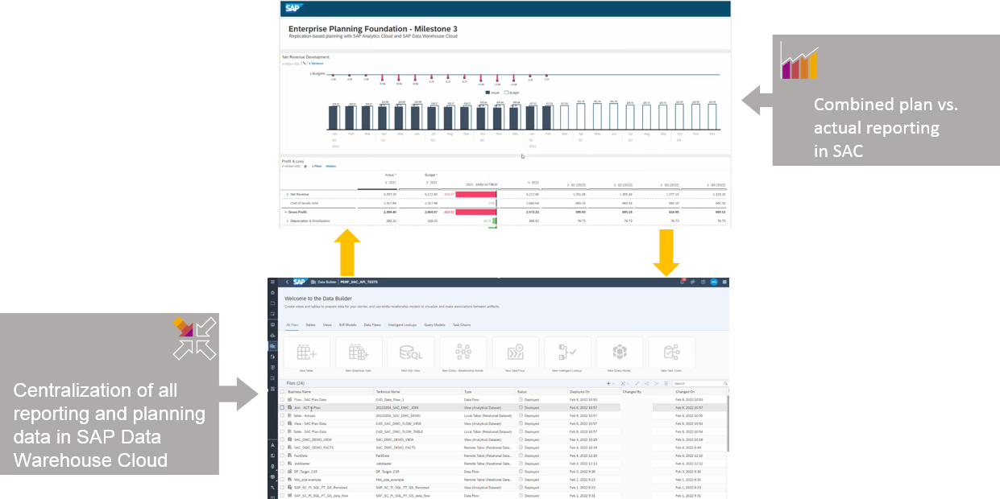

<!-- loiof589cdea41674badaecfa1bf02571b6f -->

# Integrate with SAP Analytics Cloud for Planning

SAP Datasphere integrates with SAP Analytics Cloud to act as a data source for loading actuals data into a planning model, and can also persist your planning data and combine it with live actuals or other data as appropriate.

For example, you can load fact data and master data from SAP Datasphere to SAP Analytics Cloud to use actual data from SAP Datasphere in your planning tables in SAC. Then you can seamlessly retract plan data from SAC models and use it in SAP Datasphere. Additionally, you can join plan and actual data from multiple sources in common views in SAP Datasphere that you can then use for live reporting or any other kind of downstream processing of your plan data. You can also meet corporate requirements to store all steering-relevant data in one data warehouse as a single source of truth.

You can:

-   Load data from SAP Datasphere into SAP Analytics Cloud via an OData Services Connection \(see [Consume Data in SAP Analytics Cloud via an ODATA Service](consume-data-in-sap-analytics-cloud-via-an-odata-service-9de2c66.md)\).
-   Load data from SAP Analytics Cloud into SAP Datasphere as a remote table or via a data flow \(see [Transfer Planning Data into SAP Datasphere](transfer-planning-data-into-sap-datasphere-5866995.md)\).
-   Combine planning data from SAP Analytics Cloud with actuals data in SAP Datasphere and consume the combined data in an SAP Analytics Cloud story \(see [Use Combined Data in a Story in SAP Analytics Cloud](use-combined-data-in-a-story-in-sap-analytics-cloud-9e2111f.md)\).

