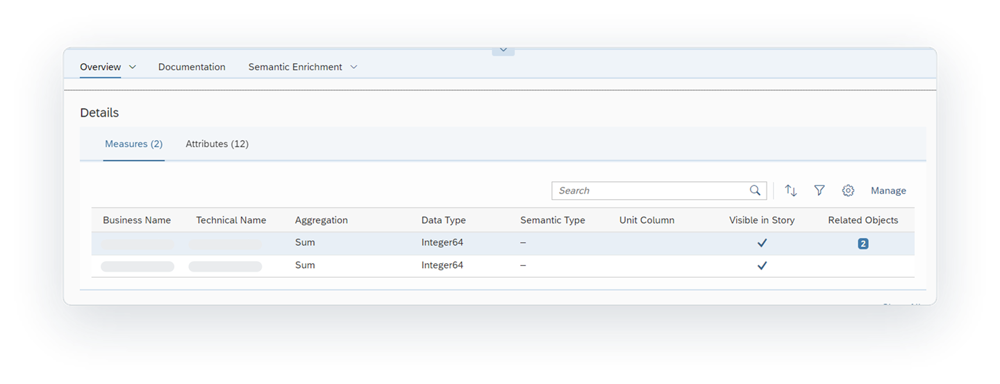
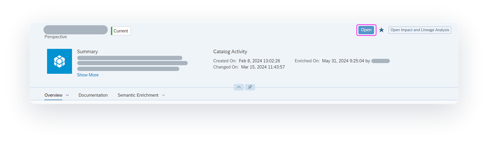

<!-- loiodc061a23484241b1b791f5540b1f38e3 -->

<link rel="stylesheet" type="text/css" href="../css/sap-icons.css"/>

# Evaluating Catalog Assets

After finding the asset you want, select it to view an overview of its information, a preview of its detailed metadata, and a diagram illustrating its impact and lineage. This information encompasses metadata extracted from the source system as well as data enrichments incorporated in the catalog.

<a name="loiodc061a23484241b1b791f5540b1f38e3__prereq_fcb_p1y_tyb"/>

## Prerequisites

You must be assigned one of the following:

-   The *Catalog User* role.

-   A custom role with the *Read* permission for *Catalog Asset*.

    > ### Note:  
    > To see the details of any terms, tags, or KPIs, the role must also have the *Read* permission for each of the following privileges: *Catalog Glossary Object*, *Catalog Tag Hierarchy*, and *Catalog KPI Object*.

> ### Tip:  
> If you have the *Catalog Administrator* role, you can enrich the information for an asset. See [Enriching, Classifying, and Publishing](https://help.sap.com/viewer/97d1d2f0e35d410c893e95a5ff3bee6f/DEV_CURRENT/en-US/1218c12e72c34cfd96293e566badb60c.html "Users with the Catalog Administrator role or appropriate privileges can set up governance for assets using hierarchical tags and business glossaries, create KPIs to measure progress towards company goals, and publish assets, glossary terms, and KPIs to the catalog.") :arrow_upper_right:.

From the \(*Catalog*\) home page, you can select the *Assets* filter to find the asset you want.

When you open an individual asset from the catalog home page, you're taken to a page that provides many different types of information about the asset. This information can include extracted metadata, like the asset name, properties, description, and impact and lineage diagram. It also includes other data enrichments, such as glossary term, tag, and key performance indicator \(KPI\) relationships applied to the asset, and much more. You can use the information provided to evaluate and make an assessment on whether the asset is the right one you need for your business task at hand.

For example, as a data modeler, you can review the details of a catalog asset to determine whether it is the one needed to add to your model. You can also view the impact and lineage diagram of that asset to see other assets it affects or is consumed by, as well as the data sources and transformations it underwent.

<a name="concept_czq_hby_tyb"/>

<!-- concept\_czq\_hby\_tyb -->

## Viewing the Header for an Asset

The header provides high-level information about the asset.

<table>
<tr>
<th valign="top">

Section

</th>
<th valign="top">

Description

</th>
</tr>
<tr>
<td valign="top">

Name and Type

</td>
<td valign="top">

Displays the asset name and type. The name might not match the name of the underlying source object if it was enriched in the catalog.

</td>
</tr>
<tr>
<td valign="top">

Functional Status

</td>
<td valign="top">

Displays the functional status of the asset. For information on the functional statuses, see [Publishing to the Catalog](https://help.sap.com/viewer/97d1d2f0e35d410c893e95a5ff3bee6f/DEV_CURRENT/en-US/f31d2d97afb0482a874acb0ec61465fe.html "You can determine what content is available to users who search the catalog. Single assets can be published directly from its information page or several assets can be published from the catalog home page. Once published, anyone who uses the catalog can discover the published content.") :arrow_upper_right:.

</td>
</tr>
<tr>
<td valign="top">

Summary

</td>
<td valign="top">

Displays a summary description of the asset. If you want a more detailed description, select the *Documentation* tab.

</td>
</tr>
<tr>
<td valign="top">

Catalog Activity

</td>
<td valign="top">

Displays date and time when the asset was added to the catalog and when it was last updated. For example, you can see when the asset was added to the catalog and when it was last changed. You can also find the date and time when the asset was enriched on and published and by which user.

</td>
</tr>
<tr>
<td valign="top">

Toolbar

</td>
<td valign="top">

Select the action you want to perform on the asset.

-   *Open*: Opens the asset in the source system where you can view or edit it. This button appears if you have permission to access the asset in the source system.

-    \(Add to Favorites\): Adds frequently used assets to your favorites.
-   *Open Impact and Lineage Analysis*: Opens a dialog that displays the *Impact and Lineage Analysis* diagram. 

</td>
</tr>
<tr>
<td valign="top">

Tabs

</td>
<td valign="top">

Select a tab to view more information about the asset, such as an overview of the asset's properties from the source system, a more detailed description of the asset, semantic enrichments, and more.

</td>
</tr>
</table>

<a name="concept_nnp_4by_tyb"/>

<!-- concept\_nnp\_4by\_tyb -->

## Viewing an Asset's Source Properties

You can view the source properties of the asset by selecting the *Overview* tab or *Overview* \> *Source*. This information is extracted from the source system.

The following table shows some common source properties that are extracted from the source system. Other source properties that are specific to the asset and the source system can also appear within these source properties or under a separate heading for **Additional Source Properties**. For more information about these properties not described here, see the documentation for the source system. 

**Common Source Properties**

<table>
<tr>
<th valign="top">

Property

</th>
<th valign="top">

Description

</th>
</tr>
<tr>
<td valign="top">

Name

</td>
<td valign="top">

The file name of the asset on the source system. The asset name can also include a *Business Name* or a *Technical Name*. For example, assets in SAP Analytics Cloud have one name that appears. Assets in SAP Datasphere have a business name, which is the descriptive name of the asset that helps you identify the asset, and a technical name, which is the name that is used in scripts and code and is synchronized with the business name.

</td>
</tr>
<tr>
<td valign="top">

System Name and Type

</td>
<td valign="top">

The source system name and type of system \(for example, SAP Datasphere or SAP Analytics Cloud\).

</td>
</tr>
<tr>
<td valign="top">

Created On

</td>
<td valign="top">

The date and time on which the asset was created on the source system. The name of the user who created the asset is also shown.

</td>
</tr>
<tr>
<td valign="top">

Changed On

</td>
<td valign="top">

The date and time on which the asset was changed on the source system. The name of the user who changed the asset is also shown.

</td>
</tr>
<tr>
<td valign="top">

Container Name and Container Business Name

</td>
<td valign="top">

The location name in the source system where the asset is saved. For example, the container name for assets in SAP Datasphere is the space name. The container name for assets in SAP Analytics Cloud is the parent folder name.

The container can also include a *Container Business Name*. For example, the container business name for assets in SAP Datasphere is a descriptive name for the space.

> ### Note:  
> For SAP Datasphere, only information for the space appears.

</td>
</tr>
<tr>
<td valign="top">

Path

</td>
<td valign="top">

Folder location of the asset, if available. This path does not appear for assets in SAP Datasphere.

</td>
</tr>
<tr>
<td valign="top">

Type

</td>
<td valign="top">

Type of container where the asset is saved. The type appears for assets in the SAP Datasphere, and it is always  Space.

</td>
</tr>
</table>

<a name="concept_s3f_vby_tyb"/>

<!-- concept\_s3f\_vby\_tyb -->

## Viewing Detailed Metadata for an Asset

You can see a preview of the detailed metadata about the asset by selecting *Overview* \> *Details*. The detailed metadata can include columns, attributes, measures, dimensions, and properties specific to each object. This tab option appears only if the asset has detailed metadata that can be shown. Each tab in this section represents the metadata type, such as measures or attributes, and has a table with its data. The number in brackets is the total number of rows for the table, with the preview showing up to 20 rows. If there are more than 20 rows for the table, select *Show All* to see the rest of the rows in a separate page.

> ### Note:  
> If you are viewing an SAP Analytics Cloud asset, this section is available only for the following model types: planning and analytical models. For a list of supported object types, see [Connecting and Monitoring Source Systems](https://help.sap.com/viewer/97d1d2f0e35d410c893e95a5ff3bee6f/DEV_CURRENT/en-US/0b5de87f256f466f95b46d4bcaa52640.html "Users with the Catalog Administrator role can open the Remote Systems page to create connections to a variety of data sources in the same landscape. This page also includes tools for monitoring and managing data sources, allowing metadata for objects to be extracted and added to the catalog assets.") :arrow_upper_right:.

In addition to the preview of the detailed metadata, each metadata table has a column for *Related Objects*. If a row has one or more object \(term or KPI\) relationships, a button with the total number of object relationships is displayed. You can select the button to see the relationships for the row. To view the term or KPI details, select the link in the dialog.

For each detailed metadata table available, you can use the toolbar to search for and organize the information:

<table>
<tr>
<th valign="top">

Tool

</th>
<th valign="top">

Description

</th>
</tr>
<tr>
<td valign="top">

 \(Search\)

</td>
<td valign="top">

Use the free-text search to search for a row by its name or description.

</td>
</tr>
<tr>
<td valign="top">

 \(Sort\)

</td>
<td valign="top">

Sort the rows in the table by ascending or descending order based on the column you select.

</td>
</tr>
<tr>
<td valign="top">

 \(Filter\)

</td>
<td valign="top">

Select column values for filtering the table.

</td>
</tr>
<tr>
<td valign="top">

 \(Select Columns\)

</td>
<td valign="top">

Select which columns you want to show in the table.

</td>
</tr>
</table>

For information on the metadata that appears in this tab, see the help documentation for the source system and search for the object you want to know more about:

-   For SAP Datasphere, see [Acquiring, Preparing, and Modeling Data with SAP Datasphere](../acquiring-preparing-and-modeling-data-with-sap-datasphere-b4a5d02.md).

-   For SAP Analytics Cloud, see [Welcome to the SAP Analytics Cloud Help](https://help.sap.com/docs/SAP_ANALYTICS_CLOUD/00f68c2e08b941f081002fd3691d86a7/1fb1f4ce92f44fc983debc25ac1f2cc9.html).

-   For SAP Datasphere, SAP BW bridge, see [SAP Datasphere, SAP BW bridge](https://help.sap.com/docs/SAP_BW_BRIDGE/107a6e8a38b74ede94c833ca3b7b6f51/f2a4eb578452482fbbcb9078a8e51551.html).

<a name="concept_svw_fb1_qbc"/>

<!-- concept\_svw\_fb1\_qbc -->

## Viewing the Description and Semantic Enrichments for an Asset

You can view the asset’s description and semantic enrichments to get a better idea of how you can use the asset for your business needs.

**Viewing the Asset’s Description**

The summary description in the header provides a short description of the asset. However, to get a more detailed description of the asset, select the *Documentation* tab. The information in this description can include rich text formatting, links to content, images, videos, and more. After reviewing this description, you can get a better idea of whether the asset meets your business needs and possibly get ideas on how you can use it.

**Viewing the Asset’s Semantic Enrichments**

Use the*Semantic Enrichment*tab to review glossary terms, tags, and KPIs that are assigned to the asset. The preview for each section shows up to 20 rows. To see more rows in a separate page, select *Show All*.

<table>
<tr>
<th valign="top">

Section Name

</th>
<th valign="top">

Description

</th>
</tr>
<tr>
<td valign="top">

Terms

</td>
<td valign="top">

Displays a list of business glossary terms that are linked to the asset. If the terms originate from several different glossaries, each glossary will be represented by its own tab. The number in brackets for the tab is the number of terms assigned from that glossary. To find a particular term within a glossary tab, use the free text search. 

</td>
</tr>
<tr>
<td valign="top">

KPIs

</td>
<td valign="top">

Displays a list of all key performance indicators \(KPIs\) that are linked to the asset. KPIs are used to track business requirements or goals. You can use the free text search to find a particular KPI linked to the asset.

</td>
</tr>
<tr>
<td valign="top">

Tags

</td>
<td valign="top">

Displays a hierarchical list of all tags that are linked to the asset. If the tags originate from several different tag hierarchies, each tag hierarchy will be represented by its own tab. The number in brackets for the tab is the number of tags assigned from that tag hierarchy. To find a particular tag within a tag hierarchy tab, use the free text search. 

</td>
</tr>
</table>

<a name="concept_qxv_gcy_tyb"/>

<!-- concept\_qxv\_gcy\_tyb -->

## Analyzing the Impact and Lineage of an Asset

Select the *Open Impact and Lineage Analysis* button in the header to see a diagram for the analyzed asset. This diagram shows the data analysis of the asset and provides an end-to-end visualization of the asset dependencies across multiple systems and layers. It can help you better understand the lineage \(also known as data provenance\) and impacts of a selected asset in the catalog. Impact and lineage contain information about the source of the object, the transformations it goes through, its final state, and assets affected by changes made to it. Impact and lineage serve distinct purposes.

-   *Lineage* is displayed to the left of the object \(or below it\). It shows objects that the analyzed asset uses as sources. It allows you to trace errors back to the root cause.
-   *Impact* is displayed to the right of the object \(or above it\). It shows objects that use the analyzed asset as a source. It allows you to understand the impact of changes on dependent objects.

This diagram provides the data analysis of the asset and contains the following features.

<table>
<tr>
<th valign="top">

Feature

</th>
<th valign="top">

Description

</th>
</tr>
<tr>
<td valign="top">

\(1\) Toolbar and Diagram Tools

</td>
<td valign="top">

Use the toolbar and diagram tools to control the layout of the diagram. Click *Reset* to restore the default layout.

</td>
</tr>
<tr>
<td valign="top">

\(2\) Outermost Container

</td>
<td valign="top">

The outermost container represents one of the following:

-   A source system \(for example,  SAP Datasphere or  SAP Analytics Cloud tenant\)
-   A  data provider

The number in brackets indicates the total number of objects in the container that are part of the impact or lineage of the analyzed object. You can expand or collapse the container, using the  \(Show/Hide All Objects\) menu on the top-right corner of the container.

</td>
</tr>
<tr>
<td valign="top">

\(3\) Inner Container

</td>
<td valign="top">

The inner container represents one of the following:

-   A location in the source system \(for example,  SAP Datasphere space or  SAP Analytics Cloud folder\). It contains assets that either appear in the lineage or impact the analyzed object. If an asset is located within a sublocation \(for example, a subfolder\), you'll see a series of nested inner containers.
-   A :package: data product. The data product is visible if you are a member of the context associated with the data product or if you are a member of the space where the data set has been installed and have **View** permission. Also, you will be able to view the details to see brief summary of the data product or open the data product page.

You can expand or collapse a container, using the  \(Show/Hide All Objects\) menu on the top-right corner of the container. The number in brackets indicates the total number of objects in the container that are part of the impact and lineage of the analyzed object.

</td>
</tr>
<tr>
<td valign="top">

\(4\) Authorized Object

\(5\) Unauthorized Object

\(6\) Analyzed Object

</td>
<td valign="top">

Authorized and unauthorized objects appear in the lineage or impact of the analyzed object.

-   Authorized objects are published and can be discovered in the catalog. They have an icon that represents its type \(for example,  \(View\)\). Click the  \(Open Asset Details\) icon to view the details page.

    -   For catalog assets, click the  \(Open Asset Details\) icon to view its view the details page.

    -   For datasets, click a link that generates a remote table or view it in the different spaces where the data product has been installed.

-   Unauthorized objects are unpublished assets or datasets or are objects that you do not have access permission to in the source system. They are represented with the :lock: icon.

-   The analyzed object appears as a light blue object. They have an icon that represents its type \(for example,  \(Story\)\) or  \(Transformation\).

You can show or hide the objects on either side of any object by clicking the  \(Show Next Level\) or  \(Hide All\) on the object.

</td>
</tr>
</table>

For information on how to control the diagram layout and use tools to further analyze the objects, see [Impact and Lineage Analysis](../impact-and-lineage-analysis-9da4892.md).

<a name="task_x4m_cny_3wb"/>

<!-- task\_x4m\_cny\_3wb -->

## Viewing or Editing an Asset

<a name="task_x4m_cny_3wb__context_d3z_1dw_hwb"/>

## Context

After you find the asset you want and have evaluated it, you might be able to open the asset in the source system to view or edit it. If the asset has been shared with you in the source system, the *Open* button appears in the top-right corner. For information about sharing files with other users within a source system, see the documentation for the specific source system:

-   For SAP Datasphere, see [Acquiring, Preparing, and Modeling Data with SAP Datasphere](../acquiring-preparing-and-modeling-data-with-sap-datasphere-b4a5d02.md).

-   For SAP Analytics Cloud, see [Welcome to the SAP Analytics Cloud Help](https://help.sap.com/docs/SAP_ANALYTICS_CLOUD/00f68c2e08b941f081002fd3691d86a7/1fb1f4ce92f44fc983debc25ac1f2cc9.html).

-   For SAP Datasphere, SAP BW bridge, see [SAP Datasphere, SAP BW bridge](https://help.sap.com/docs/SAP_BW_BRIDGE/107a6e8a38b74ede94c833ca3b7b6f51/f2a4eb578452482fbbcb9078a8e51551.html).

> ### Tip:  
> If the source file for the asset has not been shared with you, contact the person who created the asset or the person who most recently changed it. You can find this information in the asset properties.

<a name="task_x4m_cny_3wb__steps_egp_cdw_hwb"/>

## Procedure

1.  In the side navigation area, click \(*Catalog*\).

2.  On the *Catalog* home page, use the filters or the search to find the asset you want. For more information, see [Finding and Accessing Data in the Catalog](finding-and-accessing-data-in-the-catalog-1047825.md).

3.  When viewing the page for the asset, in the top-right corner, click the *Open* button to open the source file in the source system in a new browser tab.

    > ### Note:  
    > For certain source systems, the *Open* button appears if the asset has been shared with you and you have permission to view or edit it. For example, if the asset is from SAP Datasphere or SAP Analytics Cloud, the *Open* button appears only if the asset has been shared with you in the source system and you have permission to view or edit it.
    > 
    > However, for some source systems, the *Open* button is not available regardless of whether the asset has been shared with you in the source system. For example, if the asset is from an SAP Datasphere, SAP BW bridge, the *Open* button does not appear. To view or edit the asset, you must open it directly in the source system.

    

4.  Depending on how the source file is shared with you, you can view the asset in full and explore it, or you can edit it as needed.

<a name="task_x4m_cny_3wb__result_ipq_22w_hwb"/>

## Results

Because the catalog monitors changes to objects saved in SAP Datasphere and SAP Analytics Cloud source systems, these changes are detected in real time. The metadata for the assets are automatically extracted, and the functional status label *Current* is applied.

The catalog does not monitor changes to objects saved in SAP Datasphere, SAP BW bridge source systems. To ensure that these assets are up-to-date, a user with the appropriate permission must run a manual synchronization, which will manually extract all metadata for the assets.

<a name="task_zpg_fny_3wb"/>

<!-- task\_zpg\_fny\_3wb -->

## Using the Asset in a Data Project

<a name="task_zpg_fny_3wb__context_lkt_ghw_hwb"/>

## Context

After you evaluate and determine that the asset is the right one for your needs, you can use it as part of a data project to build something new. For example:

-   As a data modeler in SAP Datasphere, you can use the asset as a source for a Data Builder or Business Builder object. For more information, see [Acquiring Data in the Data Builder](../Acquiring-and-Preparing-Data-in-the-Data-Builder/acquiring-data-in-the-data-builder-1f15a29.md) or [Modeling Data in the Data Builder](../Modeling-Data-in-the-Data-Builder/modeling-data-in-the-data-builder-5c1e3d4.md).

-   As a content creator in SAP Analytics Cloud, you can use the asset in data object \(for example, a story or digital boardroom\). For more information, see [Welcome to the SAP Analytics Cloud Help](https://help.sap.com/docs/SAP_ANALYTICS_CLOUD/00f68c2e08b941f081002fd3691d86a7/1fb1f4ce92f44fc983debc25ac1f2cc9.html).

-   As a data modeler in SAP Datasphere, SAP BW bridge, you can merge data into models and make them available for reporting and analysis purposes. For more information, see the help for [SAP Datasphere, SAP BW bridge](https://help.sap.com/docs/SAP_BW_BRIDGE/107a6e8a38b74ede94c833ca3b7b6f51/f2a4eb578452482fbbcb9078a8e51551.html).

> ### Tip:  
> Before you search for an asset in the catalog, determine which application you want to use the asset in and open it in a new browser tab. By keeping the catalog opened in a separate tab, you can find the asset you want and have its property information readily available as you switch between tabs.
> 
> Depending on the SAP application you are using, you can open it from the  \(*Product Switch*\) or from the side navigation. For example, to use SAP Datasphere, in the side navigation area, right-click the application you want to use and click *Open App in New Tab*. Or to use SAP Analytics Cloud, in the side navigation area, right-click any application and click *Open App in New Tab*. In the shell bar click  \(*Product Switch*\) and click *Analytics*.

<a name="task_zpg_fny_3wb__steps_dhc_k3w_hwb"/>

## Procedure

1.  In the side navigation area, click \(*Catalog*\).

2.  On the *Catalog* home page, use the filters or the search to find the asset you want. For more information, see [Finding and Accessing Data in the Catalog](finding-and-accessing-data-in-the-catalog-1047825.md).

3.  Go to the tab where the application you want is open.

4.  Find and open an existing object or create a new object and add the asset. If you haven't opened the application in a new tab, do that now.

5.  Save the object in the location you want.

    > ### Note:  
    > If the object you are saving is in SAP Datasphere, you must save and then deploy it before it can be added to the catalog. For more information, see [Saving and Deploying Objects](../saving-and-deploying-objects-7c0b560.md).

<a name="task_zpg_fny_3wb__result_xcb_gmw_hwb"/>

## Results

The catalog automatically detects the change in real time:

-   If you created a new file, a new unpublished catalog asset is created and the functional status is set to *Current*. This asset will only be visible to users who have the *Catalog Administrator* role until they enrich it and then publish it to the catalog. After the asset is published, then it will be available for all catalog users to find.

-   If you edited an existing file, the metadata for the asset is automatically updated.

> ### Note:  
> For files in SAP Datasphere, SAP BW bridge, a user with the necessary permission must run a manual synchronization to add a new asset to the catalog or update an existing asset.

**Related Information**  

[Evaluating your Data Product](../evaluating-your-data-product-335f49b.md "Each data product has a dedicated page that describes the data product in detail to allow a transparent elaboration.")

