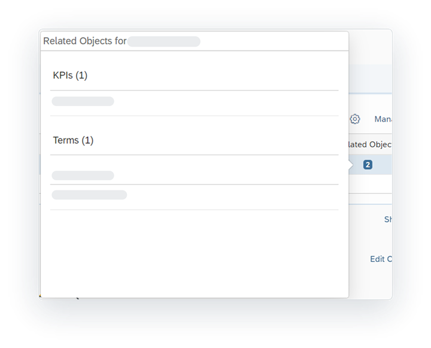

<!-- loiodc061a23484241b1b791f5540b1f38e3 -->

<link rel="stylesheet" type="text/css" href="../css/sap-icons.css"/>

# Evaluating Catalog Assets

When you find the asset you want, you can select it to view its overview information, a preview of its detailed metadata, and a diagram of its impact and lineage. This information includes metadata that is extracted from the source system and data enrichments added in the catalog.

<a name="loiodc061a23484241b1b791f5540b1f38e3__prereq_fcb_p1y_tyb"/>

## Prerequisites

You must be assigned one of the following:

-   The *Catalog User* role.

-   A custom role with the *Read* permission for *Catalog Asset*.

    > ### Note:  
    > To see the details of any terms, tags, or KPIs, the role must also have the *Read* permission for each of the following privileges: *Catalog Glossary Object*, *Catalog Tag Hierarchy*, and *Catalog KPI Object*.

> ### Tip:  
> If you have the *Catalog Administrator* role, you can enrich the information for an asset. See [Enriching, Classifying, and Publishing](https://help.sap.com/viewer/97d1d2f0e35d410c893e95a5ff3bee6f/DEV_CURRENT/en-US/1218c12e72c34cfd96293e566badb60c.html "Users with the Catalog Administrator role or appropriate privileges can set up governance for assets using hierarchical tags and business glossaries, create KPIs to measure progress towards company goals, and publish assets, glossary terms, and KPIs to the catalog.") :arrow_upper_right:.

From the \(*Catalog*\) home page, you can select the *Assets* filter to find the asset you want.

When you open an individual asset from the catalog home page, you're taken to a page that provides many different types of information about the asset. This information can include extracted metadata, like the asset name, properties, description, and impact and lineage diagram. It also includes other data enrichments, such as glossary term, tag, and key performance indicator \(KPI\) relationships applied to the asset, and much more. You can use the information provided to evaluate and make an assessment on whether the asset is the right one you need for your business task at hand.

For example, as a data modeler, you can review the details of a catalog asset to determine whether it is the one you need to add to your model. You can also view the impact and lineage diagram of that asset to see other assets that are consumed or impacted by it.

<a name="concept_czq_hby_tyb"/>

<!-- concept\_czq\_hby\_tyb -->

## Viewing the Catalog Asset Header

The asset header provides high-level information about the asset.

<table>
<tr>
<th valign="top">

Section

</th>
<th valign="top">

Description

</th>
</tr>
<tr>
<td valign="top">

Asset Name

</td>
<td valign="top">

Displays the asset name and type with an identifying icon. This name might not match the name of the underlying source object if it was enriched in the catalog.

</td>
</tr>
<tr>
<td valign="top">

Asset Functional Status and Source System

</td>
<td valign="top">

Displays the functional status of the asset with the source system name and type. For information on the functional statuses, see [Publishing to the Catalog](https://help.sap.com/viewer/97d1d2f0e35d410c893e95a5ff3bee6f/DEV_CURRENT/en-US/f31d2d97afb0482a874acb0ec61465fe.html "You can determine what content is available to users who search the catalog. Single assets can be published directly from its information page or several assets can be published from the catalog home page. Once published, anyone who uses the catalog can discover the published content.") :arrow_upper_right:.

</td>
</tr>
<tr>
<td valign="top">

Tabs

</td>
<td valign="top">

Select a tab to view more information about the asset, such as an overview of the asset's properties and descriptions, a preview of the asset's details, and a diagram of the asset's lineage and it's impact on other objects.

</td>
</tr>
<tr>
<td valign="top">

Actions

</td>
<td valign="top">

Select the action you want to perform on the asset.

-   *Open*: Opens the asset in the source system where you can view or edit it. This button appears if you have permission to access the asset in the source system.

-    \(Add to Favorites\): Adds frequently used assets to your favorites.

</td>
</tr>
</table>

<a name="concept_nnp_4by_tyb"/>

<!-- concept\_nnp\_4by\_tyb -->

## Viewing the Catalog Asset Overview

Use the *Overview* tab to view general information about the asset and relationship links to the asset. The *Overview* tab is divided into the following sections:

-   Overview

-   Relationships

**Asset Overview**

Displays the properties and description of the asset. This information is extracted from a data source or the catalog.

**Overview**

<table>
<tr>
<th valign="top">

Section Name

</th>
<th valign="top">

Description

</th>
</tr>
<tr>
<td valign="top">

Properties

</td>
<td valign="top">

Displays asset properties extracted from the source system and data enrichments added in the catalog. Properties are divided into source properties and catalog properties. 

**Source Properties**

Source properties common among all assets include:

-   *Name*: The file name of the asset on the source system. The asset name can also include a *Business Name* or a *Technical Name*. For example, assets in SAP Analytics Cloud have one name that appears. Assets in SAP Datasphere have a business name, which is the descriptive name of the asset that helps you identify the asset, and a technical name, which is the name that is used in scripts and code and is synchronized with the business name.

-   *Created On*: The date and time on which the asset was created on the source system. The name of the user who created the asset is also shown.

-   *Changed On*: The date and time on which the asset was changed on the source system. The name of the user who changed the asset is also shown.

Source properties that show information about the source system include:

-   *Container Name*: Name of the location of the asset. For example, the container name for assets in SAP Datasphereis the space name. The container for assets in SAP Analytics Cloud is the parent folder name.

-   *Container Business Name*: Business name of the location of the asset. For example, the container business name for assets in SAP Datasphere is a descriptive name for the space.

-   *Path*: Folder location of the asset, if available. For example, this path appears for assets in the SAP Analytics Cloud.

-   *Type*: Type of location where the asset is saved. The location type appears for assets in the SAP Datasphere.

Source properties common among SAP Datasphere assets include:

-   *Semantic Usage*: The way the entity should be used. For example, Fact, Dimension, Hierarchy, or Text.

-   *Exposed for Consumption*: An indicator that shows whether the asset is made available for consumption in SAP Analytics Cloud and other BI clients.

    For more information on these properties, see [Creating a Graphical View](../creating-a-graphical-view-27efb47.md).

**Catalog Properties**

If the asset data was enriched, the date of the change appears as a catalog property:

-   *Enriched On*: The date and time on which the data enrichment was added to the asset. The name of the user who enriched the asset is also shown.

</td>
</tr>
<tr>
<td valign="top">

Descriptions

</td>
<td valign="top">

Displays the asset description, which has two parts.

-   *Source Description*: This description is extracted from the source system and can't be edited.

-   *Description*: This catalog description is edited by users who have the *Catalog Administrator* role.

</td>
</tr>
</table>

**Asset Relationships**

Displays the relationships for the asset. These relationships can include glossary terms, tags, and KPIs that are linked to the asset.

<table>
<tr>
<th valign="top">

Section Name

</th>
<th valign="top">

Description

</th>
</tr>
<tr>
<td valign="top">

Glossary Terms

</td>
<td valign="top">

Displays a list of business glossary terms that are linked to the asset. You can use the free text search to see if a particular term is linked to the asset. 

</td>
</tr>
<tr>
<td valign="top">

Tags

</td>
<td valign="top">

Displays a hierarchical list of all tags that are linked to the asset. Tags help classify the types of assets that are in the catalog. You can use the free text search to see if a particular tag is linked to the asset. 

</td>
</tr>
<tr>
<td valign="top">

KPIs

</td>
<td valign="top">

Displays a list of all key performance indicators \(KPIs\) that are linked to the asset. KPIs are used to track business requirements or goals. You can use the free text search to see if a particular KPI is linked to the asset. 

</td>
</tr>
</table>

<a name="concept_s3f_vby_tyb"/>

<!-- concept\_s3f\_vby\_tyb -->

## Viewing Detailed Metadata for an Asset

Use the *Details* tab to see a preview of the detailed metadata about the asset, which can include columns, attributes, measures, dimensions, and properties specific to each object. This tab appears only if the asset has detailed metadata that can be shown.

> ### Note:  
> If you are viewing an SAP Analytics Cloud asset, this tab is available only for the following model types: planning and analytical models. For a full list of the supported object types, see [Understanding How Automatic Extraction Works](https://help.sap.com/viewer/97d1d2f0e35d410c893e95a5ff3bee6f/DEV_CURRENT/en-US/b4f364186a9a4dddbd3f757d89decf94.html "After a source system is connected to the catalog, the catalog automatically detects changes to the data and analytic objects in the source system, extracts metadata for those objects, and updates the corresponding assets in the catalog.") :arrow_upper_right:.

In addition to the preview of the detailed metadata, each metadata table has a column for *Related Objects*. If a row has one or more object \(term or KPI\) relationships, a button with the total number of object relationships is displayed. You can select the button to see the relationships for the row. To view the term or KPI details, select the link in the dialog.

For each detailed metadata table available, you can use the toolbar to search for and organize the information:

<table>
<tr>
<th valign="top">

Tool

</th>
<th valign="top">

Description

</th>
</tr>
<tr>
<td valign="top">

 \(Search\)

</td>
<td valign="top">

Use the free-text search to search for a row by its name or description.

</td>
</tr>
<tr>
<td valign="top">

 \(Sort\)

</td>
<td valign="top">

Sort the rows in the table by ascending or descending order based on the column you select.

</td>
</tr>
<tr>
<td valign="top">

 \(Filter\)

</td>
<td valign="top">

Select column values for filtering the table.

</td>
</tr>
<tr>
<td valign="top">

 \(Select Columns\)

</td>
<td valign="top">

Select which columns you want to show in the table.

</td>
</tr>
</table>

For information on the metadata that appears in this tab, see the help documentation for the source system and search for the data object or analytic object you want to know more about:

-   For SAP Datasphere, see [Acquiring, Preparing, and Modeling Data with SAP Datasphere](../acquiring-preparing-and-modeling-data-with-sap-datasphere-b4a5d02.md).

-   For SAP Analytics Cloud, see [Welcome to the SAP Analytics Cloud Help](https://help.sap.com/docs/SAP_ANALYTICS_CLOUD/00f68c2e08b941f081002fd3691d86a7/1fb1f4ce92f44fc983debc25ac1f2cc9.html).

<a name="concept_qxv_gcy_tyb"/>

<!-- concept\_qxv\_gcy\_tyb -->

## Analyzing Data Impact and Lineage

Use the *Lineage* tab to view the **Impact and Lineage Analysis** diagram. This diagram shows the data analysis of the asset and provides an end-to-end visualization of the asset dependencies across multiple systems and layers. It can help you better understand the lineage \(also known as data provenance\) and impacts of a selected asset in the catalog. Impact and lineage contain information about the source of the asset, the transformations it goes through, its final state, and objects affected by changes made to it. Impact and lineage serve distinct purposes.

-   *Lineage* is displayed to the left of the object \(or below it\). It shows objects that the analyzed asset uses as sources. It allows you to trace errors back to the root cause.
-   *Impact* is displayed to the right of the object \(or above it\). It shows objects that use the analyzed asset as a source. It allows you to understand the impact of changes on dependent objects.

In this example, a user views the diagram to analyze the **Sales** story asset. The **Sales** story asset is in the **Public** folder in SAP Analytics Cloud and has two sources that are objects in an SAP Datasphere space.

The diagram provides the data analysis of the asset and contains the following features.

<table>
<tr>
<th valign="top">

Feature

</th>
<th valign="top">

Description

</th>
</tr>
<tr>
<td valign="top">

\(1\) Toolbar and Diagram Tools

</td>
<td valign="top">

Use the toolbar and diagram tools to control the layout of the diagram. Click  \(Refresh\) to update the diagram with the latest changes.

</td>
</tr>
<tr>
<td valign="top">

\(2\) Source System

</td>
<td valign="top">

The source system is the outermost object and has an icon that represents the type of system \(for example, SAP Datasphere or SAP Analytics Cloud tenant\). The number in brackets indicates the total number of objects in the source system that are part of the impact or lineage of the analyzed object.

You can expand or collapse a source system, using the  \(Show/Hide All Objects\) menu on the top-right corner of the symbol.

</td>
</tr>
<tr>
<td valign="top">

\(3\) Container

</td>
<td valign="top">

The container is directly inside the source system and has an icon that represents its type \(for example, SAP Datasphere space or SAP Analytics Cloud folder\). It contains assets that appear in the lineage of or that impact the analyzed object. The number in brackets indicates the total number of objects in the container that are part of the impact or lineage of the analyzed object.

You can expand or collapse a container, using the  \(Show/Hide All Objects\) menu on the top-right corner of the container.

</td>
</tr>
<tr>
<td valign="top">

\(4\) Authorized Object

\(5\) Unauthorized Object

\(6\) Analyzed Object

</td>
<td valign="top">

Authorized and unauthorized objects appear in the lineage or impact of the analyzed object.

-   Authorized objects are published and can be discovered in the catalog. You can view the information page for the asset by clicking  \(Open Asset Details\) icon.

-   Unauthorized objects are unpublished and are not available in the catalog. They are shown with the :lock:.

-   The analyzed object appears as a light blue object.

You can show or hide the objects on either side of any object by clicking the  \(Show Next Level\) or  \(Hide All\) on the object.

</td>
</tr>
</table>

For information on how to control the diagram layout and use tools to further analyze the objects, see [Impact and Lineage Analysis](impact-and-lineage-analysis-9da4892.md).

<a name="task_x4m_cny_3wb"/>

<!-- task\_x4m\_cny\_3wb -->

## Viewing or Editing an Asset

<a name="task_x4m_cny_3wb__context_d3z_1dw_hwb"/>

## Context

After you find the asset you want, you can open the asset in the source system to view or edit it. When the source file for an asset has been shared with you, the *Open* button appears in the top-right corner. For information about sharing files with other users within a source system, see the documentation for the specific source system:

-   For SAP Datasphere, see [Acquiring, Preparing, and Modeling Data with SAP Datasphere](../acquiring-preparing-and-modeling-data-with-sap-datasphere-b4a5d02.md).

-   For SAP Analytics Cloud, see [Welcome to the SAP Analytics Cloud Help](https://help.sap.com/docs/SAP_ANALYTICS_CLOUD/00f68c2e08b941f081002fd3691d86a7/1fb1f4ce92f44fc983debc25ac1f2cc9.html).

> ### Tip:  
> If the source file for the asset has not been shared with you, contact the person who created the asset or the person who most recently changed it. You can find this information in the asset properties.

<a name="task_x4m_cny_3wb__steps_egp_cdw_hwb"/>

## Procedure

1.  In the side navigation area, click \(*Catalog*\).

2.  On the *Catalog* home page, use the filters or the search to find the asset you want. For more information, see [Finding and Accessing Data in the Catalog](finding-and-accessing-data-in-the-catalog-1047825.md).

3.  When viewing the page for the asset, in the top-right corner, click the *Open* button to open the source file in the source system in a new browser tab.

    The *Open* button appears only if the asset has been shared with you in the source system and you have permission to view or edit it.

    

4.  Depending on how the source file is shared with you, you can view the asset in full and explore it, or you can edit it as needed.

<a name="task_x4m_cny_3wb__result_ipq_22w_hwb"/>

## Results

If you edited a file, the catalog automatically detects the change. The metadata for the asset is automatically updated in real time, and the functional status label *Current* is applied.

<a name="task_zpg_fny_3wb"/>

<!-- task\_zpg\_fny\_3wb -->

## Using the Asset in a Data Project

<a name="task_zpg_fny_3wb__context_lkt_ghw_hwb"/>

## Context

After you evaluate and determine that the asset is the right one for your needs, you can use it as part of a data project to build something new. For example:

-   As a data modeler in SAP Datasphere, you can use the asset as a source for a Data Builder or Business Builder object. For more information, see [Acquiring Data in the Data Builder](../Acquiring-and-Preparing-Data-in-the-Data-Builder/acquiring-data-in-the-data-builder-1f15a29.md) or [Modeling Data in the Data Builder](../Modeling-Data-in-the-Data-Builder/modeling-data-in-the-data-builder-5c1e3d4.md).

-   As a content creator in SAP Analytics Cloud, you can use the asset in data object \(for example, a story or digital boardroom\). For more information, see [Welcome to the SAP Analytics Cloud Help](https://help.sap.com/docs/SAP_ANALYTICS_CLOUD/00f68c2e08b941f081002fd3691d86a7/1fb1f4ce92f44fc983debc25ac1f2cc9.html).

> ### Tip:  
> Before you search for an asset in the catalog, determine which application you want to use the asset in and open it in a new browser tab. By keeping the catalog open in a separate tab, you can find the asset you want and have its property information readily available as you switch between tabs.
> 
> Depending on the SAP application you are using, you can open it from the  \(*Product Switch*\) or from the side navigation. For example, to use SAP Datasphere, in the side navigation area, right-click the application you want to use and click *Open App in New Tab*. Or to use SAP Analytics Cloud, in the side navigation area, right-click any application and click *Open App in New Tab*. In the shell bar click  \(*Product Switch*\) and click *Analytics*.

<a name="task_zpg_fny_3wb__steps_dhc_k3w_hwb"/>

## Procedure

1.  In the side navigation area, click \(*Catalog*\).

2.  On the *Catalog* home page, use the filters or the search to find the asset you want. For more information, see [Finding and Accessing Data in the Catalog](finding-and-accessing-data-in-the-catalog-1047825.md).

3.  Go to the tab where the application you want is open.

4.  Find and open an existing object or create a new object and add the asset. If you haven't opened the application in a new tab, do that now.

5.  Save the object in the location you want.

    > ### Note:  
    > If the object you are saving is in SAP Datasphere, you must save and then deploy it before it can be added to the catalog. For more information, see [Saving and Deploying Objects](saving-and-deploying-objects-7c0b560.md).

<a name="task_zpg_fny_3wb__result_xcb_gmw_hwb"/>

## Results

The catalog automatically detects the change in real time:

-   If you created a new file, a new unpublished catalog asset is created and the functional status is set to *Current*. This asset won't be available in the catalog until a user with the *Catalog Administrator* role enriches the metadata and publishes it.

-   If you edited an existing file, the metadata for the asset is automatically updated.

**Related Information**  

[Evaluating your Data Product](../evaluating-your-data-product-335f49b.md "Each data product has a dedicated page that describes the data product in detail to allow a transparent elaboration.")

