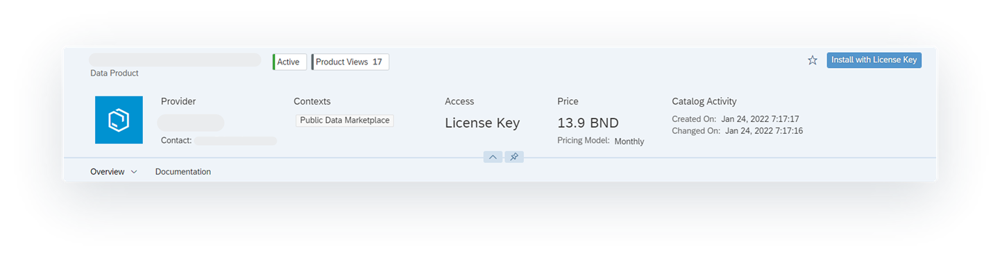
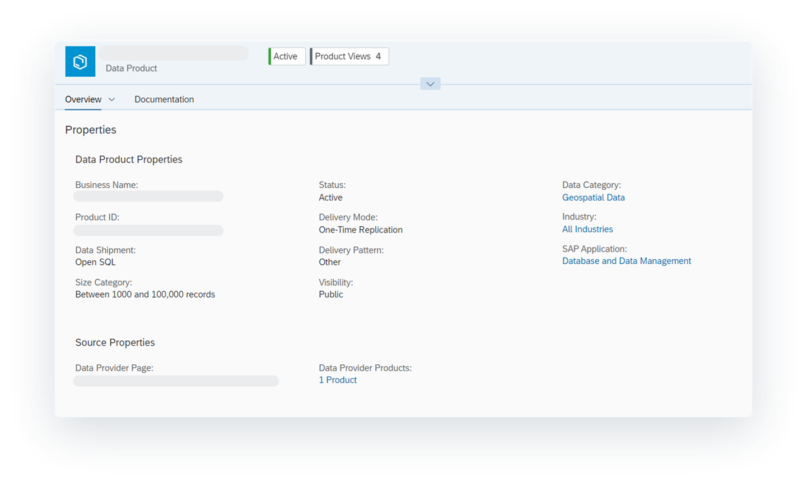
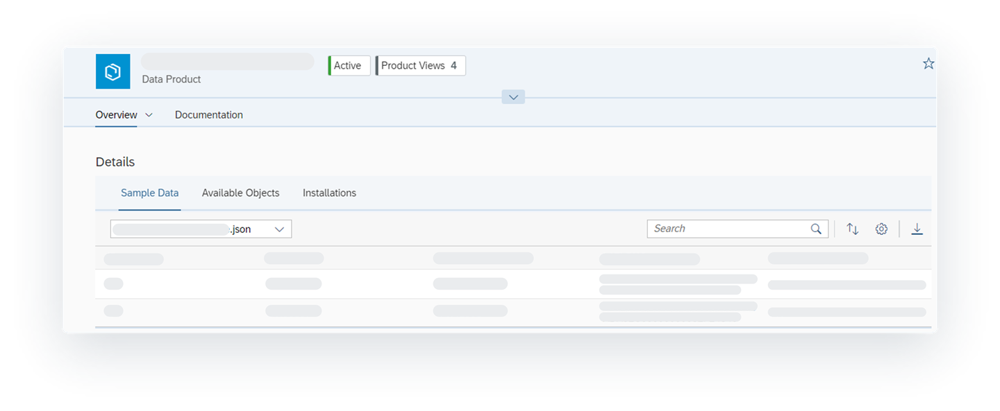
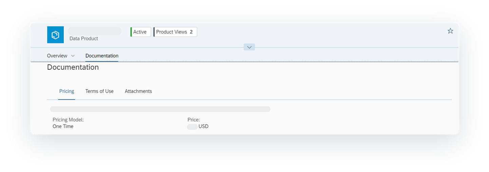

<!-- loio92c35efd6a4945a1a78250539aee9a51 -->

<link rel="stylesheet" type="text/css" href="../css/sap-icons.css"/>

# Evaluating Marketplace Data Products

You can search and browse for marketplace data products. When you find a marketplace data product, you can select it to view information about it to make sure it’s the right one for your business needs.

<a name="loio92c35efd6a4945a1a78250539aee9a51__prereq_fcb_p1y_tyb"/>

## Prerequisites

You must be assigned one of the following roles:

-   DW Viewer
-   DW Modeler
-   DW Integrator

Or you must be assigned a custom role with the following settings:

-   *Read* permission for *Spaces*
-   *Create*, *Read*, *Update*, and *Delete* permissions for *Space Files* and *Data Warehouse Remote Connection*
-   *Create*, *Read*, and *Update* for *Data Warehouse Data Integration* and *Data Warehouse Data Builder*

You also must be assigned as a member user for one or more spaces and be a member of one or more contexts.

> ### Note:  
> If a data product is delivered using the Open SQL delivery mode, you must have access to a space and an Open SQL schema with credentials that you can share with the data provider.

From the \(*Catalog*\) home page, you can select the *Marketplace Data Products* filter to show only market place data products. Marketplace data products are high-quality coherent data sets you can use with other data projects within SAP Datasphere tenants in the same data region to help you make better business decisions.

For each data product, you'll see the a preview of the data product, including its name, data type, and a short summary. When you find a data product that might suit your needs, select it to view its details page that provides many different types of information about it. This information can include a preview of its pricing information, marketing description and images, terms of use, and more.

For example, when a data modeler reviews the details of a data product, they can review the pricing and installation information, review the terms of use and other supplemental documents, and download and test a sample dataset \(if available\).

<a name="concept_czq_hby_tyb"/>

<!-- concept\_czq\_hby\_tyb -->

## Viewing the Header for a Data Product

The header provides high-level information about the data product.

<table>
<tr>
<th valign="top">

Field

</th>
<th valign="top">

Description

</th>
</tr>
<tr>
<td valign="top">

Name and Type

</td>
<td valign="top">

Displays the data product name and type.

</td>
</tr>
<tr>
<td valign="top">

Status and Product Views

</td>
<td valign="top">

Displays the lifecycle status of the data product and the number of times it was viewed.

-   A data product that is listed is active and available for public or limited visibility. Catalog users can search for the data product.
-   A data product that is delisted is inactive and no longer available for consumers. Consumers who obtained the data product before it became inactive can still use it. However, support and updates from the data provider might be limited or not available.

</td>
</tr>
<tr>
<td valign="top">

Provider

</td>
<td valign="top">

Displays the name of the data provider and contact information.

</td>
</tr>
<tr>
<td valign="top">

Contexts

</td>
<td valign="top">

Displays the context for the data product. Contexts control who has access to the data product. For a user to be able to use a data product, they must belong to a context that is assigned to the data product. 

</td>
</tr>
<tr>
<td valign="top">

Access and Price

</td>
<td valign="top">

Displays the license access type and the price for the data product.

The data product has these different access types:

-   *Open*: The data product is free of charge and does not require a license key to activate it. This data product can be part of public domain data or data provided by a commercial data provider as give-away data. This data product is activated after accepting the data specific terms of use.
-   *License Key*: The data product requires a license key to activate it. The license key provides authorization to access one or multiple data products. License keys can be used for commercial data products, where the data provider sends the license key via email after closing the commercial agreement, or for any other type of product that needs access authorization \(for example for scenarios where non-public data is exchanged without payment\).
-   *On Request*: The data product must be requested from the data provider before you can have access to install it.

For data products that require you to purchase a license key, the price, currency code, and pricing model are displayed.

</td>
</tr>
<tr>
<td valign="top">

Catalog Activity

</td>
<td valign="top">

Displays the date when the data product was added to the catalog and when it was updated.

</td>
</tr>
<tr>
<td valign="top">

Toolbar

</td>
<td valign="top">

The following tools are available for the data product.

-   *Install*: Opens a dialog for installing the free data product.
-   *Install with License Key*: Opens a dialog for installing a data product that requires a license key. If you are installing the data product for the first time, you must enter the license key to activate the data products. For subsequent installations, the license key will be marked as registered.
-   *Request Access*: Opens an email message that you can edit and send to the data provider to request access to the data product.
-    \(Add to Favorites\): Adds frequently used data products to your favorites.

    Adding a data product to your favorites is different from using bookmarks. For more information about bookmarks, see [Using Bookmarks](../using-bookmarks-aec68bb.md).

</td>
</tr>
<tr>
<td valign="top">

Tabs

</td>
<td valign="top">

Select a tab to view more information about the data product, such as an overview of the data product's properties, sample data, terms of use, and more.

</td>
</tr>
</table>

<a name="concept_nnp_4by_tyb"/>

<!-- concept\_nnp\_4by\_tyb -->

## Viewing a Data Product's Properties

You can view the properties of the data product by selecting the *Overview tab* \> *Properties*.

The properties are separated into the following areas: 

-   Data product properties are properties directly related to the data product, such as the name, shipment, lifecycle status and delivery mode of the data product.
-   Source properties are properties about the data provider or data aggregator.

For more information about properties not described here, see the documentation for the data product.

**Data Product Properties**

<table>
<tr>
<th valign="top">

Field

</th>
<th valign="top">

Description

</th>
</tr>
<tr>
<td valign="top">

Business Name

</td>
<td valign="top">

Displays the business name for the data product.

</td>
</tr>
<tr>
<td valign="top">

Product ID

</td>
<td valign="top">

Displays the unique identifier for the data product.

</td>
</tr>
<tr>
<td valign="top">

Data Shipment

</td>
<td valign="top">

Displays how the data product will be delivered to your space. The shipment varies depending on how the data provider offers the data product.

-   *Integrated Delivery*: The data is copied directly into the selected space. After the data product is activated, it is visible in the *Repository Explorer*, where it can be selected for use in an SAP Datasphere project. For example, the data product can be used as a source in the *Data Builder*. This type of data shipment is managed by Data Marketplace.
-   *External Delivery*: The data is delivered by sharing files outside SAP Datasphere. This type of data shipment is managed by the data provider.
-   *Open SQL*: The data is delivered by using an Open SQL Schema. Consumers create an OpenSQL Schema in the space and provide the information to the data provider using the Data Inbox. Once the data product is activated, consumers can access the data through the *Data Builder* and the provided schema appears as a source. This type of data shipment is managed by the data provider.

For more information, see [Data Shipment](../data-shipment-837e749.md).

</td>
</tr>
<tr>
<td valign="top">

Delivery Pattern

</td>
<td valign="top">

Displays the update cycle of the data product. For example, a data product can be updated biweekly, daily, monthly, quarterly, weekly, yearly, or other.

</td>
</tr>
<tr>
<td valign="top">

Size Category

</td>
<td valign="top">

Displays the size of the data product, using the following ranges.

-   S: Less than 1000 records
-   M: Between 1000 and 100,000 records
-   L: Between 100,000 and 1 million records
-   XL: Between 1 million and 10 million records
-   XXL: Between 10 million and 100 million records
-   XXXL: More than 100 million records

</td>
</tr>
<tr>
<td valign="top">

Status

</td>
<td valign="top">

Displays the lifecycle status of the data product.

-   A data product is active when it is listed and available for public or limited visibility.
-   A data product is inactive when it is delisted, deactivated, deleted, or in draft. These data products are not available for consumers. Consumers who obtained a previously active data product before it became inactive can still use it. However, support and updates from the data provider might be limited or not available.

</td>
</tr>
<tr>
<td valign="top">

Delivery Mode

</td>
<td valign="top">

Displays whether new deliveries \(for example, data updates\) are offered by the data provider and how these deliveries affect the existing data.

-   **Full Replication**: Delivers multiple data updates. You can find the updated data under *My Data Products*.
-   **Live Access**: Delivers data within the same tenant without replication. Because the data view is shared live with the target space, the data is always up-to-date and doesn’t require any update. In the target space, under **Shared Objects**, you can find the views in the repository corresponding to all other views shared with the space
-   **One-Time Replication**: Delivers data only once without any additional corrections or updates. This type of delivery is suited when the nature of the data doesn't require a refresh on the consumer side. For example, a snapshot of historical facts such as: NYC Taxi Trip Data of 2020. If the consumer needs to receive data corrections, they can re-load the data through **My Data Products** re-initialization.

> ### Note:  
> For data products that require a license key, the license validity is not effective for products with live access delivery.

</td>
</tr>
<tr>
<td valign="top">

Delivery Pattern Description

</td>
<td valign="top">

Displays the description of the delivery pattern for the data product.

</td>
</tr>
<tr>
<td valign="top">

Visibility

</td>
<td valign="top">

Displays who \(public or private\) can view the product details. Currently, only public data products can be offered and can be seen by all users.

</td>
</tr>
<tr>
<td valign="top">

Additional Properties

</td>
<td valign="top">

Displays the additional properties for the data product. These properties are hidden by default and are visible after you select the **Show More** link.

-   Data Category: Displays one or more categories where the data product can be used.
-   Industry: Displays one or more industries where the data product can be used.
-   SAP Application: Displays one or more SAP Applications where the data product can be used.
-   Regional Coverage: Displays the countries and regions the data product is assigned for.

</td>
</tr>
</table>

**Source Properties**

<table>
<tr>
<th valign="top">

Field

</th>
<th valign="top">

Description

</th>
</tr>
<tr>
<td valign="top">

Content Aggregator

</td>
<td valign="top">

Displays the content aggregator's name. A content aggregator is a company that manages one or multiple data provider profiles and that creates the data product content on behalf of one or multiple data providers. For more information, see [Data Provider Vs Content Aggregator](https://help.sap.com/viewer/bb1899f0b39f415b9de29a845873d7af/DEV_CURRENT/en-US/ba1b703d905547b392c09b35c1028de1.html "Data Marketplace content can either be created by a data provider or a content aggregator.") :arrow_upper_right:.

</td>
</tr>
<tr>
<td valign="top">

Data Provider Page

</td>
<td valign="top">

Displays a link to the data provider profile page that provides additional information about the data provider and other data products or product groups.

</td>
</tr>
<tr>
<td valign="top">

Data Provider Products

</td>
<td valign="top">

Displays a link that shows the number of additional data products from the data provider.

</td>
</tr>
</table>

<a name="concept_s3f_vby_tyb"/>

<!-- concept\_s3f\_vby\_tyb -->

## Viewing the Details for a Data Product

You can view the details of the data product by selecting the *Overview tab* \> *Details*.

This section has tabs for sample data, available objects, and installations. Each tab has a table shows a preview of up to 20 rows. If there are more than 20 rows, select *Show All* to see the rest of the rows for the tab in a separate page.

<table>
<tr>
<th valign="top">

Tab

</th>
<th valign="top">

Description

</th>
</tr>
<tr>
<td valign="top">

Sample Data

</td>
<td valign="top">

Review the contents of a sample dataset and download it if you think it might work for your needs. Sample data is usually in JSON format, but can only be downloaded as a Microsoft Excel file. Some data products offer free sample data that you can activate and then use for testing purposes. 

This tab appears only if one or more samples are available.

</td>
</tr>
<tr>
<td valign="top">

Available Objects

</td>
<td valign="top">

View a preview of all available dimensions and measures in the data product. The information available for the dimensions and measures includes the name of the object, a description, the attribute, delivery mode, and data filter.

</td>
</tr>
<tr>
<td valign="top">

Installations

</td>
<td valign="top">

Review the installations for the data product. The information available includes the space name where the data product is installed and the date it was installed on.

</td>
</tr>
</table>

<a name="concept_fls_bjg_2cc"/>

<!-- concept\_fls\_bjg\_2cc -->

## Viewing the Documentation for a Data Product

You can view supporting documentation for the data product by selecting the *Documentation* tab.

<table>
<tr>
<th valign="top">

Tab

</th>
<th valign="top">

Description

</th>
</tr>
<tr>
<td valign="top">

Pricing

</td>
<td valign="top">

Displays the pricing information, the price with the currency code, and pricing model \(one time or monthly\) for the data product. If you need to purchase a license key for the data product, you can select the *URL for License Key Purchase* to purchase your own license.

</td>
</tr>
<tr>
<td valign="top">

Terms of Use

</td>
<td valign="top">

Displays the terms of use for the data product.As a best practice, review the terms of use before installing the data product. By installing the data product, you agree to the terms as outlined by the data provider.

</td>
</tr>
<tr>
<td valign="top">

Attachments

</td>
<td valign="top">

Displays a list of additional documents for the data product.These documents can include the following types:

-   **Legal**: Documents that outline the legal agreement between you and the data provider for using the data product.
-   **Supplemental**: Documents that describe the data available in the data product or provide other information about the data product and its terms of use \(for example, warranties and refund policies\).

</td>
</tr>
</table>

<a name="task_y5j_bmg_2cc"/>

<!-- task\_y5j\_bmg\_2cc -->

## Downloading a Sample Dataset

<a name="task_y5j_bmg_2cc__context_mdn_cmg_2cc"/>

## Context

After you find the data product you want and have evaluated it, you might want to test a sample dataset to see if it’s really what you need.

<a name="task_y5j_bmg_2cc__steps_nh4_dmg_2cc"/>

## Procedure

1.  In the side navigation area, click \(*Catalog*\).

2.  On the *Catalog* home page, use the filters or the search to find the data product you want. For more information, see [Finding and Accessing Data in the Catalog](finding-and-accessing-data-in-the-catalog-1047825.md).

3.  When viewing the page for the data product, select *Overview tab* \> *Details*, and select the *Sample Data* tab.

4.  Select a dataset and review the preview of the sample data.

5.  If the dataset is suitable, download it.

<a name="task_y5j_bmg_2cc__result_v1d_wmg_2cc"/>

## Results

Open the file explorer on your computer to find the sample dataset and then use it where you need it. If it passes all your tests and satisfies your business needs, you can go back to the data product and install it in the space that you need it in.

<a name="task_wz2_ymg_2cc"/>

<!-- task\_wz2\_ymg\_2cc -->

## Installing a Data Product

<a name="task_wz2_ymg_2cc__context_vvx_ymg_2cc"/>

## Context

After you decide that the data product is what you need, you can install it in any space you have access to and use in a data project.

<a name="task_wz2_ymg_2cc__steps_oyn_1ng_2cc"/>

## Procedure

1.  In the side navigation area, click \(*Catalog*\).

2.  On the *Catalog* home page, use the filters or the search to find the data product you want. For more information, see [Finding and Accessing Data in the Catalog](finding-and-accessing-data-in-the-catalog-1047825.md).

3.  On the data product details page, choose one of the following to install it:

    -   For free data products, select *Install*.

        If the data product has already been installed, the install dialog shows a list of spaces where it has been installed.

    -   For data products that require a license key, select *Install with License Key*.

        If the data product has already been installed, the license key is automatically entered in the install dialog and you'll see a list of spaces where it has been installed.

    -   For data products that you have to request for, select *Request Access*.

        Edit the email to request access for the data product and send it to the data provider. You can continue with these steps after you get access to the data product.

4.  If the data product requires a license key, enter it.

    If you don't have a license key, select *Get Key* to contact the data provider and continue with these steps after you get the license key.

5.  In *Target Space*, select the space where you want to install the data product.

    You can select only spaces that you have access to. If no target spaces are available, the data product has been installed to all spaces that you have access to or you must request user access to a different space.

6.  If available, select the update type.

    Data products that have the *Full Replication*type delivery mode can receive updates.

7.  Review the terms of use, the legal documents, and other supplemental documents, and then select *Install*.

<a name="task_wz2_ymg_2cc__result_ivx_fng_2cc"/>

## Results

The data product is installed in the space you selected. You can go to the *Repository Explorer* to find the data product and use it in a data project as a source. For example, in the *Data Builder*, you can create a graphical view. For information on preparing data in the *Data Builder*, see [Preparing Data in the Data Builder](../preparing-data-in-the-data-builder-f2e359c.md).

<a name="concept_mhv_gxp_lcc"/>

<!-- concept\_mhv\_gxp\_lcc -->

## Managing Marketplace Data Products

After you install one or more data products, you can monitor the data products, your licenses, and contexts periodically.

-   Go to the *My Data Products* page to review and manage the data products you have installed. You can also see when they were last updated and their delivery status. For more information, see [Managing your Data Products](../managing-your-data-products-2e9d2e2.md).
-   Go to the *My Licenses* page to keep track of your licenses. For more information, see [Managing your Licenses](../managing-your-licenses-98d9865.md).
-   Go to the *My Contexts* page to manage the contexts you are member of. For more information, see [Managing your Contexts](../managing-your-contexts-4c390c5.md).

