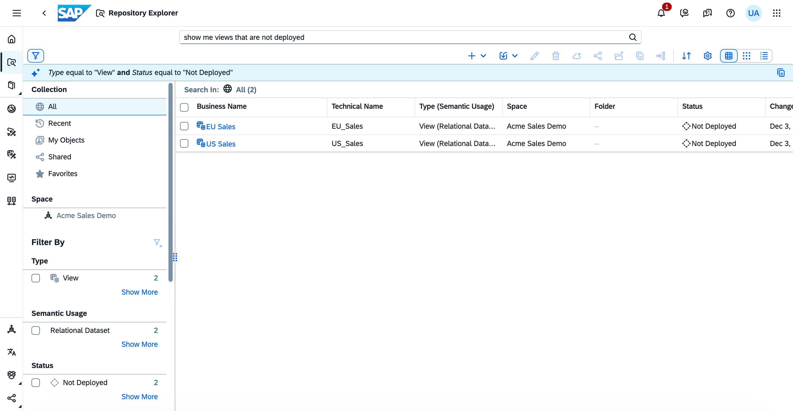
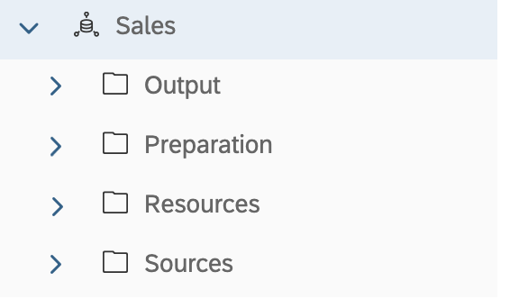
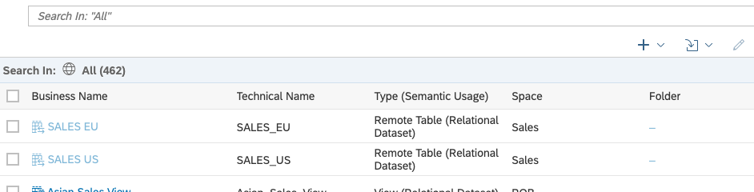
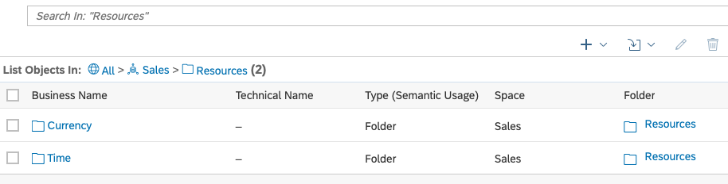
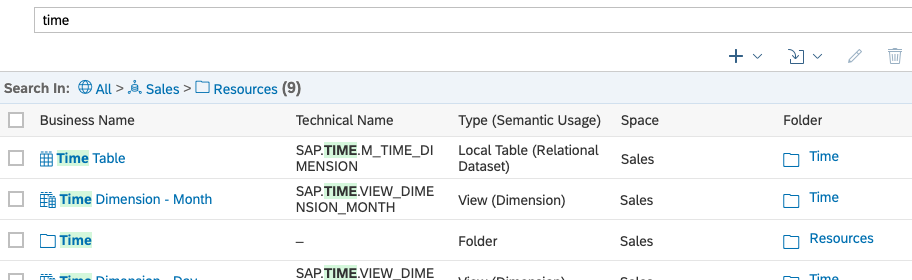

<!-- loiof8ce0b4a24fe473a962176c8aa3cad42 -->

<link rel="stylesheet" type="text/css" href="../css/sap-icons.css"/>

# Repository Explorer

The *Repository Explorer* gives you access to all your SAP Datasphere objects. You can search and filter the list, open or act on existing objects, and create new objects.

This topic contains the following sections:

-   [Open the Repository Explorer](repository-explorer-f8ce0b4.md#loiof8ce0b4a24fe473a962176c8aa3cad42__section_open)
-   [Enter a String to Search On](repository-explorer-f8ce0b4.md#loiof8ce0b4a24fe473a962176c8aa3cad42__section_string_search)
-   [Filter by Collection, Space, or Folder](repository-explorer-f8ce0b4.md#loiof8ce0b4a24fe473a962176c8aa3cad42__section_collection_space_filter)
-   [Search Mode vs List Mode](repository-explorer-f8ce0b4.md#loiof8ce0b4a24fe473a962176c8aa3cad42__section_browsing)
-   [Filter by Criteria](repository-explorer-f8ce0b4.md#loiof8ce0b4a24fe473a962176c8aa3cad42__section_criteria_filter)
-   [Define Advanced Filter Conditions](repository-explorer-f8ce0b4.md#loiof8ce0b4a24fe473a962176c8aa3cad42__section_advanced_filter)
-   [Favorite Objects](repository-explorer-f8ce0b4.md#loiof8ce0b4a24fe473a962176c8aa3cad42__section_favorite)
-   [Create Objects and Act on Existing Objects](repository-explorer-f8ce0b4.md#loiof8ce0b4a24fe473a962176c8aa3cad42__section_tools)

<a name="loiof8ce0b4a24fe473a962176c8aa3cad42__section_open"/>

## Open the Repository Explorer

Click *Repository Explorer* in the left navigation area. There is no need to select a space. The *Explorer* shows you all the objects in all the spaces you are assigned to.

<a name="loiof8ce0b4a24fe473a962176c8aa3cad42__section_string_search"/>

## Enter a String to Search On

Enter one or more characters in the *Search* field and press *Enter* \(or click *Search*\).

-   If you've searched for objects before, clicking in the search field shows a list of recently entered searches. As you type, the field will begin proposing objects and search strings. Select an object to open it directly. Click on a string to start a search on it. 

-   The search is case-insensitive and automatically applies wildcards so that, for example, the string "`lend`" will find objects containing both "`lender`" and "`calendar`".

-   If natural language search is enabled on your tenant \(and you have the appropriate role\), the search field will propose example natural language strings that are appropriate to your current filter context. Select an example string or enter your own and SAP Datasphere will interpret it and filter your results appropriately. See [Natural Language Search](natural-language-search-04170c6.md).

<a name="loiof8ce0b4a24fe473a962176c8aa3cad42__section_collection_space_filter"/>

## Filter by Collection, Space, or Folder

Restrict the scope of the list by selecting a collection, space, or folder in the *Search In* area of the left panel.

Choose one collection, space, or folder:

-   *Collection*:
    -   *All* \(default\)
    -   *Recent* - Objects that you recently opened
    -   *My Objects* - Objects that you created
    -   *Shared* - Objects that are shared from/to their space to/from other spaces

        > ### Note:  
        > If you are not assigned to a space an object is shared from, it appears greyed out and you cannot open or otherwise act on it.

    -   *Favorites* - Objects that you have favorited

-   *Space*: Spaces you are assigned to are listed here in order of your last visit. Click a space to show only objects contained in that space. If your space contains folders, you can drill down into the folder structure. Click a folder to show only objects contained in that folder.

<a name="loiof8ce0b4a24fe473a962176c8aa3cad42__section_browsing"/>

## Search Mode vs List Mode

By default, when you enter the *Repository Explorer*, you are searching the *All* collection, which shows all the objects you are permitted to see across all your spaces \(and folders\) in a flat list. In this example, we see that we are searching in the *All* collection, and 462 objects are shown:

If you click a space or folder, then the display changes to list only the objects contained directly in that space or folder. To see the contents of a sub-folder, click it to go down into it.

Here, we see that there are only the two objects contained directly in the *Sales \> Resources* folder, both of which are sub-folders:

If you then search for a string \(or apply a filter\), the display changes back to searching in the current space or folder \(and any sub-folders\) and presents the results in a flat list. Here, we see that we are now searching for the string `time` in the *Sales \> Resources* folder. The folder structure is no longer displayed, and nine objects are shown in a flat list, including the *Time* folder, and a number of objects inside it:

<a name="loiof8ce0b4a24fe473a962176c8aa3cad42__section_criteria_filter"/>

## Filter by Criteria

Filter by any of the categories listed in the *Filter By* area of the left panel.

You can select one or more values in each filter category in the *Filter By* section:

-   Each value selected in a category acts as an `OR` condition.
-   Values selected in separate categories act together as `AND` conditions.

For example, to:

<table>
<tr>
<th valign="top">

To Display

</th>
<th valign="top">

Select Filter Criteria

</th>
</tr>
<tr>
<td valign="top">

All objects with a semantic usage of *Fact*

</td>
<td valign="top">

*Semantic Usage*: *Fact*

</td>
</tr>
<tr>
<td valign="top">

All objects with a semantic usage of *Fact* or *Dimension*

</td>
<td valign="top">

*Semantic Usage*: *Fact*, *Dimension*

</td>
</tr>
<tr>
<td valign="top">

Only views with a semantic usage of *Fact* or *Dimension*

</td>
<td valign="top">

*Type* \> *View*

and

*Semantic Usage*: *Fact*, *Dimension*

</td>
</tr>
</table>

Filtering for shared objects changes when you select a space:

<table>
<tr>
<th valign="top">

To Display

</th>
<th valign="top">

Select Filter Criteria

</th>
</tr>
<tr>
<td valign="top">

All objects that are shared with any other spaces

</td>
<td valign="top">

*Sharing* \> *Shared*

</td>
</tr>
<tr>
<td valign="top">

All objects that are shared from a particular space

</td>
<td valign="top">

*Space* \> **<Space\>**

and

*Sharing* \> *Shared from My Space*

</td>
</tr>
<tr>
<td valign="top">

All objects that are shared with a particular space

</td>
<td valign="top">

*Space* \> **<Space\>**

and

*Sharing* \> *Shared to My Space*

</td>
</tr>
</table>

> ### Note:  
> If you are not assigned to a space an object is shared from, it appears greyed out and you cannot open or otherwise act on it.

<a name="loiof8ce0b4a24fe473a962176c8aa3cad42__section_advanced_filter"/>

## Define Advanced Filter Conditions

For those filter options that are not related to date or time, you can create a custom filter with specific conditions.

1.  Click *Show More* at the bottom of a filter category to open the Filter Settings dialog. Some filters have a *Select Items* and a *Define Conditions* tab.
2.  On the *Define Conditions* tab, choose an operator and enter a value in the *Filter Condition* box.
3.  Click :heavy_plus_sign: to create an alternative condition. Each condition in one category acts as an `OR` operator, so that an object must meet one of the conditions to be included in the search results. If you define one condition in two categories, then each category acts as an `AND` operator, so that both conditions must be true for the object to be returned in the search results.

You can create advanced filter conditions for multiple filter categories. An object must meet one of the conditions in each of the categories to be included in the search results.

<a name="loiof8ce0b4a24fe473a962176c8aa3cad42__section_favorite"/>

## Favorite Objects

To add an object to your favorites, click the  \(Add to Favorites\) tool in the *Actions* column.

To view your favorites, select *Favorites* in the *Collection* list

<a name="loiof8ce0b4a24fe473a962176c8aa3cad42__section_tools"/>

## Create Objects and Act on Existing Objects

You can act on objects in the list in the following ways:

-   Click the *Business Name* of an object to open it in its editor.
-   Click the *Favorite* tool in the *Actions* column to add an object to your *Favorites* collection.
-   Select one or more objects and use any of the following tools:

    > ### Note:  
    > If you select an object that is shared from a space you're not assigned to, you cannot access any of these tools.

    <table>
    <tr>
    <th valign="top">

    Tool
    
    </th>
    <th valign="top">

    Description
    
    </th>
    </tr>
    <tr>
    <td valign="top">
    
    Create
    
    </td>
    <td valign="top">
    
    Create a new object \(independent of any selection\) and open it in the appropriate editor. 
    
    </td>
    </tr>
    <tr>
    <td valign="top">
    
    Import
    
    </td>
    <td valign="top">
    
    Import CSV files or objects from files or connections.

    For more information, see:

    -   [Creating a Local Table from a CSV File](../Acquiring-and-Preparing-Data-in-the-Data-Builder/creating-a-local-table-from-a-csv-file-8bba251.md)
    -   [Importing Objects from a CSN/JSON File](importing-objects-from-a-csn-json-file-23599e6.md)
    -   [Importing Objects with Semantics from SAP S/4HANA, SAP BW∕4HANA and SAP BW Bridge](../Acquiring-and-Preparing-Data-in-the-Data-Builder/importing-objects-with-semantics-from-sap-s-4hana-sap-bw-4hana-a-361729b.md)
    -   [Import Remote Tables](../Acquiring-and-Preparing-Data-in-the-Data-Builder/import-remote-tables-fd04efb.md)
    -   [Process Source Changes for Several Remote Tables](../Acquiring-and-Preparing-Data-in-the-Data-Builder/process-source-changes-for-several-remote-tables-4e0be16.md)

    
    </td>
    </tr>
    <tr>
    <td valign="top">
    
    Edit
    
    </td>
    <td valign="top">
    
    Open the selected object in the appropriate editor. 
    
    </td>
    </tr>
    <tr>
    <td valign="top">
    
    Delete
    
    </td>
    <td valign="top">
    
    Delete the selected objects. Allows multi-selection. 

    If the object is used by one or more other objects then a dialog listing these dependencies opens, and the deletion is canceled.

    > ### Note:  
    > If you want to delete a remote table with a data access of *Replicated \(Real-Time\)*, you must ensure that:
    > 
    > -   The data provisioning agent is connected.
    > -   The real-time replication is not paused and is working normally.
    > 
    > If either of these requirements is not met, you must remove the replicated data before you can delete the remote table.

    
    </td>
    </tr>
    <tr>
    <td valign="top">
    
    Deploy
    
    </td>
    <td valign="top">
    
    Deploy the selected objects. Allows multi-selection of supported object types from a single space. 

    Only the following object types can be deployed here:

    -   Local Table \(see [Creating a Local Table](../Acquiring-and-Preparing-Data-in-the-Data-Builder/creating-a-local-table-2509fe4.md)\)
    -   Graphical View \(see [Creating a Graphical View](../creating-a-graphical-view-27efb47.md)\)
    -   SQL View \(see [Creating an SQL View](../creating-an-sql-view-81920e4.md)\)
    -   Data Access Control \(see [Create a "Single Values" Data Access Control](https://help.sap.com/viewer/9f36ca35bc6145e4acdef6b4d852d560/DEV_CURRENT/en-US/5246328ec59045cb9c2aa693daee2557.html "Users with the DW Space Administrator role (or equivalent privileges) can create data access controls in which criteria are defined as single values. Each user can only see the records that match any of the single values she is authorized for in the permissions entity.") :arrow_upper_right:\)
    -   Analytic Model \(see [Creating an Analytic Model](../Modeling-Data-in-the-Data-Builder/creating-an-analytic-model-e5fbe9e.md)\)
    -   Task Chain \(see [Creating a Task Chain](../Acquiring-and-Preparing-Data-in-the-Data-Builder/creating-a-task-chain-d1afbc2.md)\)

    Other types of objects can only be deployed from their editors. If one or more objects that you have selected cannot be deployed, the *Deploy* dialog opens, allowing you to review your selection. Click *Deploy* to deploy those objects listed on the Deployable tab, or *Cancel* to go back and alter your selection.
    
    </td>
    </tr>
    <tr>
    <td valign="top">
    
    Share
    
    </td>
    <td valign="top">
    
    Share the selected objects to other spaces. Allows multi-selection from a single space. 

    For more information, see [Sharing Entities and Task Chains to Other Spaces](sharing-entities-and-task-chains-to-other-spaces-64b318f.md).
    
    </td>
    </tr>
    <tr>
    <td valign="top">
    
    Move To
    
    </td>
    <td valign="top">
    
    Move the selected objects to another folder. Allows multi-selection from a single space. 

    For more information, see [Folders](folders-bbedad6.md).
    
    </td>
    </tr>
    <tr>
    <td valign="top">
    
    Copy
    
    </td>
    <td valign="top">
    
    Create a copy of the selected object in the same space. You must specify a new business and technical name. 
    
    </td>
    </tr>
    <tr>
    <td valign="top">
    
    Impact and Lineage Analysis
    
    </td>
    <td valign="top">
    
    Open the *Impact and Lineage Analysis* dialog for the selected object to see the objects on which it depends and the objects that depend on it. 

    For more information, see [Impact and Lineage Analysis](../impact-and-lineage-analysis-9da4892.md).
    
    </td>
    </tr>
    <tr>
    <td valign="top">
    
    Sort
    
    </td>
    <td valign="top">
    
    Open the *Sort* dialog to control the ordering of the results table. 

    By default, the table is sorted by *Best Match on Top*, which calculates relevance on a range of criteria, including objects that you have recently changed, those that you have created, and those that have validation errors. To sort on a specific column, select a *Sort Order* and a *Sort By* column, and then click *OK* to apply them.
    
    </td>
    </tr>
    <tr>
    <td valign="top">
    
    Select Columns
    
    </td>
    <td valign="top">
    
    Open the *Columns* dialog to control the display of columns in the results table. 

    Modify the column list in any of the following ways, and then click *OK* to apply your changes:

    -   To select a column for display, select its checkbox. To hide a column deselect its checkbox.
    -   Click on a column token to highlight it and use the arrow buttons to move it in the list.
    -   Click *Reset* to go back to the default column display.

    
    </td>
    </tr>
    <tr>
    <td valign="top">
    
    Display as...
    
    </td>
    <td valign="top">
    
    Set the presentation of the object list to *Table* \(default\), Grid, or List. 
    
    </td>
    </tr>
    </table>
    

