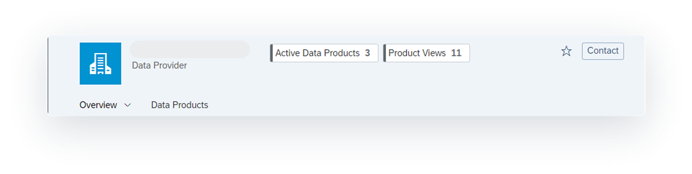
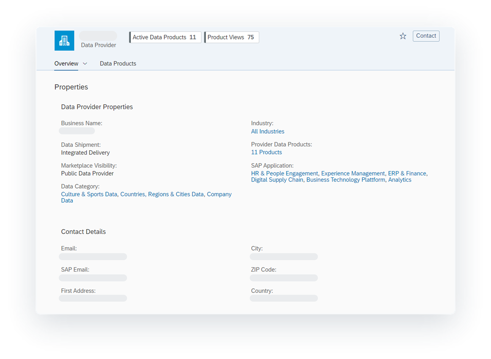
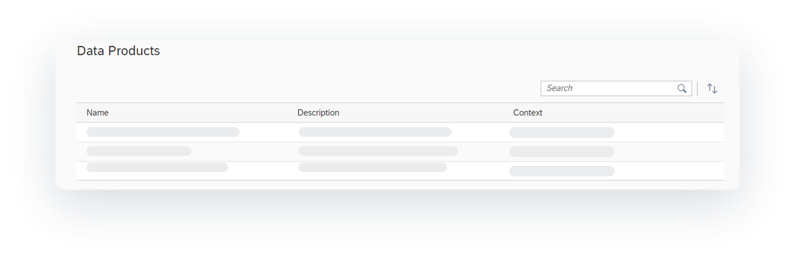

<!-- loio9ce49dcb70df4065880342beec03e25e -->

<link rel="stylesheet" type="text/css" href="../css/sap-icons.css"/>

# Reviewing Data Provider Profiles

You can search and browse for data providers. When you find a data provider, you can select it to view their profile, where you’ll learn more about the data provider and what data products they offer.

<a name="loio9ce49dcb70df4065880342beec03e25e__prereq_fcb_p1y_tyb"/>

## Prerequisites

You must be assigned one of the following roles:

-   DW Viewer
-   DW Modeler
-   DW Integrator

Or you must be assigned a custom role with the following settings:

-   *Read* permission for *Spaces*
-   *Create*, *Read*, *Update*, and *Delete* permissions for *Space Files* and *Data Warehouse Remote Connection*
-   *Read* and *Update* for *Data Warehouse Data Integration* and *Data Warehouse Data Builder*

From the \(*Catalog*\) home page, you can select the *Data Providers* filter to show only data providers. On each card, you'll see the data provider's name and a short description. You can select a data provider to see a page that shows their profile information. This information includes all legally required and additional information, such as company and contact information and general information about the data products offered, including the industry your data products belong to and the SAP applications that are related to your data products.

Data provider profiles are managed by the data provider themselves or by a content aggregator.

-   A data provider is a person or company that offers one or multiple data products.
-   A content aggregator is a company managing one or multiple data provider profiles and their available data products.

To learn more, see [Data Provider Vs Content Aggregator](https://help.sap.com/viewer/bb1899f0b39f415b9de29a845873d7af/DEV_CURRENT/en-US/ba1b703d905547b392c09b35c1028de1.html "Data Marketplace content can either be created by a data provider or a content aggregator.") :arrow_upper_right:.

For example, if you’re a content aggregator, you might want to review the data provider profile of one of the companies that you manage so you can make sure their information is correct and that their data offerings are current. If any changes are needed, you can go to the Data Sharing Cockpit to make them. For more information, see [Maintaining your Data Provider Profile](https://help.sap.com/viewer/bb1899f0b39f415b9de29a845873d7af/DEV_CURRENT/en-US/4d298f8654fe4a6c9b6a4399a9e14c77.html "Provide information as you would like to present it to consumers of Data Marketplace. Provide company and business contact information as well as general information about the data you offer.") :arrow_upper_right:.

<a name="concept_czq_hby_tyb"/>

<!-- concept\_czq\_hby\_tyb -->

## Viewing the Header for a Data Provider

The header provides high-level information about the data provider.

<table>
<tr>
<th valign="top">

Field

</th>
<th valign="top">

Description

</th>
</tr>
<tr>
<td valign="top">

Name

</td>
<td valign="top">

Displays the name of the data provider.

</td>
</tr>
<tr>
<td valign="top">

Active Data Products and Product Views

</td>
<td valign="top">

Displays the number of published data products and the total number of views for all data products.

</td>
</tr>
<tr>
<td valign="top">

Toolbar

</td>
<td valign="top">

The following tools are available for the data provider profile.

-   *Contact*: Opens an email message that you can edit and send to the data provider.
-    \(Add to Favorites\): Adds frequently viewed data providers to your favorites.

</td>
</tr>
<tr>
<td valign="top">

Tabs

</td>
<td valign="top">

Select a tab to view more information about the data provider and their data products.

</td>
</tr>
</table>

<a name="concept_nnp_4by_tyb"/>

<!-- concept\_nnp\_4by\_tyb -->

## Viewing a Data Provider's Properties

You can view the properties of the data provider and data aggregator by selecting the *Overview tab* \> *Properties*.

The properties are divided into the following sections: data provider properties and contact details. The following tables provide descriptions of the content you'll see. For more information about properties not described here, see the documentation for the data provider.

> ### Tip:  
> If the property is related to a search filter, each value appears as a link that you can select. The link opens the catalog home page with the filter value applied.

**Data Provider Properties**

<table>
<tr>
<th valign="top">

Field

</th>
<th valign="top">

Description

</th>
</tr>
<tr>
<td valign="top">

Business Name

</td>
<td valign="top">

Displays the business name of the data provider.

</td>
</tr>
<tr>
<td valign="top">

Data Shipment

</td>
<td valign="top">

Displays the data shipment types the data provider supports.

-   *Integrated Delivery*: The data is copied directly into the selected space. After the data product is activated, it is visible in the *Repository Explorer*, where it can be selected for use in an SAP Datasphere project. For example, the data product can be used as a source in the *Data Builder*. This type of data shipment is managed by Data Marketplace.
-   *External Delivery*: The data is delivered by sharing files outside SAP Datasphere. This type of data shipment is managed by the data provider.
-   *Open SQL*: The data is delivered by using an Open SQL Schema. Consumers create an OpenSQL Schema in the space and provide the information to the data provider using the Data Inbox. Once the data product is activated, consumers can access the data through the *Data Builder* and the provided schema appears as a source. This type of data shipment is managed by the data provider.

</td>
</tr>
<tr>
<td valign="top">

Marketplace Visibility

</td>
<td valign="top">

Displays the visibility of the data provider profile. The visibility affects which contexts have visible access to the data products.

-   *Public Data Provider*: The data provider profile and data products are visible for everyone in the context owned by SAP.

-   *Private Data Provider*: The data provider profile and data products are visible to users that are members of contexts created by the data provider. These type of contexts include Private Data Products, Private Data Exchange, or Data Shop.

-   *Internal Data Provider*: The data provider profile and data products are visible to only members who belong to tenants that have been specified in your contexts. Data providers can also restrict the visibility to individual users.

A data provider can have both public and private visibility options. The internal option cannot be used with the public or private options. For more information, see [Using Contexts to Realize Public, Private, and Internal Data Marketplaces](https://help.sap.com/viewer/bb1899f0b39f415b9de29a845873d7af/DEV_CURRENT/en-US/c936499e7ef045b09139723fd0ac9e09.html "Use contexts to realize private or internal data marketplaces by restricting the visibility of your data provider profile and your data products to selected users only.") :arrow_upper_right:.

</td>
</tr>
<tr>
<td valign="top">

Content Aggregator

</td>
<td valign="top">

Displays the content aggregator's name. A content aggregator is a company that manages one or multiple data provider profiles and that creates the data product content on behalf of one or multiple data providers. For more information, see [Data Provider Vs Content Aggregator](https://help.sap.com/viewer/bb1899f0b39f415b9de29a845873d7af/DEV_CURRENT/en-US/ba1b703d905547b392c09b35c1028de1.html "Data Marketplace content can either be created by a data provider or a content aggregator.") :arrow_upper_right:.

</td>
</tr>
<tr>
<td valign="top">

SAP Store ID

</td>
<td valign="top">

Displays the data provider's SAP store customer number.

</td>
</tr>
<tr>
<td valign="top">

Industry

</td>
<td valign="top">

Displays one or more industries that the data provider has data products for.

</td>
</tr>
<tr>
<td valign="top">

Provider Data Products

</td>
<td valign="top">

Displays a link that shows the number of additional data products from the data provider.

</td>
</tr>
<tr>
<td valign="top">

SAP Application

</td>
<td valign="top">

Displays one or more SAP applications that the data provider has data products for.

</td>
</tr>
<tr>
<td valign="top">

Additional Properties

</td>
<td valign="top">

Displays the additional properties for the data provider. These properties are hidden by default and are visible after you select the **Show More** link.

-   Data Category: Displays one or more categories that the data provider has data products for.
-   Regional Coverage: Displays the countries and regions that the data provider has data products for.

</td>
</tr>
</table>

**Contact Details**

Displays the contact details for the data provider and data aggregator, which can include the email address, address, and phone number.

<a name="concept_r2r_fh3_2cc"/>

<!-- concept\_r2r\_fh3\_2cc -->

## Viewing a Data Provider's Data Products

To see what types of data products the data provider offers, select *Overview tab* \> *Data Products*. This tab provides a list of all active and inactive data products from the data provider.

<table>
<tr>
<th valign="top">

Field

</th>
<th valign="top">

Description

</th>
</tr>
<tr>
<td valign="top">

Name

</td>
<td valign="top">

Displays the data product name. Select the link to open the data product details page.

</td>
</tr>
<tr>
<td valign="top">

Description

</td>
<td valign="top">

Displays a description of the data product.

</td>
</tr>
<tr>
<td valign="top">

Contexts

</td>
<td valign="top">

Displays the contexts that the data provider has data products for. For a user to be able to use a data product, they must belong to a context that is assigned to the data product.

</td>
</tr>
</table>

<a name="concept_a1y_yh3_2cc"/>

<!-- concept\_a1y\_yh3\_2cc -->

## Next Steps

Now that you've reviewed the data provider's profile and have seen their data products, what's next?

If you're the data provider or a content aggregator and noticed that the profile needs to be updated or that inactive data products need to be activated or maintained in some other way, you can go to the Data Sharing Cockpit to complete tasks, such as the following:

-   [Maintaining your Data Provider Profile](https://help.sap.com/viewer/bb1899f0b39f415b9de29a845873d7af/DEV_CURRENT/en-US/4d298f8654fe4a6c9b6a4399a9e14c77.html "Provide information as you would like to present it to consumers of Data Marketplace. Provide company and business contact information as well as general information about the data you offer.") :arrow_upper_right:
-   [Preparing your Data Products for Listing](https://help.sap.com/viewer/bb1899f0b39f415b9de29a845873d7af/DEV_CURRENT/en-US/e5cdfc3cf098402ca5d77b6be262761b.html "Prepare the data products you want to offer to your consumers.") :arrow_upper_right:
-   [Managing your Data Product's Lifecycle](https://help.sap.com/viewer/bb1899f0b39f415b9de29a845873d7af/DEV_CURRENT/en-US/c400001264094f8c89da104db72514ad.html "To reflect various situations and different phases in the lifecycle of a data product, you can change its lifecycle status.") :arrow_upper_right:

If you're a data consumer and you're interested in any of the data products, you can select a data product that you are interested in and evaluate it to see if it meets your needs. For more information, see [Evaluating Marketplace Data Products](evaluating-marketplace-data-products-92c35ef.md).

