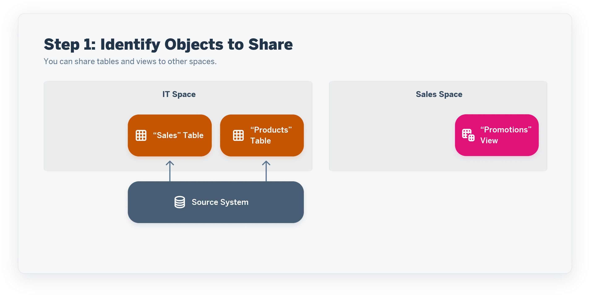
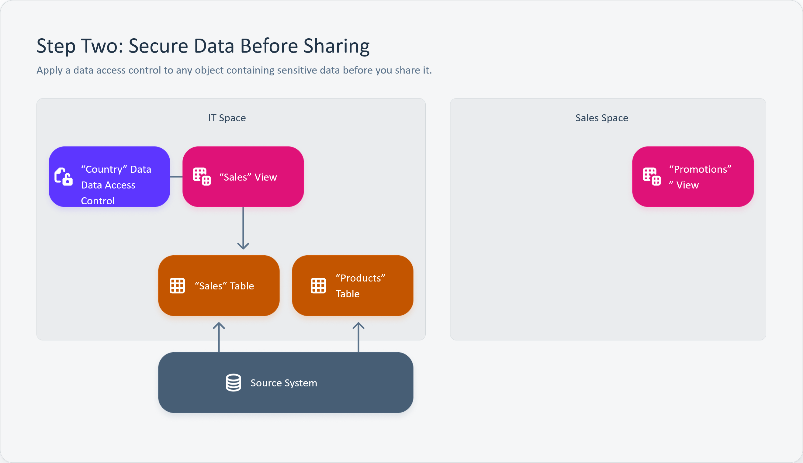
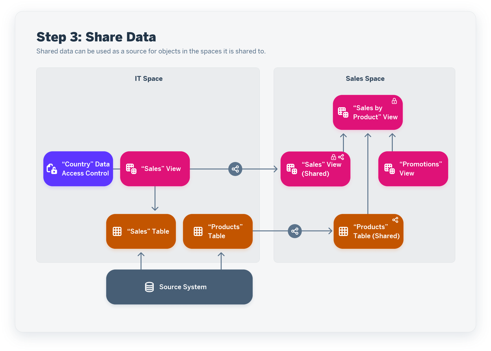
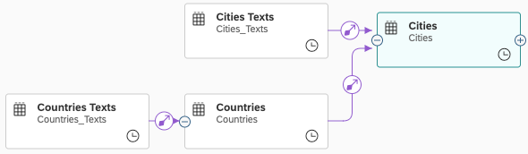
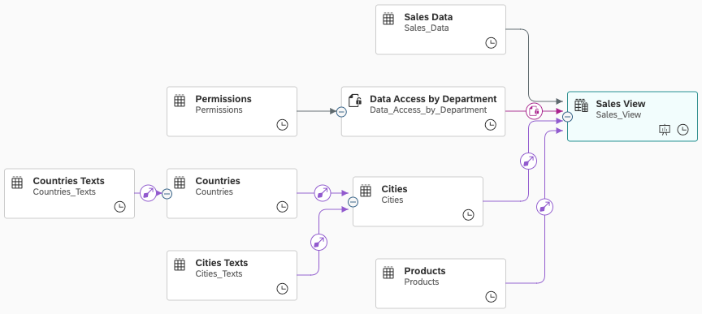

<!-- loio64b318f8afd74bb78467cf56eb44294f -->

<link rel="stylesheet" type="text/css" href="../css/sap-icons.css"/>

# Sharing Entities and Task Chains to Other Spaces

Share a table or view to another space to allow users assigned to that space to use it as a source for their objects. Share a task chain to another space to allow it to be added to and controlled by another task chain in the space that you share it to.

This topic contains the following sections:

-   [Preparing to Share Entities](sharing-entities-and-task-chains-to-other-spaces-64b318f.md#loio64b318f8afd74bb78467cf56eb44294f__section_preparation)
-   [Share Entities](sharing-entities-and-task-chains-to-other-spaces-64b318f.md#loio64b318f8afd74bb78467cf56eb44294f__section_share)
-   [Share Supporting Entities](sharing-entities-and-task-chains-to-other-spaces-64b318f.md#loio64b318f8afd74bb78467cf56eb44294f__section_semantics)
-   [Share Task Chains](sharing-entities-and-task-chains-to-other-spaces-64b318f.md#loio64b318f8afd74bb78467cf56eb44294f__section_task_chains)
-   [Review Objects Shared With Your Space](sharing-entities-and-task-chains-to-other-spaces-64b318f.md#loio64b318f8afd74bb78467cf56eb44294f__section_review)
-   [Unshare an Object](sharing-entities-and-task-chains-to-other-spaces-64b318f.md#loio64b318f8afd74bb78467cf56eb44294f__section_unshare)

<a name="loio64b318f8afd74bb78467cf56eb44294f__section_preparation"/>

## Preparing to Share Entities

Your space is a secure area and its entities and other objects cannot be seen in other spaces unless you choose to share them. When you share an entity to another space, users in that space can use it as a source for their views and other objects.

> ### Note:  
> Only entities \(tables and views\) and task chains can be shared. Other *Data Builder* objects and *Business Builder* objects cannot be shared to other spaces.

You can share tables and views, but only views can have row-level security applied to protect data \(see [Securing Data with Data Access Controls](https://help.sap.com/viewer/9f36ca35bc6145e4acdef6b4d852d560/DEV_CURRENT/en-US/a032e51c730147c7a1fcac125b4cfe14.html "Data access controls allow you to apply row-level security to your objects. When a data access control is applied to a data layer view or a business layer object, any user viewing its data will see only the rows for which they are authorized, based on the specified criteria.") :arrow_upper_right:\).

In this example, the *IT* space has imported the *Sales* and *Products* tables from a source system and wants to share them to the *Sales* space, but the *Sales* table contains sensitive data:

In order to protect that data and ensure that users can view only data for which they have permission, an *IT* space user consumes the *Sales* table in the *Sales* view and applies a data access control to the view \(see [Apply a Data Access Control](../apply-a-data-access-control-8f79fc8.md)\):

Now that the data is protected, the *Sales* view and the *Products* table can both be shared to the *Sales* space, where they are joined with the *Promotions* view to produce the *Sales by Product* view, which inherits the row-level security from the shared *Sales* view:

<a name="loio64b318f8afd74bb78467cf56eb44294f__section_share"/>

## Share Entities

When you share an entity to another space, users in that space can use it as a source for their views and other objects.

1.  Select the entity or entities you want to share in the *Data Builder* start page or *Repository Explorer*.

    Alternatively, open an entity in its editor.

    > ### Note:  
    > An entity must be deployed before it can be shared.

2.  Click  \(Share\) to open the *Share* dialog.
3.  In the *Add Spaces* field, enter the name of the space or spaces that you want to share the objects to \(or click  to select the spaces in a list and then click *Select*.

    > ### Note:  
    > You can share objects to any spaces in your SAP Datasphere tenant, including those you are not assigned to.

4.  Click *Share* to grant the other spaces *Read* access to the objects.

    If you have selected a single space, the *Shared with* list is updated to include these spaces.

    > ### Note:  
    > The *Shared with* list is not shown if two or more objects are selected for sharing.

5.  Click *Close* to close the *Share* dialog.

    Entities that are shared to other spaces display a  \(Share\) icon after their business name in the *Data Builder* start page and *Repository Explorer*. You can click this icon to open the *Share* dialog, review the spaces the object is shared to, and, if appropriate, stop sharing it.

<a name="loio64b318f8afd74bb78467cf56eb44294f__section_semantics"/>

## Share Supporting Entities

Entities with a semantic usage of *Fact* or *Dimension* commonly have dependencies on other entities and when sharing them, you must also share these associated entities in order to make the services they provide work in the target space:

-   Dimensions - Providing categories to analyze measures \(see [Create a Dimension to Categorize Data](../Modeling-Data-in-the-Data-Builder/create-a-dimension-to-categorize-data-5aae0e9.md)\)
-   Text entities - Providing translations of text values \(see [Create a Text Entity for Attribute Translation](../Modeling-Data-in-the-Data-Builder/create-a-text-entity-for-attribute-translation-b25726d.md)\)
-   External hierarchies - Providing drill-down capabilities \(see [Create an External Hierarchy for Drill-Down](../Modeling-Data-in-the-Data-Builder/create-an-external-hierarchy-for-drill-down-dbac7a8.md)\)
-   Hierarchies with directories - Including all their supporting entities \(see [Create a Hierarchy with Directory](../Modeling-Data-in-the-Data-Builder/create-a-hierarchy-with-directory-36c39ee.md)\)
-   Value help entities - Providing values for input parameters \(see [Create an Input Parameter](../create-an-input-parameter-53fa99a.md)\)
-   Lookup entities - Providing help in deriving values for variables \(see [Add a Variable](../Modeling-Data-in-the-Data-Builder/add-a-variable-cdd8fa0.md)\)

> ### Note:  
> If any expected service is missing in the space to which you share your entity, verify that the relevant supporting entity is correctly shared. For example, if texts, hierarchies, or value helps are missing, verify that you have shared the appropriate text entity, hierarchy, or value help entity.

In this example, the *Cities* entity has a semantic usage of *Dimension* and has associations to the *Cities Texts* text entity and to the *Countries* dimension \(which, itself, has an association to the *Countries Texts* text entity\). When sharing *Cities*, you would generally share the other three entities as well:

In this example, the *Sales View* entity has a semantic usage of *Fact* and has associations to the *Cities* and *Products* dimensions. These dimensions then have further associations to other dimensions and text entities. When sharing *Sales View*, you would generally share the other five entities as well:

> ### Note:  
> You should only share additional entities \(dimensions, text entities, and hierarchies\) that are connected by associations. In this example, you would not share the source table, *Sales Data*, nor the data access control, *Data Access by Department*.

<a name="loio64b318f8afd74bb78467cf56eb44294f__section_task_chains"/>

## Share Task Chains

When you share a task chain to another space, users in that space can add it as a step in their task chains.

> ### Note:  
> When you share a task chain to another space, the integrator in that space must also be a member of your space in order to be able to run your shared task chain as a step in their task chain.

1.  Select the task chains you want to share in the *Data Builder* start page or *Repository Explorer*.

    Alternatively, open a task chain in its editor.

    > ### Note:  
    > A task chain must be deployed before it can be shared.

2.  Click  \(Share\) to open the *Share* dialog.
3.  In the *Add Spaces* field, enter the name of the space or spaces that you want to share the objects to \(or click  to select the spaces in a list and then click *Select*.

    > ### Note:  
    > You can share objects to any spaces in your SAP Datasphere tenant, including those you are not a assigned to.

4.  Click *Share* to grant the other spaces *Read* access to the objects.

    If you have selected a single space, the *Shared with* list is updated to include these spaces.

    > ### Note:  
    > The *Shared with* list is not shown if two or more objects are selected for sharing.

5.  Click *Close* to close the *Share* dialog.

    Objects that are shared to other spaces display a  \(Share\) icon after their business name in the *Data Builder* start page and *Repository Explorer*. You can click this icon to open the *Share* dialog, review the spaces the object is shared to, and, if appropriate, stop sharing it.

<a name="loio64b318f8afd74bb78467cf56eb44294f__section_review"/>

## Review Objects Shared With Your Space

You can see the objects shared with your space:

-   In the *Repository Explorer* \(see [Repository Explorer](repository-explorer-f8ce0b4.md)\).
-   In the *Shared Objects* folder on the *Repository* tab of the *Source Browser* in any *Data Builder* editor \(see [Using the Source Browser](../using-the-source-browser-7d2b21d.md)\).

> ### Note:  
> Objects shared to your space are not listed in the *Data Builder* start page.

<a name="loio64b318f8afd74bb78467cf56eb44294f__section_unshare"/>

## Unshare an Object

To stop sharing an object, expand the *Shared with* list, select the spaces you want to stop sharing it with, and click *Unshare*.

