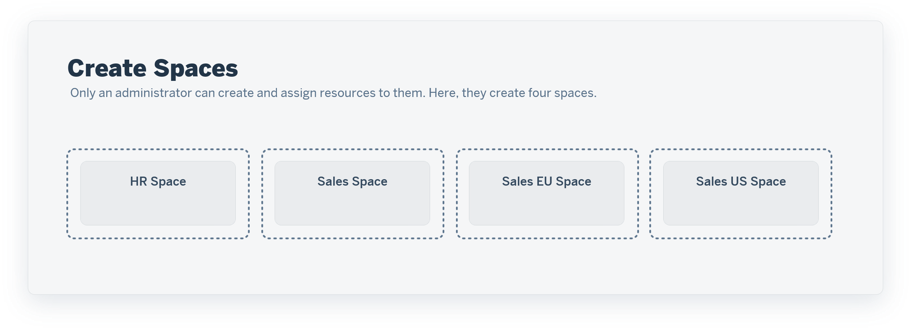
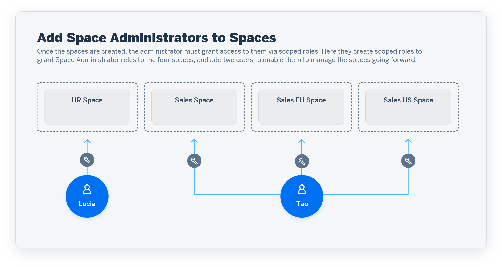
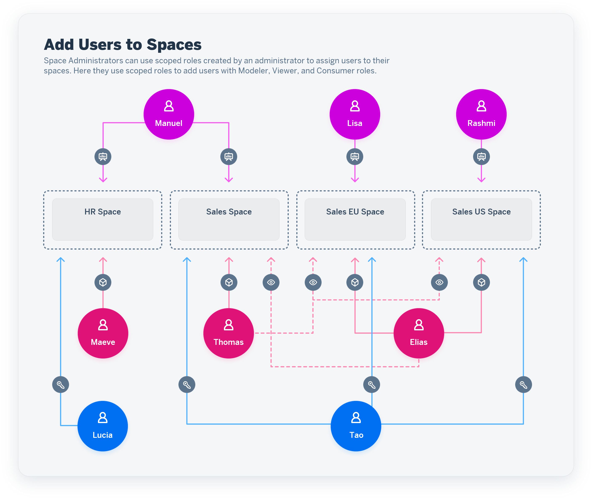
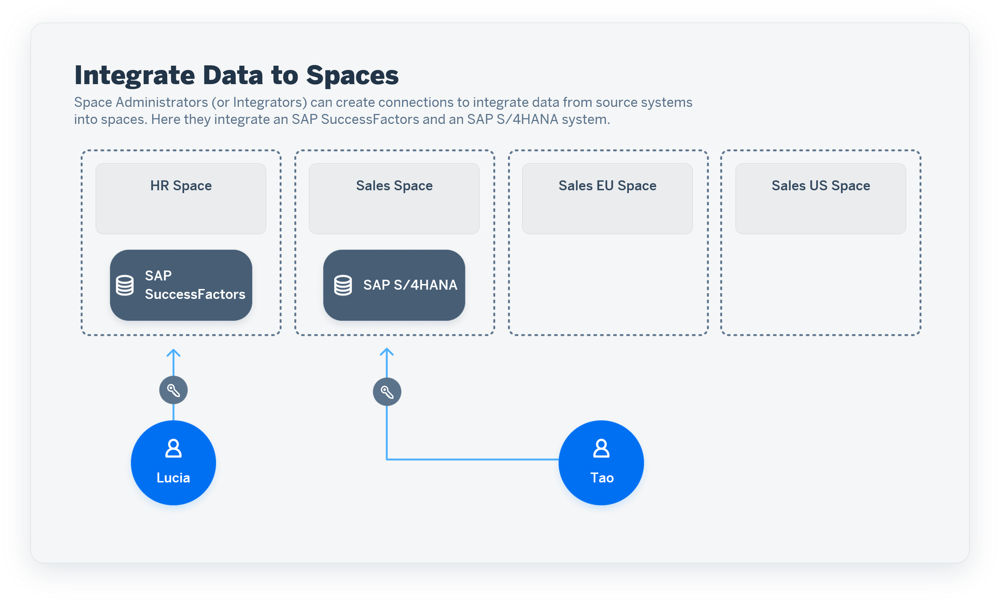
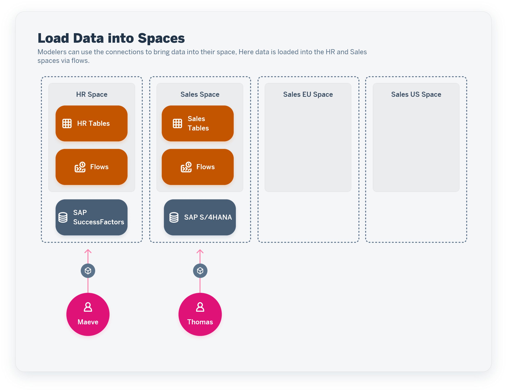
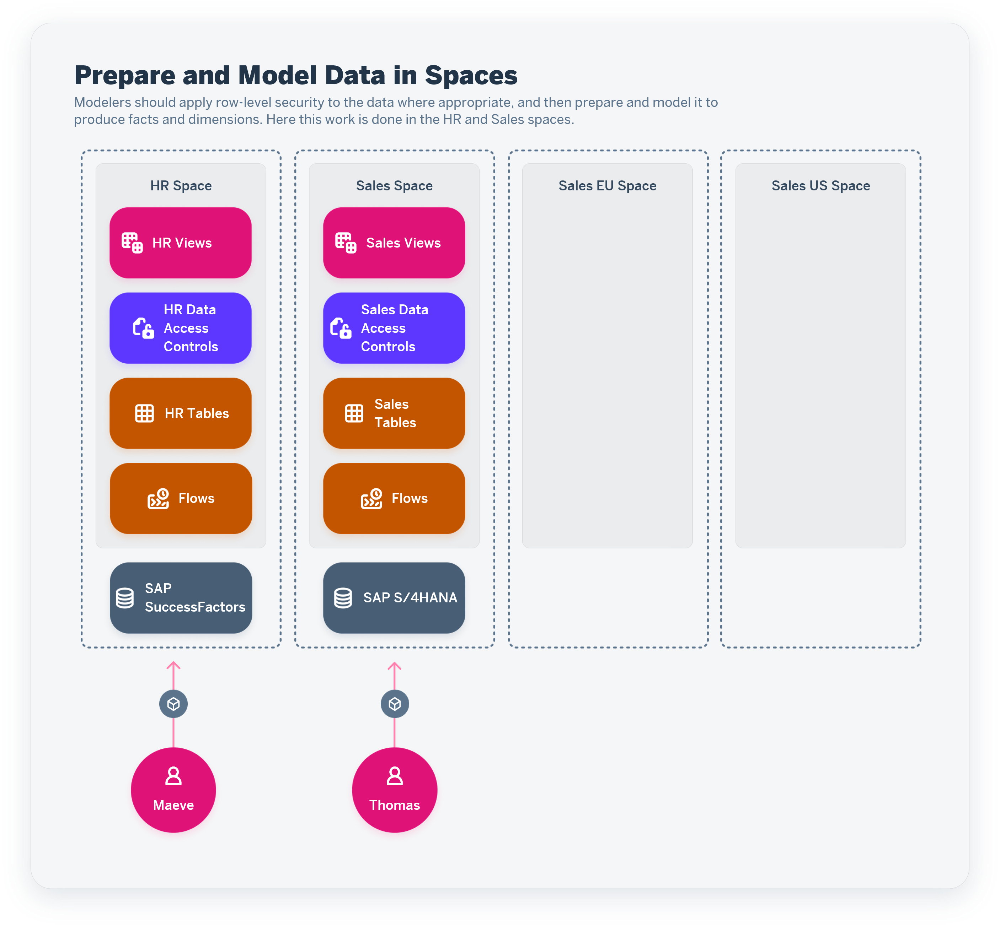
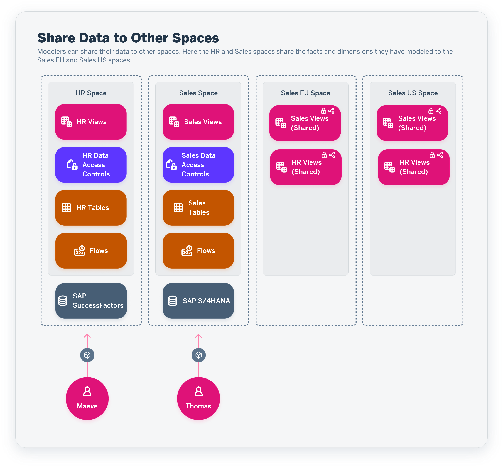
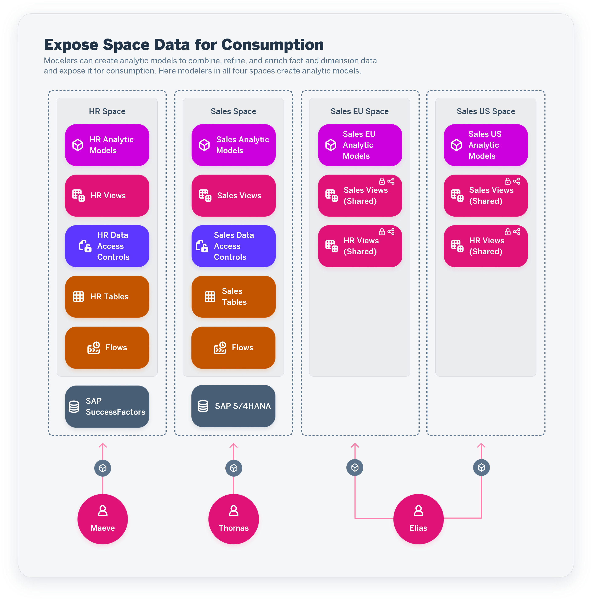
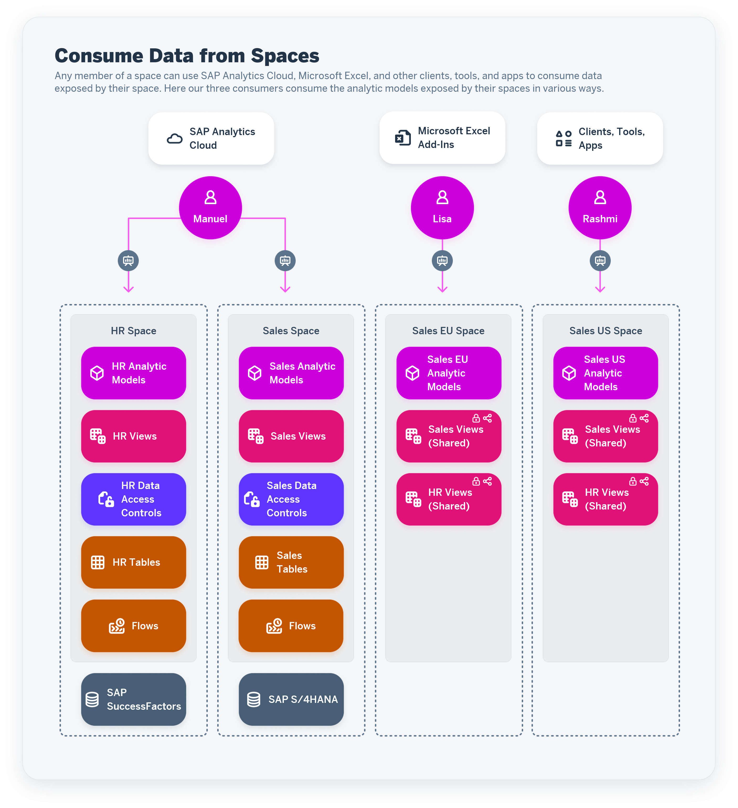

<!-- loio6a396f6cf7ad41faa3a8cdd24f4e728a -->

# Working in SAP Datasphere Spaces

All data acquisition, preparation, and modeling in SAP Datasphere happens inside spaces. A space is a secure area - space data cannot be accessed outside the space unless it is shared to another space or exposed for consumption.

This topic contains the following sections:

-   [Introduction to Spaces](working-in-sap-datasphere-spaces-6a396f6.md#loio6a396f6cf7ad41faa3a8cdd24f4e728a__section_intro)
-   [Create Spaces](working-in-sap-datasphere-spaces-6a396f6.md#loio6a396f6cf7ad41faa3a8cdd24f4e728a__section_create)
-   [Prepare Access to Spaces and Assign Space Administrators](working-in-sap-datasphere-spaces-6a396f6.md#loio6a396f6cf7ad41faa3a8cdd24f4e728a__section_roles)
-   [Add Users to Spaces](working-in-sap-datasphere-spaces-6a396f6.md#loio6a396f6cf7ad41faa3a8cdd24f4e728a__section_staff)
-   [Integrate Connections and Other Sources to Spaces](working-in-sap-datasphere-spaces-6a396f6.md#loio6a396f6cf7ad41faa3a8cdd24f4e728a__section_integrate)
-   [Load Data into Spaces](working-in-sap-datasphere-spaces-6a396f6.md#loio6a396f6cf7ad41faa3a8cdd24f4e728a__section_load)
-   [Prepare and Model Data in Spaces](working-in-sap-datasphere-spaces-6a396f6.md#loio6a396f6cf7ad41faa3a8cdd24f4e728a__section_model)
-   [Share Data to Other Spaces](working-in-sap-datasphere-spaces-6a396f6.md#loio6a396f6cf7ad41faa3a8cdd24f4e728a__section_share)
-   [Expose Data From a Space](working-in-sap-datasphere-spaces-6a396f6.md#loio6a396f6cf7ad41faa3a8cdd24f4e728a__section_expose)
-   [Consume Data From a Space](working-in-sap-datasphere-spaces-6a396f6.md#loio6a396f6cf7ad41faa3a8cdd24f4e728a__section_consume)

<a name="loio6a396f6cf7ad41faa3a8cdd24f4e728a__section_intro"/>

## Introduction to Spaces

You may be assigned to one or more spaces. For each space you are assigned to, you can see all the objects in that space.

Many apps, such as the *Data Builder*, require you to select a space before you can open the app. When you select a space, the app will then show you only the relevant objects that belong to that space. The *Repository Explorer*, by contrast shows you objects from all the spaces you are assigned to, in order to give you a global view of all your objects.

<a name="loio6a396f6cf7ad41faa3a8cdd24f4e728a__section_create"/>

## Create Spaces

Only a tenant administrator can create spaces and assign resources to them.

In our simple example, the administrator creates four spaces with the following purposes:

-   `HR` - Acquire, prepare, and model HR data.
-   `Sales` - Acquire, prepare, and model Sales data.
-   `Sales EU` - Model EU sales data using data shared from the `Sales` and `HR` spaces
-   `Sales US` - Model US sales data using data shared from the `Sales` and `HR` spaces.

See [Create a Space](https://help.sap.com/viewer/935116dd7c324355803d4b85809cec97/DEV_CURRENT/en-US/bbd41b82ad4d4d9ba91341545f0b37e7.html "Create a space, allocate storage, and set the space priority and statement limits.") :arrow_upper_right:.

<a name="loio6a396f6cf7ad41faa3a8cdd24f4e728a__section_roles"/>

## Prepare Access to Spaces and Assign Space Administrators

The administrator must add the spaces to scoped roles to allow the assignment of users with the appropriate role templates:

In our example, the administrator creates scoped roles to allow users to be assigned to the spaces with space administrator, modeler, viewer, and consumer roles. They add users to the space administrator scoped roles, to allow these users to add other users to the other roles for their spaces:

<table>
<tr>
<th valign="top">

Scoped Role

</th>
<th valign="top">

Role Template

</th>
<th valign="top">

Scopes \(Spaces\)

</th>
<th valign="top">

Users

</th>
</tr>
<tr>
<td valign="top">

HR Space Administrators

</td>
<td valign="top">

DW Space Administrator

</td>
<td valign="top" rowspan="4">

HR

</td>
<td valign="top">

Lucia

</td>
</tr>
<tr>
<td valign="top">

HR Modelers

</td>
<td valign="top">

DW Modeler

</td>
<td valign="top">

 

</td>
</tr>
<tr>
<td valign="top">

HR Viewers

</td>
<td valign="top">

DW Viewer

</td>
<td valign="top">

 

</td>
</tr>
<tr>
<td valign="top">

HR Consumers

</td>
<td valign="top">

DW Consumer

</td>
<td valign="top">

 

</td>
</tr>
<tr>
<td valign="top">

Sales Space Administrators

</td>
<td valign="top">

DW Space Administrator

</td>
<td valign="top" rowspan="4">

Sales

Sales EU

Sales US

</td>
<td valign="top">

Tao

</td>
</tr>
<tr>
<td valign="top">

Sales Modelers

</td>
<td valign="top">

DW Modeler

</td>
<td valign="top">

 

</td>
</tr>
<tr>
<td valign="top">

Sales Viewers

</td>
<td valign="top">

DW Viewer

</td>
<td valign="top">

 

</td>
</tr>
<tr>
<td valign="top">

Sales Consumers

</td>
<td valign="top">

DW Consumer

</td>
<td valign="top">

 

</td>
</tr>
</table>

See [Create a Scoped Role to Assign Privileges to Users in Spaces](https://help.sap.com/viewer/935116dd7c324355803d4b85809cec97/DEV_CURRENT/en-US/b5c4e0b6c462414783ebbfc053815521.html "A scoped role inherits a set of scoped privileges from a standard or custom role and grants these privileges to users for use in the assigned spaces.") :arrow_upper_right:.

<a name="loio6a396f6cf7ad41faa3a8cdd24f4e728a__section_staff"/>

## Add Users to Spaces

Administrators and space administrators can assign users to spaces via scoped roles.

In our example, the space administrators assign users as follows:

<table>
<tr>
<th valign="top">

Space

</th>
<th valign="top">

Space Admins

</th>
<th valign="top">

Modelers

</th>
<th valign="top">

Viewers

</th>
<th valign="top">

Consumers

</th>
</tr>
<tr>
<td valign="top">

HR

</td>
<td valign="top">

Lucia

</td>
<td valign="top">

Maeve

</td>
<td valign="top">

Thomas

</td>
<td valign="top" rowspan="2">

Manuel

</td>
</tr>
<tr>
<td valign="top">

Sales

</td>
<td valign="top" rowspan="3">

Tao

</td>
<td valign="top">

Thomas

</td>
<td valign="top">

Maeve

</td>
</tr>
<tr>
<td valign="top">

Sales EU

</td>
<td valign="top" rowspan="2">

Elias

</td>
<td valign="top">

Thomas

</td>
<td valign="top">

Lisa

</td>
</tr>
<tr>
<td valign="top">

Sales US

</td>
<td valign="top">

Thomas

</td>
<td valign="top">

Rashmi

</td>
</tr>
</table>

See [Control User Access to Your Space](https://help.sap.com/viewer/9f36ca35bc6145e4acdef6b4d852d560/DEV_CURRENT/en-US/9d59fe511ae644d98384897443054c16.html "You can assign users to your space and manage them.") :arrow_upper_right:.

<a name="loio6a396f6cf7ad41faa3a8cdd24f4e728a__section_integrate"/>

## Integrate Connections and Other Sources to Spaces

Space administrators and integrators can create connections to systems and other sources to allow data to be loaded into the space.

In our example, the space administrators create connections to an SAP SuccessFactors system and an SAP S/4HANA system.

See [Integrating Data via Connections](https://help.sap.com/viewer/9f36ca35bc6145e4acdef6b4d852d560/DEV_CURRENT/en-US/eb85e157ab654152bd68a8714036e463.html "Connections provide access to data from a wide range of remote systems, cloud as well as on-premise, SAP as well as Non-SAP, and partner tools. They allow users assigned to a space to use objects from the connected remote system as source to acquire, prepare and access data from those sources in SAP Datasphere. In addition, you can use certain connections to define targets for replication flows.") :arrow_upper_right:.

<a name="loio6a396f6cf7ad41faa3a8cdd24f4e728a__section_load"/>

## Load Data into Spaces

Modelers assigned to a space can acquire data from the connections and other sources.

In our example, the modelers acquire data from the SAP SuccessFactors and SAP S/4HANA connections via flows.

See [Acquiring Data in the Data Builder](../Acquiring-and-Preparing-Data-in-the-Data-Builder/acquiring-data-in-the-data-builder-1f15a29.md).

<a name="loio6a396f6cf7ad41faa3a8cdd24f4e728a__section_model"/>

## Prepare and Model Data in Spaces

Modelers can use views, tables and flows to combine, harmonize, filter and otherwise transform their data.

In our example the modelers protect their loaded data with data access controls and model views into facts, dimensions, and other semantic entities.

See:

-   [Preparing Data in the Data Builder](../preparing-data-in-the-data-builder-f2e359c.md)
-   [Modeling Data in the Data Builder](../Modeling-Data-in-the-Data-Builder/modeling-data-in-the-data-builder-5c1e3d4.md)

<a name="loio6a396f6cf7ad41faa3a8cdd24f4e728a__section_share"/>

## Share Data to Other Spaces

Modelers can choose to share certain tables and views from their space to other spaces. Data shared in this way can then be further modeled and consumed in the recipient spaces.

In our example, the modelers in the `HR` and `Sales` spaces share views to the `Sales EU` and `Sales US` spaces.

See [Sharing Entities and Task Chains to Other Spaces](sharing-entities-and-task-chains-to-other-spaces-64b318f.md).

<a name="loio6a396f6cf7ad41faa3a8cdd24f4e728a__section_expose"/>

## Expose Data From a Space

Modelers can combine their facts and associated dimensions in analytic models and select measures and attributes to expose for consumption in SAP Analytics Cloud, MS Excel, and other clients, tools, and apps.

In our example, the modelers in all four spaces produce analytic models, which are exposed for consumption.

See [Creating an Analytic Model](../Modeling-Data-in-the-Data-Builder/creating-an-analytic-model-e5fbe9e.md).

<a name="loio6a396f6cf7ad41faa3a8cdd24f4e728a__section_consume"/>

## Consume Data From a Space

Consumers \(or users with any other role\) who are assigned to a space can consume the data exposed using SAP Analytics Cloud, MS Excel, and other clients, tools, and apps.

In our example, the three consumers use various clients, tools, and apps to consume and visualize the exposed data.

See [Consuming Data Exposed by SAP Datasphere](https://help.sap.com/viewer/43509d67b8b84e66a30851e832f66911/cloud/en-US/d7d56284bb5148c887ac4054689bfbca.html "All users of with any of the standard roles can consume data exposed by spaces they are assigned to. If a user does not need to access SAP Datasphere itself, and only wants to consume data exposed by it, they should be granted the DW Consumer role.") :arrow_upper_right:.

