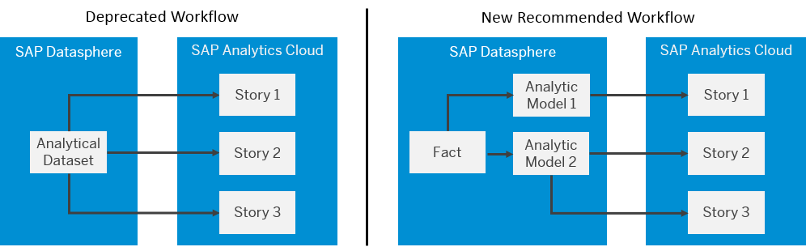

<!-- loio70dab71147834c20b98ead017d7c5d8a -->

# Analytical Datasets \(Deprecated\)

The *Analytical Dataset* semantic usage is now deprecated and we recommend that you use the new *Fact* semantic usage instead.

This topic contains the following sections:

-   [Use Facts with Analytic Models to Expose Data to SAP Analytics Cloud](analytical-datasets-deprecated-70dab71.md#loio70dab71147834c20b98ead017d7c5d8a__section_use_facts)
-   [Migrate Your Analytical Datasets to Facts](analytical-datasets-deprecated-70dab71.md#loio70dab71147834c20b98ead017d7c5d8a__section_migrate_to_facts)

<a name="loio70dab71147834c20b98ead017d7c5d8a__section_use_facts"/>

## Use Facts with Analytic Models to Expose Data to SAP Analytics Cloud

Facts \(see [Creating a Fact](creating-a-fact-30089bd.md)\) allow you to model data in all the ways familiar from analytical datasets, but they are not intended to be consumed directly in SAP Analytics Cloud.

The preferred way to expose data to SAP Analytics Cloud is now to identify your measures in a table or view with a semantic usage of *Fact* and then to use this fact in one or more analytic models, each of which can be consumed by one or more stories \(see [Creating an Analytic Model](creating-an-analytic-model-e5fbe9e.md)\).

This new workflow provides the following benefits:

<table>
<tr>
<th valign="top">

Feature

</th>
<th valign="top">

Analytical Dataset

</th>
<th valign="top">

Fact + Analytic Model

</th>
</tr>
<tr>
<td valign="top">

Aggregations

</td>
<td valign="top">

Standard aggregations only, such as SUM, COUNT.

</td>
<td valign="top">

Standard and post-aggregation measures \(calculated measures, restricted measures, and count distinct measures\), including support for exception aggregations.

Move post-aggregation measures from your SAP Analytics Cloud stories into your analytic models to benefit from real-time previewing of results and to promote re-use.

</td>
</tr>
<tr>
<td valign="top">

Measures and attribute selection

</td>
<td valign="top">

All measures and attributes and first-level dimension always exposed to SAP Analytics Cloud. More remote dimensions cannot be included.

</td>
<td valign="top">

Model as many measures, attributes, and associations to dimensions as appropriate in a fact, and then choose to expose only those that you need in each analytic model. You can select attributes from any dimension that is associated with the fact, whether it is a first-level dimension \(directly associated with the fact\) or any dimension that can be reached by following further associations.

</td>
</tr>
<tr>
<td valign="top">

Data viewer

</td>
<td valign="top">

Relational data viewer shows lists of records

</td>
<td valign="top">

Rich analytic viewer, based on the SAP Analytics Cloud Data Analyzer, supports measure and attribute selection, filtering and pivoting, and hierarchy support​.

</td>
</tr>
</table>

Where previously you would set the *Semantic Usage* of a view to *Analytical Dataset*, we now recommend that you choose *Fact* and then use your fact and its associated dimensions as sources for an analytic model.

<a name="loio70dab71147834c20b98ead017d7c5d8a__section_migrate_to_facts"/>

## Migrate Your Analytical Datasets to Facts

The *Analytical Dataset* semantic usage is deprecated, but existing views can continue to be consumed, at present, by SAP Analytics Cloud. However, we encourage you to migrate your analytical datasets to facts.

If your analytical dataset is consumed by one or more SAP Analytics Cloud stories, to minimize disruption:

1.  Open your analytical dataset and click *Create Analytic Model* under the *Semantic Usage* property to create an analytic model with all the same measures, attributes and associated dimensions as your view.
2.  Save and deploy your analytic model.
3.  In your SAP Analytics Cloud story, add your analytic model as a new data source.
4.  Copy relevant pages of your story to work on.
5.  For each affected chart or table on your copied page, switch the measure and attribute references to those provided by your analytic model.
6.  Compare the charts and tables between the original and copied pages and, once everything is the same, delete the original page.
7.  When all of your stories that consume a particular analytical dataset are fully converted:
    1.  Open your analytical dataset view and change the semantic usage to *Fact*.
    2.  Deploy your view.
    3.  Deploy your analytic model.

Now you can benefit from all the advantages of the analytic model:

-   Enhance your analytic model by removing unnecessary measures and dimensions and adding analytic measures as needed.
-   Move post-aggregation measures from your SAP Analytics Cloud stories into your analytic models to benefit from real-time previewing of results and to promote re-use.

-   Create additional analytic models on your fact as needed.

