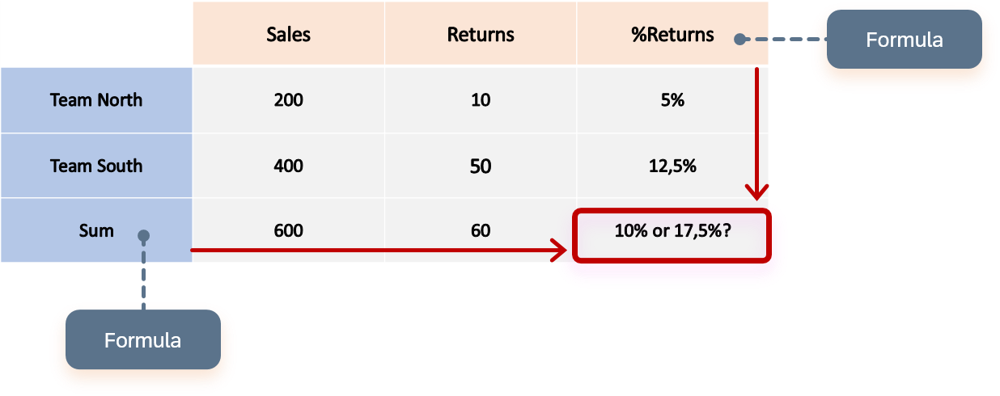

<!-- loio025ba2d3956047b3bde749145051bb1c -->

<link rel="stylesheet" type="text/css" href="../css/sap-icons.css"/>

# Configure Collision Handling

When the analytic model has measures and at least one structure you need to define how the calculations should be prioritized.

## Context

In the collision handling configuration, you can define if the calculation of measures should be prioritized or the calculation of structure members. You can decide whether the measures’ calculations/formulas will be shown, or the structures’ calculations/formulas will be shown.

> ### Example:  
> This graphic shows a table with measures in the columns with a formula calculation, and a structure member in the drill down which also has a formula calculation. For the sum, the question is which calculation to apply first.
> 
> 

## Procedure

1.  You are in the editor of your analytic model. You can configure collision handling by clicking the background of the canvas and choosing :gear: in the properties panel in the section *Structure Members*.

2.  Decide which properties and formula you want to prioritize: the measures' properties/formula or the structure members' properties/formula.

