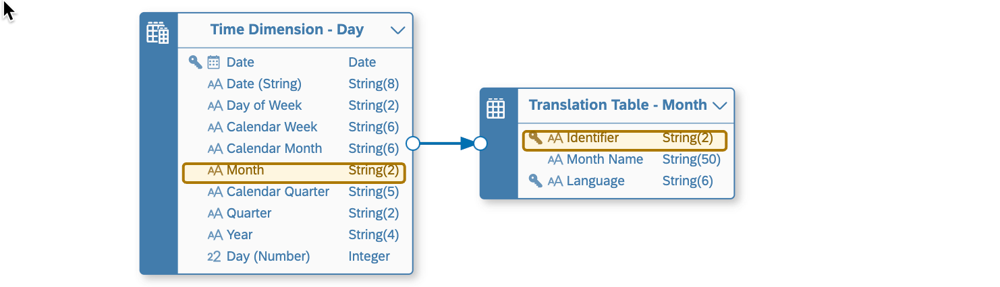

<!-- loiob25726df116b463e97435ba720e48ac9 -->

<link rel="stylesheet" type="text/css" href="../css/sap-icons.css"/>

# Create a Text Entity for Attribute Translation

Select a *Semantic Usage* of *Text* to indicate that your entity contains strings with language identifiers to translate text attributes in other entities.

## Context

For example:

-   The `Time Dimension - Day` dimension generated by SAP Datasphere contains a `Month` column that stores as numbers \(with `01` representing January, `02` February, `03` for March, and so on\).
-   The text entity `Translation Table - Month` contains the names of these months in English, French, German, and Spanish and can provide the name in the appropriate language.
-   A text association is drawn from the `Month` column to the *Identifier* column in the `Translation Table - Month` text entity.

## Procedure

1.  In the table editor or view editor output node side panel, set the *Semantic Usage* property to *Text*.

2.  Specify your attributes \(see [Specify Attributes](specify-attributes-cedc59c.md)\).

    You must specify at least the following attributes:

    <table>
    <tr>
    <th valign="top">

    Content
    
    </th>
    <th valign="top">

    Key
    
    </th>
    <th valign="top">

    Semantic Type
    
    </th>
    </tr>
    <tr>
    <td valign="top">
    
    Identifier

    Identifies the master data member for which the text is provided.

    Example: `01`
    
    </td>
    <td valign="top">
    
    Yes
    
    </td>
    <td valign="top">
    
    None
    
    </td>
    </tr>
    <tr>
    <td valign="top">
    
    Language Identifier

    Identifies the language in which the text is provided. The following identifier formats are supported for any data access language available in SAP Analytics Cloud:

    -   `E`
    -   `en`
    -   `EN`
    -   `EN-UK`

    Example: `en`
    
    </td>
    <td valign="top">
    
    Yes
    
    </td>
    <td valign="top">
    
    *Language*
    
    </td>
    </tr>
    <tr>
    <td valign="top">
    
    Validity Start Date

    \[optional\] For time-dependent text entities, specifies the date from which the text is valid \(see [Enable Time-Dependency for a Dimension or Text Entity](enable-time-dependency-for-a-dimension-or-text-entity-11b2ff4.md)\).

    Example: `01/01/2022`
    
    </td>
    <td valign="top">
    
    Yes
    
    </td>
    <td valign="top">
    
    *Business Date - From*
    
    </td>
    </tr>
    <tr>
    <td valign="top">
    
    Validity End Date

    \[optional\] For time-dependent text entities, specifies the date until which the text is valid.

    Example: `31/12/2022`
    
    </td>
    <td valign="top">
    
    No
    
    </td>
    <td valign="top">
    
    *Business Date - To*
    
    </td>
    </tr>
    <tr>
    <td valign="top">
    
    Text

    Provides the text in the appropriate language.

    Example: `January`
    
    </td>
    <td valign="top">
    
    No
    
    </td>
    <td valign="top">
    
    *Text*
    
    </td>
    </tr>
    </table>
    
3.  Set attributes as keys to indicate that the data they contain can uniquely identify records.

    > ### Note:  
    > You must set two or three key attributes for a *Text Entity*:
    > 
    > -   Identifier
    > -   Language Identifier
    > -   Validity Start Date - if time-dependency is required \(see [Enable Time-Dependency for a Dimension or Text Entity](enable-time-dependency-for-a-dimension-or-text-entity-11b2ff4.md)\)

    To set an attribute as a key column, select the checkbox in the *Key* column or hover over the attribute in the side panel and click  \(Menu\)** \> *Set as Key*.

4.  Click  \(Save\)** \> *Save* to save your entity or click  \(Deploy\) to save and deploy it immediately.

    For more information, see [Saving and Deploying Objects](../Creating-Finding-Sharing-Objects/saving-and-deploying-objects-7c0b560.md).

