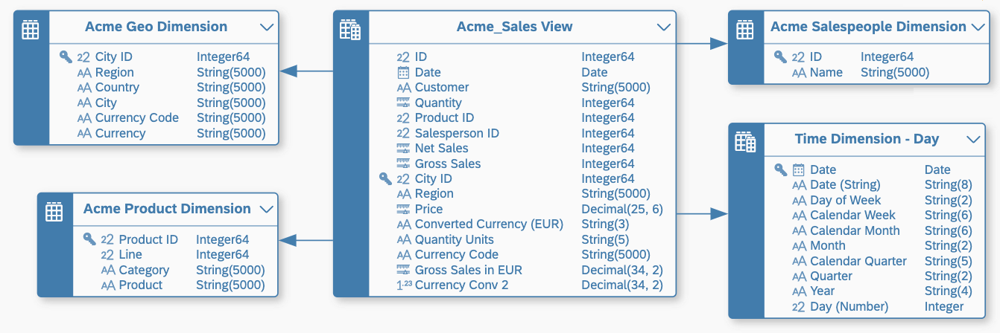
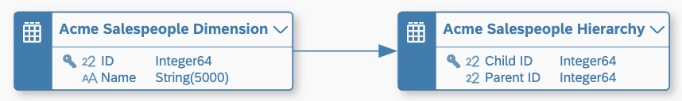

<!-- loio66c6998af9974dac8f54a46515777560 -->

<link rel="stylesheet" type="text/css" href="../css/sap-icons.css"/>

# Create an Association to Define a Semantic Relationship Between Entities

Click the *Create* button in the *Associations* section of the side panel of your table or view to create an association to another data entity and define a semantic relationship between them. 

This topic contains the following sections:

-   [Introduction to Associations](create-an-association-to-define-a-semantic-relationship-between-entities-66c6998.md#loio66c6998af9974dac8f54a46515777560__section_intro)
-   [Create an Association to a Dimension](create-an-association-to-define-a-semantic-relationship-between-entities-66c6998.md#loio66c6998af9974dac8f54a46515777560__section_dimension)
-   [Create an Association to a Text Entity](create-an-association-to-define-a-semantic-relationship-between-entities-66c6998.md#loio66c6998af9974dac8f54a46515777560__section_text)
-   [Create an Association to a Hierarchy or a Hierarchy with Directory](create-an-association-to-define-a-semantic-relationship-between-entities-66c6998.md#loio66c6998af9974dac8f54a46515777560__section_hierarchy)
-   [Copy Associations from a Source](create-an-association-to-define-a-semantic-relationship-between-entities-66c6998.md#loio66c6998af9974dac8f54a46515777560__section_from_source)
-   [Consuming Associations in an Analytic Model](create-an-association-to-define-a-semantic-relationship-between-entities-66c6998.md#loio66c6998af9974dac8f54a46515777560__section_analytic_model)

<a name="loio66c6998af9974dac8f54a46515777560__section_intro"/>

## Introduction to Associations

When you create a join in a view, you are immediately combining the data from the two sources based on the definition of the join mapping. In contrast, creating an association will merely prepare the conditions for performing a join in the future. A join is a one-time operation, while an association can be used to do any number of joins in different contexts.

You can create an association from any table or view to any other table or view at any level of the data layer, but they are required when defining the semantic relationships between facts, dimensions, text entities, and hierarchies. Since associations need to identify specific records in the entities they point to, they generally require key columns to be set in either or both entities in the relationship \(see [Set Key Columns to Uniquely Identify Records](set-key-columns-to-uniquely-identify-records-d9ef2c9.md).

You can create associations in the:

-   E/R model editor \(for any table or view\), in the side panel *Associations* section or by drawing associations in the diagram \(see [Create an Association in an E/R Model Diagram](../create-an-association-in-an-e-r-model-diagram-82e6869.md)\).
-   Table editor *Associations* section.
-   Graphical view editor/SQL view editor, in the output node *Associations* section.

In this simple star schema example:

-   The `Acme Sales` fact has associations to four dimensions.
-   The `Acme Product` and `Time` dimensions have associations to text entities.
-   The `Acme Salespeople` dimension has an association to a hierarchy.

<a name="loio66c6998af9974dac8f54a46515777560__section_dimension"/>

## Create an Association to a Dimension

You can create an association to a dimension from a fact, a dimension, or a hierarchy with directory to provide context and categories when analyzing data. The association is mapped from one or more attributes in the source entity \(which act as foreign keys\) to the one or more attributes in the dimension that are marked as keys.

In this example, the `Acme Sales View` fact, has associations to four dimensions to allow the sales data measures to be analyzed by :

-   Geographical area - the attribute `City ID` is mapped to the primary key `City ID` in `Acme Geo Dimension`.
-   Product, product line, and product category - the attribute `Product ID` is mapped to the primary key `Product ID` in `Acme Product Dimension`.
-   Salesperson - the attribute `Salesperson ID` is mapped to the primary key `ID` in `Acme Salesperson Dimension`.
-   Time - the attribute `Date` is mapped to the primary key `Date` in `Time Dimension - Day`.

For information about dimensions, see [Create a Dimension to Categorize Data](create-a-dimension-to-categorize-data-5aae0e9.md).

1.  Open the table or view from which you want to create the association..

    Alternatively, select the entity in an E/R model to open its *Properties* panel.

2.  In the *Associations* section, click  \(Create Association\) *Association* to open the *Select Object* dialog, listing all the entities available in the space.
3.  Select the appropriate dimension from the list and click *OK* to create the association and open it in the side panel.

    You can filter the list using the search field or by clicking  \(Show filters\) to open the filter panel, and selecting any of the available filter criteria.

4.  Review the proposed *Business Name* and *Technical Name* and the columns mapped by default in the *Mappings* section.

    > ### Note:  
    > You must complete the mappings as follows:
    > 
    > -   *Fact* - One attribute in the \(source\) *Fact* must be mapped to each \(target\) *Dimension* key column so that all target key columns are mapped.
    > -   *Dimension* - One attribute in the \(source\) *Dimension* must be mapped to each \(target\) *Dimension* key column so that all target key columns are mapped.
    > -   *Hierarchy with Directory*:
    >     -   A *Dimension* acting as its directory - The hierarchy name attribute in the \(source\) hierarchy entity must be mapped to the primary key column in the \(target\) dimension.
    >     -   Any non-leaf *Dimension* providing nodes to the hierarchy - The appropriate node type values columns in the \(source\) hierarchy must be mapped to the key columns in the \(target\) *Dimension*.

5.  Click *< \(Back\)* in the table editor \(or use the breadcrumbs in the side panel\) to return to the list of associations, where the new association now appears.

<a name="loio66c6998af9974dac8f54a46515777560__section_text"/>

## Create an Association to a Text Entity

You can create an association to a text entity from a fact or a dimension to provide text values for an attribute in one or more languages. The association is mapped from one or more attributes in the source entity that require text labels to the one or more attributes in the text entity that are marked as keys and have a semantic type of `None`.

In this example, the `Time Dimension - Day` dimension has associations to three text entities to provide text labels in multiple languages for three attributes:

-   The attribute `Day of Week` is mapped to `Identifier` in `Translation Table - Day` to provide text labels for the names of days.
-   The attribute `Month` is mapped to `Identifier` in `Translation Table - Month` to provide text labels for the names of months.
-   The attribute `Quarter` is mapped to `Identifier` in `Translation Table - Quarter` to provide text labels for the names of quarters.

:

For information about text entities, see [Create a Text Entity for Attribute Translation](create-a-text-entity-for-attribute-translation-b25726d.md).

1.  Open the table or view from which you want to create the association..

    Alternatively, select the entity in an E/R model to open its *Properties* panel.

2.  In the *Associations* section, click  \(Create Association\) *Text Association* to open the *Select Object* dialog, listing all the text entities available in the space.
3.  Select the appropriate text entity from the list and click *OK* to create the association and open it in the side panel.

    You can filter the list using the search field or by clicking  \(Show filters\) to open the filter panel, and selecting any of the available filter criteria.

4.  Review the proposed *Business Name* and *Technical Name* and the columns mapped by default in the *Mappings* section. 

    > ### Note:  
    > You must complete the mappings as follows:
    > 
    > -   *Fact* - One attribute in the \(source\) *Fact* must be mapped to each \(target\) *Text Entity* identifier key column.
    > -   *Dimension* - One attribute in the \(source\) *Dimension* must be mapped to each \(target\) *Text Entity* identifier key column.
    > 
    > When you have defined a compound key for a dimension, you must map all key columns to the text entity. You can only provide translations for the representative key column. Other key columns cannot be translated. See [Compound Keys and Representative Keys](set-key-columns-to-uniquely-identify-records-d9ef2c9.md#loiod9ef2c91f6d647e584bad51999e441cd__section_compound_keys).

5.  Click *< \(Back\)* in the table editor \(or use the breadcrumbs in the side panel\) to return to the list of associations, where the new association now appears. 

    The icon  in the list of attributes signals that an attribute is mapped to a text entity.

<a name="loio66c6998af9974dac8f54a46515777560__section_hierarchy"/>

## Create an Association to a Hierarchy or a Hierarchy with Directory

You can create an association to a hierarchy \(or a hierarchy with directory\) from a dimension, to support drill down and up in the dimension members. The association is mapped from one or more primary key attributes in the source dimension to one or more child attributes in the hierarchy that are marked as keys.

In this example, the `Acme Salesperson Dimension` has an association to a hierarchy to allow drill down and up in the sales organization structure, where the `ID` primary key attribute is mapped to the `Child ID` child key attribute in `Acme Salespeople Hierarchy`:

For information about hierarchies, see [Create an External Hierarchy for Drill-Down](create-an-external-hierarchy-for-drill-down-dbac7a8.md) and [Create a Hierarchy with Directory](create-a-hierarchy-with-directory-36c39ee.md).

1.  Open the table or view from which you want to create the association..

    Alternatively, select the entity in an E/R model to open its *Properties* panel.

2.  In the *Associations* section, click  \(Create Association\) *Hierarchy Association* \(or *Hierarchy with Directory Association*\) to open the *Select Object* dialog listing all the hierarchies \(or hierarchies with directories\) in the space.
3.  Select the appropriate hierarchy from the list and click *OK* to create the association and open it in the side panel.

    You can filter the list using the search field or by clicking  \(Show filters\) to open the filter panel, and selecting any of the available filter criteria.

4.  Review the proposed *Business Name* and *Technical Name* and the columns mapped by default in the *Mappings* section.

    > ### Note:  
    > You must complete the mappings as follows:
    > 
    > -   *Dimension* - Each key attribute in the \(source\) *Dimension* must be mapped to a \(target\) *Hierarchy* child attribute key column.

5.  Click *< \(Back\)* in the table editor \(or use the breadcrumbs in the side panel\) to return to the list of associations, where the new association now appears. 

<a name="loio66c6998af9974dac8f54a46515777560__section_from_source"/>

## Copy Associations from a Source

If your view has a source entity that itself has associations, you can copy one or more of those associations instead of creating it again:

1.  Open the view in its editor.
2.  In the *Associations* section, click  \(Create Association\) \> *Copy from Source* to open the *Copy Associations from Source* dialog.

    All associations available from all sources are listed, so long as the relevant attribute from the source has not been excluded from the current view.

3.  Select the associations to copy and click *Create* to return to the *Associations* section and add them to the list.

<a name="loio66c6998af9974dac8f54a46515777560__section_analytic_model"/>

## Consuming Associations in an Analytic Model

Any number of analytic models can consume a single fact and the entities it connects to via associations \(see [Creating an Analytic Model](creating-an-analytic-model-e5fbe9e.md)\).

When creating an analytic model, the modeler decides for each dimension towards which the fact has an association, whether to include it in the model \(see [Add a Dimension](add-a-dimension-4caf098.md)\). When a particular dimension is included, then the analytic model will follow the association to bring in the relevant data from the dimension.

While it is possible to define multiple associations that use the same attribute as their source, the analytic model can use only one association per attribute. To be sure that the analytic model is using the correct association, review the attribute's *Text / Association* property.

This property can contain:

-   An association pointing to a dimension \(see [Create an Association to a Dimension](create-an-association-to-define-a-semantic-relationship-between-entities-66c6998.md#loio66c6998af9974dac8f54a46515777560__section_dimension)\)
-   A text association pointing to a text entity \(see [Create an Association to a Text Entity](create-an-association-to-define-a-semantic-relationship-between-entities-66c6998.md#loio66c6998af9974dac8f54a46515777560__section_text)\)
-   An attribute with a semantic type of *Text*

It is automatically filled when you create an association or a text association and map the attribute as the source of the association. If you want to specify an attribute with a semantic type of *Text* to act as a label for the column, then you must manually select the attribute here.

> ### Note:  
> In cases where multiple associations and/or text associations are defined on a single attribute, you can manually choose which association \(or local text attribute\) should be used by the analytic model by making the appropriate selection here.

