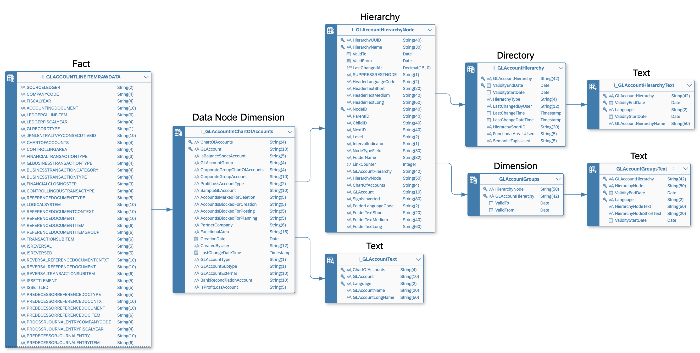
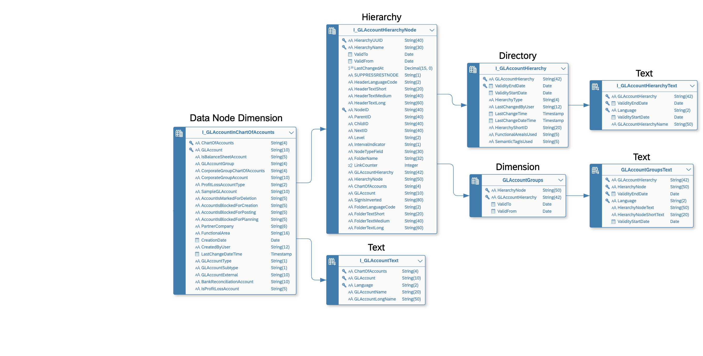
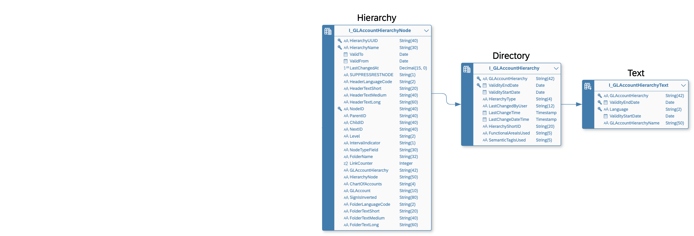
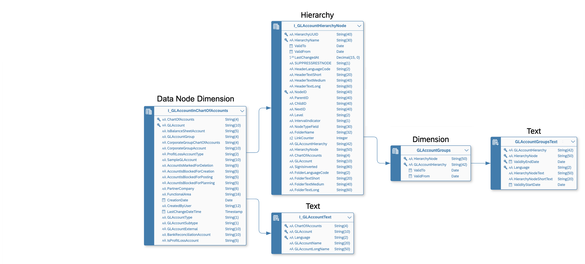

<!-- loio36c39eee184c485a80ebce9d0fec49ec -->

# Creating a Hierarchy with Directory

Select a *Semantic Usage* of *Hierarchy with Directory* to indicate that your entity contains one or more parent-child hierarchies and has an association to a directory dimension containing a list of the hierarchies.

These types of hierarchy entities can include nodes from multiple dimensions \(for example, country, cost center group, and cost center\) and are commonly imported from SAP S/4HANA Cloud and SAP BW \(including SAP BW Bridge\) systems.

For more information and walkthroughs, see also:

-   SAP S/4HANA [Hierarchy with Directory Samples](https://github.com/SAP-samples/analytics-cloud-datasphere-community-content/blob/main/Hierarchy_with_Directory_Sample/README.md) on the Community Content Github.
-   The blog series beginning with [An Introduction to Hierarchy with Directory in SAP Datasphere](https://blogs.sap.com/2024/01/15/an-introduction-to-hierarchy-with-directory-in-sap-datasphere/) on the SAP Community site.

This topic contains the following sections:

-   [Example: SAP S/4HANA Cloud General Ledger Account Hierarchy](creating-a-hierarchy-with-directory-36c39ee.md#loio36c39eee184c485a80ebce9d0fec49ec__section_example)
-   [Prepare the Leaf Node and Other Hierarchy Node Dimensions and Text Entities](creating-a-hierarchy-with-directory-36c39ee.md#loio36c39eee184c485a80ebce9d0fec49ec__section_dimension)
-   [Prepare the Hierarchy Directory Entity and Text Entities](creating-a-hierarchy-with-directory-36c39ee.md#loio36c39eee184c485a80ebce9d0fec49ec__section_directory)
-   [Prepare the Hierarchy Entity](creating-a-hierarchy-with-directory-36c39ee.md#loio36c39eee184c485a80ebce9d0fec49ec__section_hierarchy)
-   [Use a Hierarchy in an Analytic Model](creating-a-hierarchy-with-directory-36c39ee.md#loio36c39eee184c485a80ebce9d0fec49ec__section_use_am)
-   [Use a Hierarchy in an SAP Analytics Cloud Story](creating-a-hierarchy-with-directory-36c39ee.md#loio36c39eee184c485a80ebce9d0fec49ec__section_use_sac)

<a name="loio36c39eee184c485a80ebce9d0fec49ec__section_example"/>

## Example: SAP S/4HANA Cloud General Ledger Account Hierarchy

Our example is created from entities imported from an SAP S/4HANA Cloud system and defines hierarchies of general ledger accounts and categories:

-   `I_GLACCOUNTLINEITEMRAWDATA` \(semantic usage: *Fact*\) - Contains transactional data and has an association to:
    -   `I_GLAccountInChartOfAccounts` \(semantic usage: *Dimension*\) - A dimension containing general ledger accounts, which are organized into hierarchies. It has associations to:
        -   `I_GLAccountText` \(semantic usage: *Text*\) - A text entity containing translations of the general ledger account names.
        -   `I_GLAccountHierarchyNode` \(semantic usage: *Hierarchy with Directory*\) - A hierarchy entity for defining parent-child relationships between general ledger accounts and categories. It has associations to:
            -   `I_GLAccountHierarchy` \(semantic usage: *Dimension*\) - The directory for `GLAccountHierarchyNode`, which contains the names of the various hierarchies. It has an association to:
                -   `I_GLAccountHierarchyText` \(semantic usage: *Text*\) - A text entity containing translations of the hierarchy names.

            -   `GLAccountGroups` \(semantic usage: *Dimension*\) - A dimension containing grouping nodes that are used in the general ledger account hierarchies. It has an association to:

                -   `I_GLAccountGroupText` \(semantic usage: *Text*\) - A text entity containing translations of the general ledger account group names.

                > ### Note:  
                > In SAP S/4HANA Cloud, the GL account hierarchy grouping nodes are stored directly in the `I_GLAccountHierarchyNode` entity, but SAP Datasphere requires all hierarchy node types to be stored in separate dimensions. Therefore, to complete the valid definition of the hierarchy and its supporting entities we extracted the unique values for the groups into this separate view.

<a name="loio36c39eee184c485a80ebce9d0fec49ec__section_dimension"/>

## Prepare the Leaf Node and Other Hierarchy Node Dimensions and Text Entities

You must identify a leaf node dimension, which is the dimension that contains the lowest nodes \(leaf nodes\) in the hierarchy, along with any other dimensions that contribute nodes to the hierarchy. Each dimension will generally be associated with one or more text entities to provide translation of the node names.

In our example, `GLAccountInChartOfAccounts` is the leaf node dimension and `GLAccountGroups` is another dimension providing non-leaf nodes, and each has an association to an appropriate text entity:

1.  Open your leaf node dimension and set the semantic usage to *Dimension*.

    Your leaf node dimension must have a key and will contain records of members that are related in one or more parent-child hierarchies.

    For more information about dimensions, see [Creating a Dimension](creating-a-dimension-5aae0e9.md).

2.  In the *Associations* section, click *New* \> *Hierarchy Association*, select your hierarchy entity and complete the mapping.
3.  In the *Associations* section, click *New* \> *Text Association*, select the appropriate text entity and complete the mapping.

    For more information about text entities, see [Create a Text Entity for Attribute Translation](create-a-text-entity-for-attribute-translation-b25726d.md).

4.  \[optional\] If your hierarchy contains other node types, ensure that each dimension containing one of these node types is available in your space, has its semantic usage set to *Dimension*, and has text associations to appropriate text entities.

    In our example, `GLAccountGroups` is a dimension containing GL Account grouping nodes, which is a non-leaf node type in our hierarchy.

<a name="loio36c39eee184c485a80ebce9d0fec49ec__section_directory"/>

## Prepare the Hierarchy Directory Entity and Text Entities

You must identify a hierarchy directory entity that contains hierarchy identifiers and names. A directory will generally be associated with one or more text entities to provide translation of the hierarchy names.

In our example, `I_GLAccountHierarchy` is the hierarchy directory dimension:

1.  Open your hierarchy directory entity and set the semantic usage to *Dimension*.
2.  Ensure that it contains, as a minimum, the following columns:
    -   Hierarchy Identifier - \(key\) containing the unique identifier of a hierarchy
    -   Hierarchy Name - Containing the human-readable name of a hierarchy.

        A text entity may be used to provide translations of the hierarchy name

    -   \[optional\] Time dependency-columns to control the availability of hierarchies based on the key date used in the eventual chart \(see [Enable Time-Dependency for a Dimension or Text Entity](enable-time-dependency-for-a-dimension-or-text-entity-11b2ff4.md)\).

3.  In the *Associations* section, click *New* \> *Text Association*, select the appropriate text entity and complete the mapping.

    For more information about text entities, see [Create a Text Entity for Attribute Translation](create-a-text-entity-for-attribute-translation-b25726d.md).

<a name="loio36c39eee184c485a80ebce9d0fec49ec__section_hierarchy"/>

## Prepare the Hierarchy Entity

You must identify a hierarchy entity that contains parent-child hierarchy data, along with hierarchy identifiers, node types, and unique identifier columns for each type of node.

In our example `I_GLAccountHierarchyNode` is the hierarchy node:

1.  Open the table or view containing the hierarchy information and set the *Semantic Usage* property to *Hierarchy with Directory*.
2.  Ensure the following columns are marked as keys:
    -   The column containing the identifiers of child nodes in the parent-child relationship.

        In our example, this is the `NodeID` column.

    -   The column containing the identifier of the hierarchy to which the parent-child relationship belongs.

        In our example, this is the `HierarchyName` column.

3.  Create an association from the hierarchy entity to the directory entity, and map the column you selected as the *Hierarchy Name Column* in the hierarchy entity to the primary key column in the directory entity.

    In our example, the `HierarchyName` column in the hierarchy entity `I_GLAccountHierarchyNode`, is mapped to the primary key column in the directory entity, `I_GLAccountHierarchy`.

4.  \[if multiple types of hierarchy nodes are specified\] Create an association from the hierarchy entity to each \(non-leaf\) dimension containing nodes that are used in the hierarchies, and map the appropriate node type values columns identified in the hierarchy entity to the key columns in the dimensions.

    In our example, the columns, `GLAccountHierarchy` and `HierarchyNode` in the hierarchy entity `I_GLAccountHierarchyNode`, are mapped to the key columns in the `GLAccountGroups` dimension.

5.  \[optional\] If time-dependency columns are available, add the appropriate semantic types \(see [Enable Time-Dependency for a Dimension or Text Entity](enable-time-dependency-for-a-dimension-or-text-entity-11b2ff4.md)\).
6.  Click the *Hierarchy with Directory Settings* button, complete the following properties in the dialog, and then click *OK*:

    <table>
    <tr>
    <th valign="top">

    Property
    
    </th>
    <th valign="top">

    Description
    
    </th>
    </tr>
    <tr>
    <td valign="top">
    
    Parent
    
    </td>
    <td valign="top">
    
    Select the column containing the identifiers of parent nodes in the parent-child relationship.

    In our example, the `ParentID` column is selected.
    
    </td>
    </tr>
    <tr>
    <td valign="top">
    
    Child
    
    </td>
    <td valign="top">
    
    Select the column containing the identifiers of child nodes in the parent-child relationship.

    This column must be marked as a key.

    In our example, the `NodeID` column is selected.
    
    </td>
    </tr>
    <tr>
    <td valign="top">
    
    Hierarchy Name Column
    
    </td>
    <td valign="top">
    
    Select the column containing the identifier of the hierarchy to which the parent-child relationship belongs.

    This column must be marked as a key.

    In our example, the `HierarchyName` column is selected.
    
    </td>
    </tr>
    <tr>
    <td valign="top">
    
    Hierarchy Directory Entity
    
    </td>
    <td valign="top">
    
    Displays the name of the hierarchy directory entity, once the *Hierarchy Name Column* property is set and an association is created to point from the hierarchy to the directory entity.
    
    </td>
    </tr>
    <tr>
    <td valign="top">
    
    Node Type Column
    
    </td>
    <td valign="top">
    
    Select the column containing the type of the child node in the parent-child relationship.

    In our example, the `NodeTypeField` column is selected.
    
    </td>
    </tr>
    <tr>
    <td valign="top">
    
    Node Type Values
    
    </td>
    <td valign="top">
    
    Create one entry for each value that appears in the node type column, and complete the properties as follows:

    -   *Node Type Value* - Enter the value that is used to identify the type of the node in the *Node Type Column*.

        In our example:

        -   `GLAccount` is used to identify that the node is from the `GLAccountInChartOfAccounts` dimension.
        -   `HierarchyNode` is used to identify that the node is from the `GLAccountGroups` dimension.

    -   *Set as Leaf* - Select this option if this type of node is at the lowest level of the hierarchy.

        > ### Note:  
        > Only one node type can be identified as the leaf, and all the hierarchies defined in the entity must have the same leaf type.

        In our example, `GLAccount` is the leaf node type.

    -   *Column 1*- Select the column that contains the identifiers of nodes of this type. If more than one column is used, click the *Add Column* button to add and specify each required column.

        All of the columns you identify must be mapped in the association between the hierarchy and the dimension.

        In our example:

        -   Two columns, `ChartOfAccounts` and `GLAccount` identify nodes from the `GLAccountInChartOfAccounts` dimension.
        -   Two columns, `GLAccountHierarchy` and `HierarchyNode` identify nodes from the `GLAccountGroups` dimension.

    
    </td>
    </tr>
    </table>
    

<a name="loio36c39eee184c485a80ebce9d0fec49ec__section_use_am"/>

## Use a Hierarchy in an Analytic Model

If your leaf dimension is included in an analytic model, you can enable any of your defined hierarchies in the analytic preview:

1.  Open your analytic model and click *Preview* to open the analytic preview.
2.  In the *Available Objects* panel, enable your leaf node column as a row.

    No hierarchy is enabled by default.

3.  In the *Builder* panel *Rows* section, hover over your leaf node column and then click *More* \> *Hierarchy* \> *Select Hierarchy*.
4.  In the *Select Hierarchy* dialog, select your hierarchy and click *OK*

    The hierarchy is shown collapsed and you can drill down into it as appropriate.

For more information about working with the analytic preview, see [Using the Data Preview](using-the-data-preview-9f1fa73.md).

<a name="loio36c39eee184c485a80ebce9d0fec49ec__section_use_sac"/>

## Use a Hierarchy in an SAP Analytics Cloud Story

Hierarchies defined in a hierarchy with directory are supported only in stories created using the Optimized Design Experience \(see [Create a New Story \(Optimized Story Experience\)](https://help.sap.com/docs/SAP_ANALYTICS_CLOUD/9cf81b2ed2cd4e1da36662b609651c7b/2e0e2a7a8eb544baabd53554353366a8.html) in the *SAP Analytics Cloud* documentation.

> ### Note:  
> Hierarchies defined in a hierarchy with directory cannot be used in Classic Design Experience stories.

For information about using hierarchies in SAP Analytics Cloud, see [Work with Hierarchies in a Chart](https://help.sap.com/docs/SAP_ANALYTICS_CLOUD/9cf81b2ed2cd4e1da36662b609651c7b/fb6eeaa01c0045f4867b07d9126aa3c4.html).

