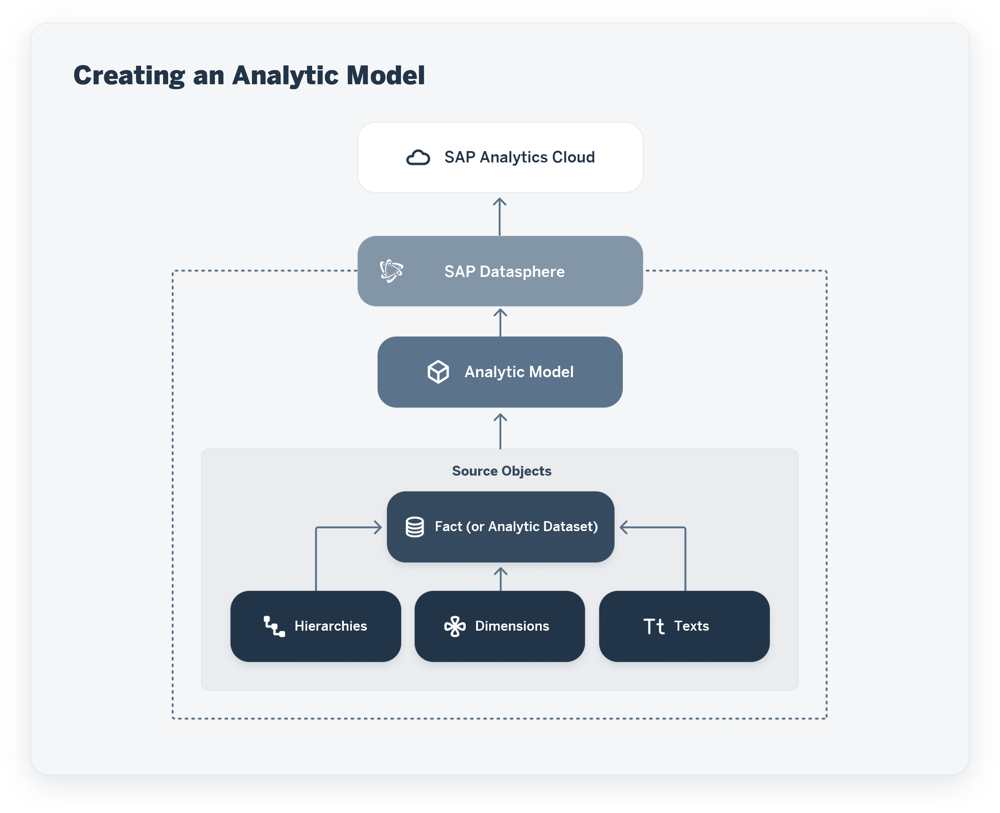

<!-- loioe5fbe9e2cb93484dab8b1963145e565f -->

<link rel="stylesheet" type="text/css" href="../css/sap-icons.css"/>

# Creating an Analytic Model

Create an analytic model as a basis for consumption in SAP Analytics Cloud.

## Context

Analytic models are the analytical foundation for making data ready for consumption in SAP Analytics Cloud. They allow you to create and define multi-dimensional models to provide data for analytical purposes to answer different business questions. Pre-defined measures, hierarchies, filters, parameters, and associations provide flexible and simple navigation through the underlying data.

The sources for analytic models are facts \(or analytical datasets\), which can contain dimensions, texts, and hierarchies.

> ### Note:  
> Some terms and concepts are used differently in analytic models to align more closely with the terminology in SAP Analytics Cloud stories:
> 
> -   "Input parameters” in facts are called “variables” in analytic models.
> -   "Attributes” in facts are called “dimensions” in analytic models.

This graphic shows the role of the analytic model within SAP Datasphere:

## Procedure

1.  From the side navigation, choose *Data Builder*, select a space if necessary, and choose *New Analytic Model* to open the editor.

2.  Drag your source from the Repository and drop it onto the canvas. For more information, see [Add a Source](add-a-source-27075ee.md).

3.  The side panel shows the properties of your analytic model. Complete the missing information as appropriate:

    <table>
    <tr>
    <th valign="top">

    Property
    
    </th>
    <th valign="top">

    Description
    
    </th>
    </tr>
    <tr>
    <td valign="top">
    
    Business Name
    
    </td>
    <td valign="top">
    
    Enter a descriptive name to help users identify the object. This name can be changed at any time.
    
    </td>
    </tr>
    <tr>
    <td valign="top">
    
    Technical Name
    
    </td>
    <td valign="top">
    
    Displays the name used in scripts and code, synchronized by default with the *Business Name*.

    To override the default technical name, enter a new one in the field. Technical names can contain only alphanumeric characters and underscores.

    > ### Note:  
    > Once the object is saved, the technical name can no longer be modified.

    
    </td>
    </tr>
    <tr>
    <td valign="top">
    
    Package
    
    </td>
    <td valign="top">
    
    Select the package to which the object belongs.
    
    </td>
    </tr>
    <tr>
    <td valign="top">
    
    Status
    
    </td>
    <td valign="top">
    
    \[read-only\] Displays the deployment and error status of the object.

    For more information, see [Saving and Deploying Objects](../saving-and-deploying-objects-7c0b560.md).
    
    </td>
    </tr>
    </table>
    
4.  Select your fact source on the canvas to select or deselect any measures, associated dimensions, or attributes in the properties panel on the right. For more information, see [Add a Dimension](add-a-dimension-4caf098.md).

    > ### Note:  
    > Attributes of type ***LargeString*** are not consumable in SAP Analytics Cloud.

5.  When you click on a dimension or the fact source on the canvas, you make several changes:

    <table>
    <tr>
    <th valign="top">

    Property
    
    </th>
    <th valign="top">

    Description
    
    </th>
    </tr>
    <tr>
    <td valign="top">
    
    Alias
    
    </td>
    <td valign="top">
    
    You can change the alias of this item.The alias is the name that is shown in the story in SAP Analytics Cloud.

    > ### Example:  
    > In many cases you need to have a more specific name for a field than the source provides. For example, the field name is *Costcenter*, but you want to specify if it is to *Receiving Costcenter* or *Sending Costcenter*.

    
    </td>
    </tr>
    <tr>
    <td valign="top">
    
    Measures
    
    </td>
    <td valign="top">
    
    You can add or deselect measures. You can copy measures \(which are not fact source measures\) to create a new measure with same properties.
    
    </td>
    </tr>
    <tr>
    <td valign="top">
    
    Associated Dimensions
    
    </td>
    <td valign="top">
    
    You can add or deselect associated dimensions.
    
    </td>
    </tr>
    <tr>
    <td valign="top">
    
    Attributes
    
    </td>
    <td valign="top">
    
    You can add or deselect attributes. Attributes used in associations cannot be unselected.
    
    </td>
    </tr>
    <tr>
    <td valign="top">
    
    Input Parameters
    
    </td>
    <td valign="top">
    
    You can add or deselect input parameters.
    
    </td>
    </tr>
    </table>
    
6.  You can choose *Preview* to check if the data looks like expected. Here you have two options: there is the simple preview which is available via the context menu in the editor at the analytic model. For more information, see [Viewing Object Data](../viewing-object-data-b338e4a.md). And then there is the analytical preview in which you can drill down by rows and columns. For more information, see [Using the Data Preview](using-the-data-preview-9f1fa73.md).

    > ### Note:  
    > When you change an analytic model for which a story has been defined, and you deploy it again, you need to open the story in SAP Analytics Cloud and save it again.

    > ### Note:  
    > For technical reasons, there is a timeout after three minutes when opening the data preview or when executing a query against an analytic model in SAP Analytics Cloud.

7.  The tools in the editor toolbar help you work with your object throughout its lifecycle:

    <table>
    <tr>
    <th valign="top">

    Tool
    
    </th>
    <th valign="top">

    Description
    
    </th>
    </tr>
    <tr>
    <td valign="top">
    
     \(Save\)
    
    </td>
    <td valign="top">
    
    Save your changes to the design-time repository. You can use *Save As* to create a copy of the object. 

    See [Saving and Deploying Objects](../saving-and-deploying-objects-7c0b560.md).
    
    </td>
    </tr>
    <tr>
    <td valign="top">
    
     \(Deploy\)
    
    </td>
    <td valign="top">
    
    Deploy your changes to make them available in the run-time environment.

    See [Saving and Deploying Objects](../saving-and-deploying-objects-7c0b560.md).
    
    </td>
    </tr>
    <tr>
    <td valign="top">
    
     \(Source Browser\)
    
    </td>
    <td valign="top">
    
    Show the *Source Browser* panel to drag sources into the editor. 

    See [Using the Source Browser](../using-the-source-browser-7d2b21d.md).
    
    </td>
    </tr>
    <tr>
    <td valign="top">
    
     \(Preview Data\)
    
    </td>
    <td valign="top">
    
    Open the *Data Preview* panel to preview data in the selected diagram node. 

    See [Viewing Object Data](../viewing-object-data-b338e4a.md).
    
    </td>
    </tr>
    <tr>
    <td valign="top">
    
     \(Undo\) /  \(Redo\)
    
    </td>
    <td valign="top">
    
    Revert the last change to the object or redo a change you have previously undone.
    
    </td>
    </tr>
    <tr>
    <td valign="top">
    
     \(Export\)
    
    </td>
    <td valign="top">
    
    Export:

    -   The object to a CSN/JSON file \(see [Exporting Objects to a CSN/JSON File](../Creating-Finding-Sharing-Objects/exporting-objects-to-a-csn-json-file-3916101.md)\).
    -   Support information to send to SAP Support to help analyze an issue.

    
    </td>
    </tr>
    <tr>
    <td valign="top">
    
     \(Impact and Lineage Analysis\)
    
    </td>
    <td valign="top">
    
    Open the *Impact and Lineage Analysis* graph for the object. 

    See [Impact and Lineage Analysis](../impact-and-lineage-analysis-9da4892.md).
    
    </td>
    </tr>
    <tr>
    <td valign="top">
    
     \(Generate OData Request\)
    
    </td>
    <td valign="top">
    
    Open the *Generate OData Request* dialog to prepare access to the OData API. 

    See [Consume Data via the OData API](https://help.sap.com/viewer/43509d67b8b84e66a30851e832f66911/cloud/en-US/7a453609c8694b029493e7d87e0de60a.html "You can connect to the OData API and consume data exposed as views or analytic models in SAP Analytics Cloud and other clients, tools, and apps that are capable of accessing an OData service and authenticating via an OAuth client.") :arrow_upper_right:.
    
    </td>
    </tr>
    </table>
    

