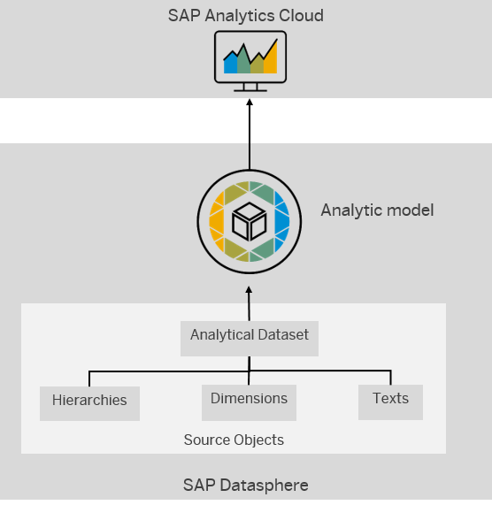

<!-- loioe5fbe9e2cb93484dab8b1963145e565f -->

# Creating an Analytic Model

Create an analytic model as a basis for consumption in SAP Analytics Cloud.

## Context

Analytic models are the analytical foundation for making data ready for consumption in SAP Analytics Cloud. They allow you to create and define multi-dimensional models to provide data for analytical purposes to answer different business questions. Pre-defined measures, hierarchies, filters, parameters, and associations provide flexible and simple navigation through the underlying data.

The sources for analytic models are facts \(or analytical datasets\), which can contain dimensions, texts, and hierarchies.

> ### Note:  
> Some terms and concepts are used differently in analytic models to align more closely with the terminology in SAP Analytics Cloud stories:
> 
> -   "Input parameters” in facts are called “variables” in analytic models.
> -   "Attributes” in facts are called “dimensions” in analytic models.

This graphic shows the role of the analytic model within SAP Datasphere:

  

## Procedure

1.  From the side navigation, choose *Data Builder*, select a space if necessary, and choose *New Analytic Model* to open the editor.

2.  Add a source. For more information, see [Add a Source](add-a-source-27075ee.md).

3.  Click on your fact source on the canvas to select or deselect any measures, associated dimensions, or attributes in the properties panel on the right. For more information, see [Add a Dimension](add-a-dimension-4caf098.md).

    > ### Note:  
    > Attributes of type ***LargeString*** are not consumable in SAP Analytics Cloud.

4.  To edit the properties of the analytic model: Click on the background of the canvas to show the analytic model's properties in the side panel. You can make the following changes here:

    1.  Enter a descriptive *Name* to help users identify the object. This name can be changed at any time.

    2.  Enter a new *Technical Name*. Technical names can contain only alphanumeric characters and underscores.

        > ### Note:  
        > Once the object is saved, the technical name can no longer be modified.

    3.  You can add a measure. For more information, see [Add Measures](add-measures-e4cc3e8.md).
    4.  You can add a variable. For more information, see [Add a Variable](add-a-variable-cdd8fa0.md).

5.  To edit the properties of a the fact source: Click on the fact source on the canvas to show the its properties in the side panel. You can make the following changes here:

    1.  You can change the alias.
    2.  You can add or deselect measures.
    3.  You can add or deselect associated dimensions.
    4.  You can add or deselect attributes.

6.  To edit the properties of a dimension: Click on the dimension on the canvas to show the its properties in the side panel. You can make the following changes here:

    1.  You can change the alias.
    2.  You can add or deselect associated dimensions.
    3.  You can add or deselect attributes.

7.  When you click on a dimension or the fact source on the canvas, you can change the alias of this item. The alias is the name that is shown in the story in SAP Analytics Cloud.

    > ### Example:  
    > In many cases you need to have a more specific name for a field than the source provides. For example, the field name is *Costcenter*, but you want to specify if it is to *Receiving Costcenter* or *Sending Costcenter*.

8.  You can choose *Preview* to check if the data looks like expected. For more information, see [Using the Data Preview](using-the-data-preview-9f1fa73.md).

    > ### Note:  
    > When you change an analytic model for which a story has been defined, and you deploy it again, you need to open the story in SAP Analytics Cloud and save it again.

