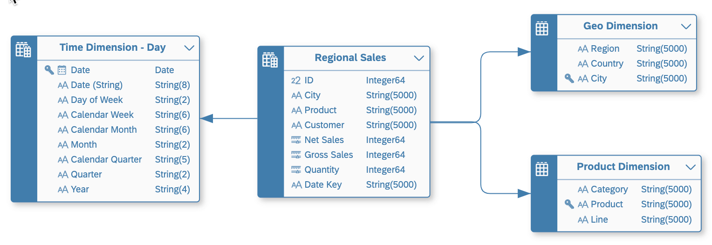

<!-- loio30089bd2aa754ab996a62cf5842ae60a -->

<link rel="stylesheet" type="text/css" href="../css/sap-icons.css"/>

# Creating an Analytical Dataset

Select a *Semantic Usage* of *Analytical Dataset* to indicate that your entity contains numerical measures that can be analyzed.

<a name="loio30089bd2aa754ab996a62cf5842ae60a__context_pmz_lr3_spb"/>

## Context

Analytical datasets typically contain transactional data, such as:

-   Financial - Sales, Purchases, Orders
-   Logistical - Deliveries, Orders
-   Organizational - Attendance, Leave, Salaries, Expenses

In this example, *Regional Sales* is an *Analytical Dataset* with:

-   Three measures: *Net Sales*, *Gross Sales*, and *Quantity*.
-   Associations to three dimensions: *Time Dimension - Day*, *Geo Dimension*, and *Product Dimension*.

## Procedure

1.  In the table editor or view editor output node side panel, set the *Semantic Usage* property to *Analytical Dataset*.

2.  \[views\] To make your view accessible to SAP Analytics Cloud and other BI clients, enable the *Expose for Consumption* property.

3.  Specify one or more measures \(see [Specify Measures](specify-measures-33f7f29.md)\).

4.  Specify your attributes \(see [Specify Attributes](specify-attributes-cedc59c.md)\).

5.  \[optional\] Set attributes as keys to indicate that the data they contain can uniquely identify records.

    > ### Note:  
    > You may set one or more key attributes for an *Analytical Dataset*, but none are required.

    To set an attribute as a key column, select the checkbox in the *Key* column or hover over the attribute in the side panel and click  \(Menu\)** \> *Set as Key*.

6.  \[optional\] Create associations to point to other entities \(see [Create an Association](../create-an-association-66c6998.md)\).

    An *Analytical Dataset* can point to a:

    -   *Dimension* - One attribute in the \(source\) *Analytical Dataset* must be mapped to each \(target\) *Dimension* key column so that all target key columns are mapped.
    -   *Text Entity* - An attribute in the \(source\) *Analytical Dataset* must be mapped to the \(target\) *Text Entity* identifier key column.

7.  Complete or consult other sections as appropriate:

    -   *Input Parameters* - Create input parameters to require the user to enter a value for use in calculated column, filter, and aggregation nodes \(see [Create an Input Parameter](../create-an-input-parameter-53fa99a.md)\).
    -   *Persistency* - Persist the view data to improve performance \(see [Persist View Data](../persist-view-data-9bd12cf.md)\).
    -   *Associations* - Create associations to other entities \(see [Create an Association](../create-an-association-66c6998.md)\).
    -   *Data Access Controls* - Add data access controls to apply row-based security and control access to individual rows based on various criteria \(see [Securing Data with Data Access Controls](https://help.sap.com/viewer/be5967d099974c69b77f4549425ca4c0/cloud/en-US/a032e51c730147c7a1fcac125b4cfe14.html "Data access controls allow you to apply row-level security to your objects. When a data access control is applied to a data layer view or a business layer object, any user viewing its data will see only the rows for which they are authorized, based on the specified criteria.") :arrow_upper_right:\).
    -   *Business Purpose* - Provide a description, purpose, contacts, and tags to help other users understand your entity.
    -   *Dependent Objects* - If your entity is used as a source or association target for other entities, then they are listed here \(see [Review the Objects That Depend on Your Table or View](../Creating-Finding-Sharing-Objects/review-the-objects-that-depend-on-your-table-or-view-ecac5fd.md)\).

8.  Click  \(Save\) to save your entity:

    -   *Save* to save your object.
    -   *Save As* to create a local a copy of the object you're working on. The object must have been previously saved at least once. The *Save* dialog opens. Enter new business and technical names and click *Save*.

    Click  \(Deploy\) to deploy your entity.

